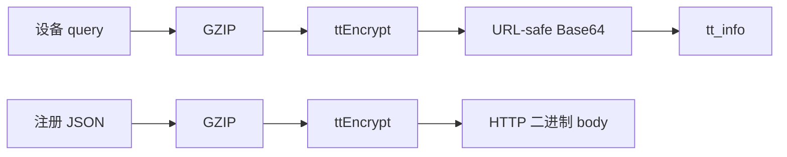
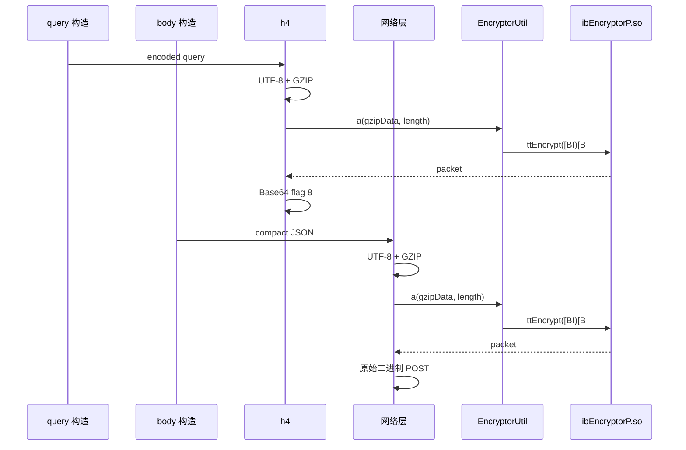
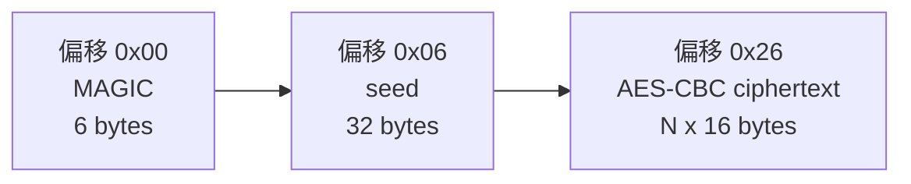
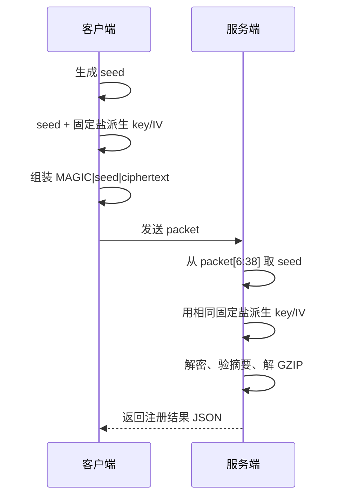

# 从抓包到纯 Python：Kimi `device_register` 接口完整还原

`device_register` 是设备首次注册时使用的接口。它看起来只有一个很长的 `tt_info` 参数和一段不可读的二进制请求体，但两者实际上使用了同一套 Native 封装。

本文从真实抓包出发，依次还原 Java 调用链、JNI 注册、ARM64 核心函数、key/IV 派生方式和 AES 参数，最后给出可以独立运行的 Python 加解密实现。

分析对象：

| 项目 | 信息 |
|---|---|
| App | Kimi Android 3.0.6 |
| 包名 | `com.moonshot.kimichat` |
| 接口 | `POST https://gator.volces.com/service/2/device_register/` |
| Java/Dex 分析 | Garlic |
| Native 分析 | Rizin 0.9.1 |
| 动态验证 | Frida 16.5.7 |
| 设备 | Pixel 6 / Android 12 / arm64 |
| APK SHA-256 | `2F8A5FE10C75E63E1288CB8BDDD511D2BEBF91BA989E4F15996D260FAE2CD809` |
| so SHA-256 | `45FD9913DC05CF9BAF36AA83611FE59E4F0167A2EEEA79E23E7935FD797209DE` |

---

## 一、最终结论

请求中有两份被保护的数据：

1. 原始设备 query 压缩、加密后，再做 URL-safe Base64，放进 `tt_info`。
2. 设备注册 JSON 压缩、加密后，直接作为 HTTP 二进制请求体发送。



`ttEncrypt` 的完整算法如下：

```text
seed = 32 字节随机数据

d1 = SHA512(seed)
d2 = SHA512(d1 || KDF_SALT)
key = d2[0:16]
iv  = d2[16:32]

digest = SHA512(gzip_data)
protected = digest || gzip_data
ciphertext = AES-128-CBC-PKCS7(key, iv, protected)

packet = MAGIC || seed || ciphertext
MAGIC = 12 39 20 20 02 03
```

固定 64 字节 `KDF_SALT`：

```text
490cc21292b05d0cc06ccbe91fb92e21
b5a7c538811dc85e27a96e28104e1cf6
9c7166efab232807390da78a8b91e49c
44b49a43feb941a1e46f2656e613e47b
```

key 和 IV 不会直接提交给服务器。每个 packet 都会明文携带 seed，服务端从 `packet[6:38]` 取出 seed，再按同样的 KDF 派生 key 和 IV。

因此，这套方案本质上是一种可逆的协议封装，而不是不可伪造的请求签名。seed 在包中明文传输，盐也是固定常量，知道算法的一方可以自行解密、修改并重新加密。

---

## 二、先分清五层数据

分析这类协议时，最容易出现的问题是把“业务明文”“AES 明文”和“线上数据”混为一谈。这里先统一概念。

| 层级 | 名称 | query | body |
|---:|---|---|---|
| 1 | 业务明文 | `_rticket=...&aid=20001731` | `{"magic_tag":"ss_app_log",...}` |
| 2 | `gzip_data` | query UTF-8 后的 GZIP | JSON UTF-8 后的 GZIP |
| 3 | `protected` | `SHA512(gzip_data) || gzip_data` | 同左 |
| 4 | `packet` | `MAGIC || seed || AES(protected)` | 同左 |
| 5 | 线上表示 | URL-safe Base64 字符串 | 原始二进制字节 |

三个细节尤其重要：

- SHA-512 计算的是 GZIP 数据，不是 GZIP 解压后的业务明文。
- AES 加密的是 `64 字节摘要 + GZIP 数据`。
- 抓包工具为了在 JSON 中保存二进制 body，通常会额外显示成 Base64；服务端在线上收到的仍是原始二进制 packet。

---

## 三、从抓包判断协议结构

真实请求概要：

```http
POST /service/2/device_register/?aid=20001731&tt_info=...
Host: gator.volces.com
Content-Type: application/octet-stream;tt-data=a
Accept-Encoding: gzip
User-Agent: Dalvik/2.1.0 (Linux; U; Android 12; Pixel 6 Build/SQ3A.220705.004)
Content-Length: 886
```

### 3.1 `tt_info` 的外观

`tt_info` 有三个明显特征：

- 字符集中包含 `-` 和 `_`，符合 URL-safe Base64。
- 尾部保留 `=` padding。
- URL 中周期性出现 `%0A`，URL 解码后是换行符。

Android `Base64.encode(data, 8)` 中，flag `8` 只代表 `URL_SAFE`。它没有同时设置 `NO_WRAP=2` 或 `NO_PADDING=1`，所以仍会保留 padding，并默认每 76 个字符插入 LF。

### 3.2 query 和 body 有共同包头

对 `tt_info` 做 URL 解码和 URL-safe Base64 解码，再对二进制 body 观察原始字节，得到：

| 项目 | query packet | body packet |
|---|---:|---:|
| 总长度 | 390 | 886 |
| 前 6 字节 | `123920200203` | `123920200203` |
| 接下来 32 字节 | 变化数据 | 变化数据 |
| 剩余部分 | 352 字节 | 848 字节 |
| 剩余长度是否为 16 的倍数 | 是 | 是 |

二者不仅有相同的 6 字节头，去掉前 38 字节后还都满足 16 字节分组对齐。这说明 query 和 body 使用同一套分组加密封装。

### 3.3 响应不加密

服务端返回普通 JSON：

```json
{
  "bd_did": "7699739002848446982",
  "cd": "7699739002848446982",
  "device_id": 0,
  "install_id": 7699739002848430085,
  "install_id_str": "7699739002848430085",
  "new_user": 1,
  "server_time": 1786445169,
  "ssid": "1731757202092847596"
}
```

所以本次只需要分析请求构造，不存在响应解密链。

---

## 四、Garlic 还原 Java 调用链

从 `device_register`、`tt_info`、`ttEncrypt`、`EncryptorP` 和 Content-Type 等字面量反向追踪，可以把 Java 层分成四部分：默认配置、query 构造、body 构造和 Native 包装。

Garlic 对部分混淆控制流存在条件反转和变量类型恢复错误，因此 Java 伪代码主要用于定位调用关系；精确条件需要结合 smali、抓包结果和 Native 行为校正。

### 4.1 默认接口和 aid

SDK 默认注册地址：

```java
r.a = "https://klink.volceapplog.com/service/2/device_register/";
```

初始化配置中的 aid：

```java
this.a = "20001731";
```

静态代码中没有出现抓包使用的 `gator.volces.com`，说明该域名由上层运行时配置覆盖。域名变化不影响后续加密流程。

### 4.2 query 参数

`com.bytedance.bdtracker.f3` 负责把设备和应用信息加入 query，主要字段包括：

```text
_rticket
manifest_version_code
ac
os_version
version_code
channel
device_type
language
resolution
update_version_code
clientudid
sdk_version_code
cdid
version_name
os_api
device_brand
ssmix
device_platform
dpi
aid
```

真实 query 明文为：

```text
_rticket=1786445210356&manifest_version_code=362&ac=wifi&os_version=12&version_code=362&channel=yingyongbao&device_type=Pixel%206&language=zh&resolution=1080*2240&update_version_code=362&clientudid=1758766c-13a6-44c9-b368-9491c57a067a&sdk_version_code=16160756&cdid=8a6f04bc-f173-4237-9a7e-6e090148be63&version_name=3.0.6&os_api=32&device_brand=google&ssmix=a&device_platform=android&dpi=420&aid=20001731
```

这里送进 GZIP 的是已经 URL 编码的字符串。例如设备型号是 `Pixel%206`，不是解码后的 `Pixel 6`。

### 4.3 body JSON

`com.bytedance.bdtracker.d3` 创建外层 JSON：

```java
JSONObject result = new JSONObject();
result.put("magic_tag", "ss_app_log");
result.put("header", header);
result.put("_gen_time", System.currentTimeMillis());
return result;
```

真实 body 解密后为：

```json
{
  "magic_tag": "ss_app_log",
  "header": {
    "platform": "Android",
    "sdk_lib": "Android",
    "device_model": "Pixel 6",
    "device_brand": "google",
    "device_manufacturer": "Google",
    "cpu_abi": "arm64-v8a",
    "sdk_target_version": 29,
    "git_hash": "e4c4456",
    "os": "Android",
    "os_api": 32,
    "os_version": "12",
    "sdk_version": 6161157,
    "sdk_version_code": 16160756,
    "sdk_version_name": "6.16.11-tracer-rc7",
    "channel": "yingyongbao",
    "not_request_sender": 0,
    "aid": "20001731",
    "app_region": "CN",
    "density_dpi": 420,
    "display_density": "xxhdpi",
    "resolution": "2400x1080",
    "language": "zh",
    "timezone": 8,
    "region": "CN",
    "tz_name": "Asia/Shanghai",
    "tz_offset": 28800,
    "mc": "02:00:00:00:00:00",
    "build_serial": "",
    "sim_serial_number": [],
    "access": "wifi",
    "package": "com.moonshot.kimichat",
    "app_version": "3.0.6",
    "app_version_minor": "362",
    "version_code": 362,
    "update_version_code": 362,
    "manifest_version_code": 362,
    "display_name": "Kimi",
    "rom": "8836240",
    "rom_version": "SQ3A.220705.004",
    "register_time": 0,
    "sig_hash": "53a8976c038811391a464033416c698a",
    "clientudid": "1758766c-13a6-44c9-b368-9491c57a067a",
    "openudid": "d1f776024aa76617",
    "cdid": "8a6f04bc-f173-4237-9a7e-6e090148be63",
    "custom": {
      "launch_type": "Organic",
      "msh_app_download_channel": "yingyongbao",
      "msh_locale": "zh-CN",
      "abstract_user_region": "REGION_CN",
      "vip_style": "",
      "subscribe_style": "free"
    },
    "req_id": "bc38c2dd-a9d8-4abf-b26c-5eaa77a71c79",
    "oaid_may_support": false
  },
  "_gen_time": 1786445210356
}
```

为了展示而格式化的 JSON 带有缩进；线上实际送进 GZIP 的是 `JSONObject.toString()` 生成的紧凑 JSON。

### 4.4 `tt_info` 的 Java 封装

`com.bytedance.bdtracker.h4` 的有效逻辑：

```java
Uri uri = Uri.parse(url);
String encodedQuery = uri.getEncodedQuery();

byte[] gzipData = gzip(encodedQuery.getBytes("UTF-8"));
byte[] packet = EncryptorUtil.a(gzipData, gzipData.length);
String ttInfo = new String(Base64.encode(packet, 8));

return rebuildUrlWithAidAndTtInfo(uri, ttInfo);
```

决定性原始调用：

```java
String query = uri.getEncodedQuery();
builder.appendQueryParameter(
    "tt_info",
    new String(Base64.encode(this.b(query), 8))
);
```

`this.b(query)` 内部先使用 `GZIPOutputStream`，再调用 `EncryptorUtil`。

### 4.5 body 的 Java 封装

网络层的有效逻辑：

```java
byte[] data = compactJson.getBytes("UTF-8");
byte[] gzipData = gzip(data);
byte[] packet = EncryptorUtil.a(gzipData, gzipData.length);

headers.put(
    "Content-Type",
    "application/octet-stream;tt-data=a"
);
post(url, headers, packet);
```

query 和 body 到这里已经收敛成相同输入：一段 GZIP 字节。

### 4.6 JNI 包装

`EncryptorUtil` 加载目标 so：

```java
static {
    System.loadLibrary("EncryptorP");
}
```

Java 包装方法校验输入和长度后调用：

```java
private static native byte[] ttEncrypt(byte[] data, int length);
```

完整调用关系：



---

## 五、Rizin 分析 `libEncryptorP.so`

### 5.1 先判断磁盘 so 是否可信

目标 so 是 83,928 字节的 ARM64 ELF，具备 PIE、NX、Full RELRO 和 stack canary，符号已裁剪。

在进入算法函数前先检查壳和运行时重建：

1. ELF 头、节区、动态表和重定位均能正常解析。
2. `.text` 与 `.mytext` 都是可直接反汇编的 ARM64 指令。
3. `.init_array` 只有一个 `0x0be8` constructor，只做编译器 frame 初始化。
4. 没有导入 `mmap`、`mprotect`、`memfd_create` 或 `dlopen`。
5. 静态扫描没有发现直接 `svc`。
6. 设备中的 so 与 APK 内 so 哈希一致。
7. 运行时只有正常的文件映射 `r-xp`、`r--p`、`rw-p` 段。

因此没有发现 so 自解密、匿名 RX 重建或运行时换代码的证据，可以直接以磁盘 so 为分析对象。

### 5.2 `JNI_OnLoad` 和动态注册

`JNI_OnLoad` 位于 `0x0c38`。它取得 `JNIEnv`，查找 Java 类，再调用 `RegisterNatives`。

位于 `0x18008` 的 `JNINativeMethod` 表：

| 字段 | 值 |
|---|---|
| Java 类 | `com/bytedance/applog/encryptor/EncryptorUtil` |
| 方法名 | `ttEncrypt` |
| JNI 签名 | `([BI)[B` |
| Native 地址 | `0x984c` |

`([BI)[B` 表示输入 `byte[]` 和 `int`，返回 `byte[]`，与 Java 声明完全对应。

### 5.3 JNI 包装器 `0x984c`

函数范围为 `0x984c-0x99a4`，大小 344 字节。去掉 JNI 细节后可写成：

```c
jbyteArray native_ttEncrypt(JNIEnv *env,
                            jclass clazz,
                            jbyteArray input,
                            jint input_len) {
    if (input == NULL || input_len < 1)
        return NULL;

    byte *src = GetByteArrayElements(input, NULL);
    byte *out = malloc(input_len + 0x76);
    size_t out_len = input_len + 0x76;

    core_encrypt(src, input_len, out, &out_len);  // 0x2bb8

    jbyteArray result = NewByteArray(out_len);
    SetByteArrayRegion(result, 0, out_len, out);
    ReleaseByteArrayElements(input, src, JNI_ABORT);
    free(out);
    return result;
}
```

核心跳转是：

```text
0x98d8  bl  0x2bb8
```

`input_len + 0x76` 是输出缓冲区上界，不是 packet 的最终长度公式。

### 5.4 核心函数 `0x2bb8`

核心函数范围是 `0x2bb8-0x2d88`，大小 464 字节。

| 地址 | 行为 | 含义 |
|---:|---|---|
| `0x2c10` | `malloc(0x20)` | 申请 32 字节 seed |
| `0x2c54` | 调用 `0x2e48` | 填充 seed |
| `0x2c58`、`0x2c64` | 两次 `malloc(0x10)` | 申请 key 和 IV |
| `0x2c88` | 调用 `0x4c1c` | 从 seed 派生 key/IV |
| `0x2c8c` | `input_len + 0x40` | 为 64 字节摘要加输入分配空间 |
| `0x2ca8` | 调用 `0x6ec8` | 生成 64 字节摘要 |
| `0x2cc0` | `memcpy(dst+0x40, input, len)` | 拼接 `digest || input` |
| `0x2ce0`、`0x2ce4` | 写 6 字节常量 | 写入 MAGIC |
| `0x2cec`、`0x2d14` | 写 32 字节 | seed 放到输出偏移 6 |
| `0x2d1c` | 调用 `0x1078` | 加密到输出偏移 `0x26` |
| `0x2d34` | `cipher_len + 0x26` | 返回 packet 长度 |

包头写入指令：

```text
0x2cd4  mov  w8, 0x3912
0x2cd8  movk w8, 0x2020, lsl 16
0x2cdc  mov  w9, 0x302
0x2ce0  str  w8, [out]
0x2ce4  strh w9, [out, 4]
```

ARM64 使用小端序，最终内存字节为：

```text
12 39 20 20 02 03
```

### 5.5 密码包装器

| 偏移 | 函数范围 | 参数形态 | 最终结论 |
|---:|---|---|---|
| `0x4c1c` | `0x4c1c-0x4c9c` | 32 字节输入、两个 16 字节输出 | KDF，输出 key/IV |
| `0x6ec8` | `0x6ec8-0x6f44` | 输入、长度、64 字节输出 | SHA-512 |
| `0x1078` | `0x1078-0x1100` | key、IV、输入、输出 | AES-128-CBC-PKCS#7 |

这些包装器内部继续进入大型间接调度函数，具有解释器式、VM-like 的混淆特征。但 JNI 包装器、packet 核心和参数传递仍是正常 ARM64 代码。

因此更准确的结论不是“整个 so 都被 VMP”，而是“密码原语下层存在自定义虚拟化或解释器式混淆”。`.mytext` 节本身也不能证明使用了某个商业 VMProtect 产品。

---

## 六、用 Frida 确认标准算法

静态分析已经找到包装器边界，动态阶段不再盲目跟踪混淆调度，而是在已知边界读取输入和输出。

### 6.1 第一轮：受控输入

主动调用 Java 包装方法：

```javascript
Java.perform(() => {
  const Base64 = Java.use('android.util.Base64');
  const Encryptor = Java.use(
    'com.bytedance.applog.encryptor.EncryptorUtil'
  );
  const encrypt = Encryptor.a.overload('[B', 'int');

  const input = Base64.decode('YWJj', 0); // abc
  const output = encrypt.call(Encryptor, input, input.length);
  console.log(Base64.encodeToString(output, 2));
});
```

多组输入结果：

| 输入 | 输入长度 | packet 长度 | 密文长度 |
|---|---:|---:|---:|
| `abc` | 3 | 118 | 80 |
| `A * 16` | 16 | 134 | 96 |
| `00..3f` | 64 | 182 | 144 |
| query 片段 | 38 | 150 | 112 |

长度关系已经能推出：

```text
packet_len = 6 + 32 + cipher_len
cipher_len = PKCS7_len(64 + input_len, 16)
```

以 `abc` 为例：输入 3 字节，加上 64 字节摘要后为 67 字节；PKCS#7 补到 80 字节；再加 38 字节 packet 前缀，最终得到 118 字节。

### 6.2 第二轮：hook 中间值

三个 hook 点：

```javascript
const module = Process.getModuleByName('libEncryptorP.so');

Interceptor.attach(module.base.add(0x4c1c), {
  onEnter(args) {
    this.seed = args[0];
    this.seedLength = args[1].toInt32();
    this.key = args[2];
    this.keyLength = args[3].toInt32();
    this.iv = args[4];
    this.ivLength = args[5].toInt32();
  },
  onLeave() {
    // 读取 seed、key、iv
  }
});

Interceptor.attach(module.base.add(0x6ec8), {
  onEnter(args) {
    this.input = args[0];
    this.inputLength = args[1].toInt32();
    this.digest = args[2];
  },
  onLeave() {
    // 读取 input 和 64 字节 digest
  }
});

Interceptor.attach(module.base.add(0x1078), {
  onEnter(args) {
    // args[0] key，args[2] iv，args[3] input
    // args[5] output，args[6] outputLength
  },
  onLeave() {
    // 读取 ciphertext
  }
});
```

### 6.3 `abc` 的完整中间值

输入：

```text
61 62 63
```

seed：

```text
1b4e68c80d69855f8183da3ede0c0684
177657975cecbe9af87479900c40f127
```

第一次 SHA-512：

```text
78db4e544a8d78dade27abd48bcf3bc1
c2bcc4c2d8cf8b8f5e79136a5d5e8edf
a0329616500465b8032e1996b5b46409
27c00006b70c9e60834506ba4d90cc4c
```

KDF 输出：

```text
key = b7b6b498f368ea5d848a44db2df048ac
iv  = 4ba0d2cb4fd0b7a5cda9603c44df7251
```

`abc` 的摘要：

```text
ddaf35a193617abacc417349ae204131
12e6fa4e89a97ea20a9eeee64b55d39a
2192992a274fc1a836ba3c23a3feebbd
454d4423643ce80e2a9ac94fa54ca49f
```

这是标准 SHA-512 的公开已知结果。它不仅说明输出长度像 SHA-512，而是直接用已知向量确认了算法。

进入分组加密函数的数据：

```text
SHA512("abc") || 61 62 63
```

长度为 67 字节，输出为 80 字节。使用记录到的 16 字节 key 和 16 字节 IV，以 AES-CBC 和 PKCS#7 复算，密文与 Native 输出逐字节一致。

至此可以确认：

- 摘要算法是 SHA-512。
- 对称算法是 AES-128。
- 分组模式是 CBC。
- padding 是 PKCS#7。
- KDF 是两次 SHA-512，并使用固定 64 字节盐。

---

## 七、精确算法

### 7.1 key/IV 派生

定义：

```text
H(x) = SHA512(x)
R = 32 字节 seed
S = 64 字节固定盐
```

计算：

```text
d1 = H(R)
d2 = H(d1 || S)

key = d2[0:16]
iv  = d2[16:32]
```

`d2[32:64]` 没有作为当前 AES 调用的参数。

### 7.2 完整性数据

Java 传进 Native 的输入记为 `gzip_data`：

```text
digest = SHA512(gzip_data)
protected = digest || gzip_data
```

digest 可以检测传输损坏，但它不是 HMAC。没有独立秘密密钥时，知道协议的一方可以修改 GZIP 数据、重算 digest，再重新加密。

### 7.3 AES

```text
padded = PKCS7(protected, block_size=16)
ciphertext = AES-128-CBC-Encrypt(key, iv, padded)
```

PKCS#7 规则：

- 如果还差 `N` 字节对齐，就追加 `N` 个数值为 `N` 的字节。
- 如果已经 16 字节对齐，仍追加 16 个 `0x10`。

### 7.4 packet 布局



| 偏移 | 长度 | 内容 | 加密状态 |
|---:|---:|---|---|
| `0x00` | 6 | `12 39 20 20 02 03` | 明文 |
| `0x06` | 32 | seed | 明文 |
| `0x26` | 可变 | AES-CBC 密文 | 密文 |

长度公式：

```text
protected_len = 64 + gzip_len
cipher_len = 16 * (floor(protected_len / 16) + 1)
packet_len = 38 + cipher_len
```

---

## 八、key 和 IV 如何到达服务器

这是整个协议最关键、也最容易误解的地方。

### 8.1 key/IV 不直接传输

请求中没有：

```text
key=...
iv=...
```

也没有额外 Header 或 JSON 字段保存 key/IV。真正发送的是：

```text
MAGIC || seed || ciphertext
```

### 8.2 服务端如何解密

服务端收到 packet 后执行：

```python
magic = packet[:6]
seed = packet[6:38]
ciphertext = packet[38:]

d1 = SHA512(seed)
d2 = SHA512(d1 + KDF_SALT)
key = d2[:16]
iv = d2[16:32]

protected = AES_CBC_DECRYPT(key, iv, ciphertext)
```

网络上传输的是“用于生成 key/IV 的 seed”，不是 key/IV 本身。

### 8.3 query 和 body 各有一个完整 packet

`tt_info` Base64 解码后是完整 packet；body 自身也是完整 packet。解密时必须分别读取各自的 seed，分别派生 key/IV。

本次抓包的两份 packet 使用相同 seed，因此派生出了相同 key/IV；这并不意味着解密代码可以只读取其中一个 seed。

### 8.4 固定盐为什么不用发送

固定盐是协议常量。客户端 Native 中包含这 64 字节，服务端具备同一个常量或等价派生逻辑，因此每次请求只需携带变化的 seed。



---

## 九、用真实抓包完整计算一次

### 9.1 packet 信息

| 项目 | query packet | body packet |
|---|---:|---:|
| packet 长度 | 390 | 886 |
| MAGIC | `123920200203` | `123920200203` |
| seed | `39bc8791...dcd69b15` | `39bc8791...dcd69b15` |
| 密文长度 | 352 | 848 |

完整 seed：

```text
39bc87917fb17bcef28b52b92feaa117
1097b3d73604c573d2c82b1fdcd69b15
```

### 9.2 第一次 SHA-512

```text
d1 =
638cb21c54b0fa775404735dfe077d7b
76eb994087fd2bec02f661a42782abd7
201a48db17ad9583122a2e75c2528586
8707244b30a2a020d8f0ebf48551a9c9
```

### 9.3 第二次 SHA-512

```text
d2 =
9b31d1459f1d1feb5fd26cd980eac163
1da77910668aacbf3f48a31012c1ac32
7727de93927a8e6c8872308b81ab2bf2
a7d4075dbf20acabd266379a07d0b1f1
```

截取得到：

```text
key = 9b31d1459f1d1feb5fd26cd980eac163
iv  = 1da77910668aacbf3f48a31012c1ac32
```

query 和 body 的 seed 相同，所以这次请求使用同一组 key/IV。两份密文仍然不同，因为它们的 GZIP 数据不同。

### 9.4 query 的长度变化

```text
packet                 390 字节
- MAGIC/seed            38 字节
= AES ciphertext       352 字节
AES 解密并去 padding    344 字节
- SHA-512 digest        64 字节
= GZIP data            280 字节
GZIP 解压               404 字节 query
```

### 9.5 body 的长度变化

```text
packet                 886 字节
- MAGIC/seed            38 字节
= AES ciphertext       848 字节
AES 解密并去 padding    841 字节
- SHA-512 digest        64 字节
= GZIP data            777 字节
GZIP 解压              1370 字节 JSON
```

两份数据都依次通过：

```text
MAGIC 校验
AES block 对齐校验
PKCS#7 padding 校验
SHA-512 完整性校验
GZIP CRC/ISIZE 校验
```

### 9.6 Android 与 Python JSON 的 1 字节差异

Android 原始紧凑 JSON 中：

```json
"tz_name":"Asia\/Shanghai"
```

Python `json.dumps` 通常输出：

```json
"tz_name":"Asia/Shanghai"
```

两者 JSON 语义相同，但 Android 表示多一个反斜杠，因此原始明文是 1370 字节，而 Python 对同一对象重新紧凑序列化通常为 1369 字节。

---

## 十、完整 Python 加解密实现

下面的代码不依赖 Android 或 Frida，只需要：

```text
cryptography>=41
requests>=2.31
```

### 10.1 协议核心

```python
import base64
import binascii
import gzip
import hashlib
import json
import os
import struct
import urllib.parse
import zlib

from cryptography.hazmat.primitives.ciphers import Cipher, algorithms, modes


MAGIC = bytes.fromhex("123920200203")
KDF_SALT = bytes.fromhex(
    "490cc21292b05d0cc06ccbe91fb92e21"
    "b5a7c538811dc85e27a96e28104e1cf6"
    "9c7166efab232807390da78a8b91e49c4"
    "4b49a43feb941a1e46f2656e613e47b"
)


def derive_key_iv(seed: bytes) -> tuple[bytes, bytes]:
    if len(seed) != 32:
        raise ValueError("seed 必须是 32 字节")

    d1 = hashlib.sha512(seed).digest()
    d2 = hashlib.sha512(d1 + KDF_SALT).digest()
    return d2[:16], d2[16:32]


def pkcs7_pad(data: bytes) -> bytes:
    amount = 16 - len(data) % 16
    return data + bytes([amount]) * amount


def pkcs7_unpad(data: bytes) -> bytes:
    if not data:
        raise ValueError("空的 AES 明文")

    amount = data[-1]
    if amount not in range(1, 17):
        raise ValueError("PKCS#7 padding 长度错误")
    if data[-amount:] != bytes([amount]) * amount:
        raise ValueError("PKCS#7 padding 内容错误")
    return data[:-amount]


def java_gzip(data: bytes) -> bytes:
    compressor = zlib.compressobj(level=-1, wbits=-15)
    compressed = compressor.compress(data) + compressor.flush()

    header = b"\x1f\x8b\x08\x00\x00\x00\x00\x00\x00\xff"
    trailer = struct.pack(
        "<II",
        binascii.crc32(data) & 0xFFFFFFFF,
        len(data) & 0xFFFFFFFF,
    )
    return header + compressed + trailer


def tt_encrypt(gzip_data: bytes, seed: bytes | None = None) -> bytes:
    seed = os.urandom(32) if seed is None else seed
    key, iv = derive_key_iv(seed)

    digest = hashlib.sha512(gzip_data).digest()
    protected = digest + gzip_data

    encryptor = Cipher(algorithms.AES(key), modes.CBC(iv)).encryptor()
    ciphertext = encryptor.update(pkcs7_pad(protected))
    ciphertext += encryptor.finalize()

    return MAGIC + seed + ciphertext


def tt_decrypt(packet: bytes) -> bytes:
    if len(packet) < 54:
        raise ValueError("packet 太短")
    if packet[:6] != MAGIC:
        raise ValueError("MAGIC 不匹配")
    if len(packet[38:]) % 16:
        raise ValueError("密文没有按 16 字节对齐")

    seed = packet[6:38]
    ciphertext = packet[38:]
    key, iv = derive_key_iv(seed)

    decryptor = Cipher(algorithms.AES(key), modes.CBC(iv)).decryptor()
    protected = decryptor.update(ciphertext) + decryptor.finalize()
    protected = pkcs7_unpad(protected)

    digest = protected[:64]
    gzip_data = protected[64:]
    if digest != hashlib.sha512(gzip_data).digest():
        raise ValueError("SHA-512 完整性校验失败")

    return gzip_data


def encode_tt_info(packet: bytes) -> str:
    encoded = base64.urlsafe_b64encode(packet).decode("ascii")
    lines = [encoded[i:i + 76] for i in range(0, len(encoded), 76)]
    return "\n".join(lines) + "\n"


def decode_tt_info(tt_info: str) -> bytes:
    encoded = urllib.parse.unquote(tt_info)
    encoded = "".join(encoded.split())
    encoded += "=" * (-len(encoded) % 4)
    return base64.urlsafe_b64decode(encoded)


def encrypt_query(query: str, seed: bytes | None = None) -> str:
    gzip_data = java_gzip(query.encode("utf-8"))
    return encode_tt_info(tt_encrypt(gzip_data, seed))


def encrypt_body(body: dict, seed: bytes | None = None) -> bytes:
    plain = json.dumps(
        body,
        ensure_ascii=False,
        separators=(",", ":"),
    ).encode("utf-8")
    return tt_encrypt(java_gzip(plain), seed)


def decrypt_query(tt_info: str) -> str:
    packet = decode_tt_info(tt_info)
    return gzip.decompress(tt_decrypt(packet)).decode("utf-8")


def decrypt_body(packet: bytes) -> dict:
    plain = gzip.decompress(tt_decrypt(packet))
    return json.loads(plain.decode("utf-8"))
```

### 10.2 直接粘贴密文解密

如果抓包工具显示的是 `tt_info` 字符串和 body Base64，可以直接这样使用：

```python
TT_INFO = r"""
这里粘贴 tt_info 的值
"""

BODY_BASE64 = """
这里粘贴抓包工具显示的二进制 body Base64
"""


if TT_INFO.strip():
    print("===== tt_info 明文 =====")
    print(decrypt_query(TT_INFO.strip()))

if BODY_BASE64.strip():
    encoded = "".join(BODY_BASE64.split())
    encoded += "=" * (-len(encoded) % 4)
    body_packet = base64.b64decode(encoded)

    print("===== body 明文 =====")
    print(
        json.dumps(
            decrypt_body(body_packet),
            ensure_ascii=False,
            indent=2,
        )
    )
```

不需要手工填写 key 和 IV。每份密文都会从自己的 `packet[6:38]` 读取 seed 并自动派生。

### 10.3 使用 `requests` 发送

```python
import requests


def register(endpoint: str, aid: str, query: str, body: dict):
    # 复现真实请求中 query/body 共用 seed 的关系。
    seed = os.urandom(32)
    tt_info = encrypt_query(query, seed)
    body_packet = encrypt_body(body, seed)

    response = requests.post(
        endpoint,
        params={
            "aid": aid,
            "tt_info": tt_info,
        },
        headers={
            "Content-Type": "application/octet-stream;tt-data=a",
            "Accept-Encoding": "gzip",
            "User-Agent": "Dalvik/2.1.0 (Linux; U; Android 12; Pixel 6)",
        },
        data=body_packet,
        timeout=15,
    )

    print(response.status_code)
    print(response.text)
```

原 Native 使用 `srand(time)`、`rand()` 风格生成 seed，同一秒内存在重复现象。Python 使用 `os.urandom(32)` 可以避免复制这种弱随机实现，同时不影响协议格式，因为 seed 本身会放进 packet。

真实抓包中 query 和 body 使用相同 seed。上面的请求示例也复现了这一关系。解密算法并不要求两份 packet 使用相同 seed；服务端是否额外校验这种关联，没有做不同 seed 的线上对照实验。

---

## 十一、验证闭环

| 验证项 | 结果 | 判断依据 |
|---|---|---|
| APK 与设备端 so 一致 | 通过 | SHA-256 相同 |
| 磁盘 so 可直接分析 | 通过 | ELF、constructor、imports、maps 均正常 |
| JNI 注册 | 通过 | `ttEncrypt ([BI)[B -> 0x984c` |
| packet 核心 | 通过 | `0x2bb8-0x2d88` |
| MAGIC | 通过 | ARM64 写入指令与真实 packet 一致 |
| seed 位置 | 通过 | 静态写入偏移 6，动态读取 `[6:38]` |
| SHA-512 | 通过 | `abc` 已知向量命中 |
| 固定盐 | 通过 | 第二次 digest 输入后 64 字节固定 |
| key/IV 截取 | 通过 | Frida 输出与 `d2[:32]` 一致 |
| AES-128-CBC | 通过 | 参数长度和密文逐字节复算 |
| PKCS#7 | 通过 | 多输入长度与 padding 复算 |
| query 解密 | 通过 | 得到 404 字节业务明文 |
| body 解密 | 通过 | 得到 1370 字节 JSON |
| SHA-512 完整性 | 通过 | query/body 均匹配 |
| GZIP | 通过 | query/body 均通过 CRC 和 ISIZE |
| 原 App 请求 | 通过 | HTTP 200 并返回注册标识 |

---

## 十二、哪些是确认的，哪些仍是推断

### 已确认

- query 和 body 都执行 `GZIP -> ttEncrypt`。
- `tt_info` 是 query packet 的 URL-safe Base64 表示。
- body 在线上是 packet 原始二进制，不是 Base64 文本。
- key/IV 由 packet 内 seed 和固定盐确定性派生。
- key/IV 不直接提交。
- `ttEncrypt` 使用 SHA-512、AES-128-CBC 和 PKCS#7。
- 真实 query/body 均可完整解密并通过摘要和 GZIP 校验。
- 算法可以脱离 Android，在本地纯 Python 运行。

### 有证据支持的推断

- `gator.volces.com` 是运行时配置覆盖，因为静态 APK 只出现默认域名。
- 同秒 seed 复用来自 `srand(time)` / `rand()` 路径。
- 服务端具备相同固定盐或等价派生逻辑，从 packet 内 seed 恢复 key/IV。

### 尚未验证

- 没有穷举服务端对所有 query、header 和 JSON 字段的必填规则。
- 没有对 query/body 使用不同 seed 做线上注册对照。
- 不能保证未来服务端风控和字段策略不变。
- 结论只针对 `device_register` 及其共用的 `ttEncrypt`，不自动覆盖其他接口。

---

## 结语

这次还原的关键并不是强行读完所有虚拟化调度，而是先用 Java 层确定数据流，再用 Rizin 找到 JNI、封包核心和三个密码包装器，最后通过 Frida 受控输入把每个标准原语坐实。

最终协议可以压缩成一句话：

```text
业务明文
-> GZIP
-> SHA512(GZIP) || GZIP
-> AES-128-CBC-PKCS7
-> MAGIC || seed || ciphertext
-> tt_info 或二进制 body
```

其中 seed 已经随 packet 发送，key 和 IV 只是由 seed 临时派生的中间值。这也解释了为什么本地解密时只需要密文，不需要另外提供 key 或 IV。
