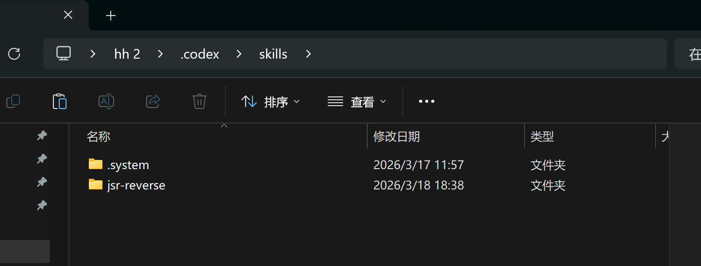
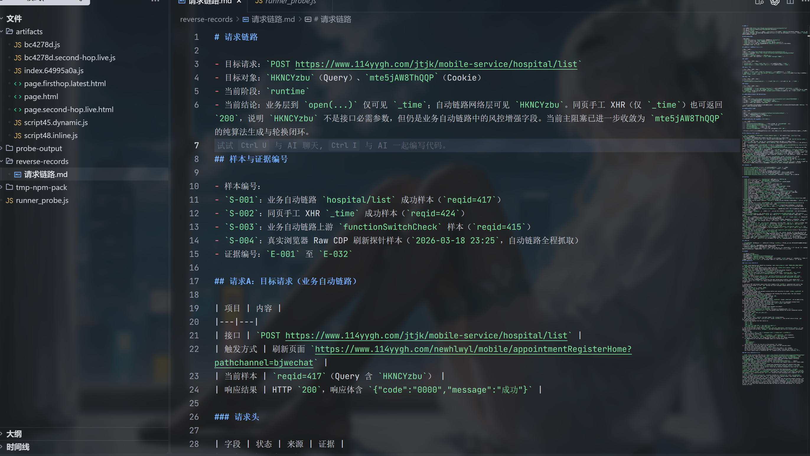
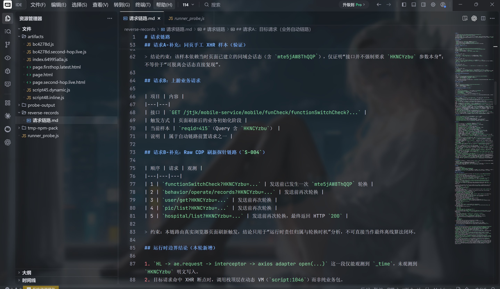
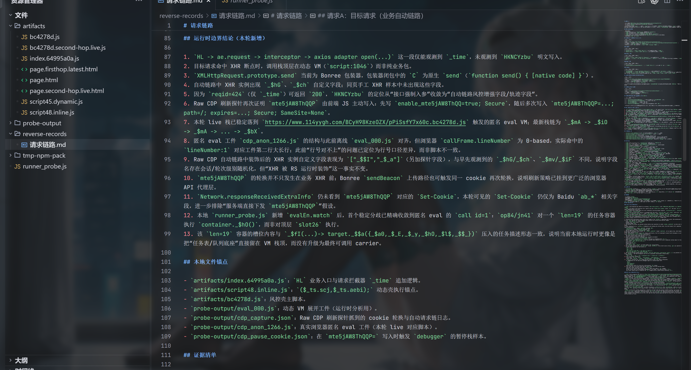
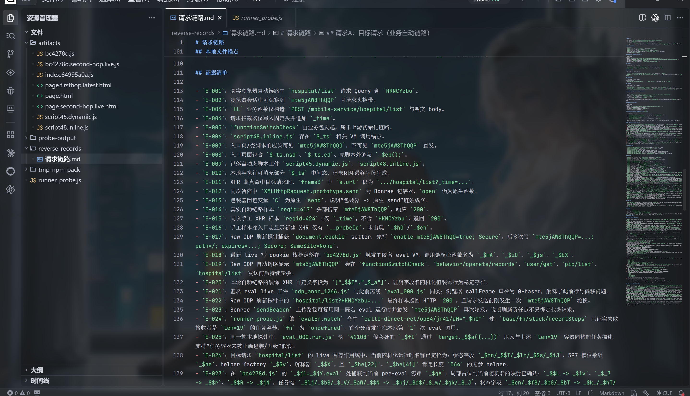

# reverse-skill

面向 Web JS 逆向分析的技能仓库，覆盖请求链定位、运行时诊断、AST 混淆恢复、JSVMP、worker、WASM、webpack/runtime 与协议语义分析。

## 安装

1. 接入 [js-reverse-mcp](https://github.com/zhizhuodemao/js-reverse-mcp)
2. 将 `jsr-reverse` 目录复制到技能根目录

安装位置：

| 环境 | 路径 |
| --- | --- |
| `Codex` | `%USERPROFILE%\.codex\skills\` |
| `Claude Code` | `%USERPROFILE%\.claude\skills\` |



## 使用

推荐最小输入：

- `URL`
- `接口 / 字段 / 消息对象`
- `触发方式`
- `当前现象`
- `已知约束`：例如 `cookie`、是否允许补环境、是否要求纯算法

唯一入口：

- `jsr-reverse`：面向真实浏览器样本、请求链证据、桥接契约、运行时事实与检查点验证的统一逆向入口。

核心能力：

- 请求链证据化：围绕目标请求、触发动作、上游依赖、状态消费与正常 / 风控分叉建立可验证证据。
- 写边界证明：定位动态字段、请求头、`cookie`、消息对象的真实 writer、builder 与 sink。
- 壳层恢复：拆解 `JSVMP`、`AST`、`worker`、`WASM`、`webpack/runtime`、协议包络与桥接层。
- 运行时对齐：识别对象、状态、时序、生命周期、指纹与风控分支造成的执行偏差。
- 检查点验证：固定样本，对齐输入、输出、中间态与状态依赖，形成可交付结论。

全自动调用示例：

```text

使用：Jsreverser Mcp
方式：在真实浏览器插桩采集输入输出及中间态数据，与本地算法进行逻辑一致性和结果正确性对比分析。
URL: 【https://example.com】
目标：【接口 / 需要的数据】
触发方式: 【刷新页面】
cookie：【使用现有cookie / 优先不使用，必须则模拟完整链路生成游客态】
约束：不使用playwright等自动化工具、不联网搜索公开案例
必须纯算法实现，【能/不能】依赖补环境
交付：Node.js 生成加密参数，Python 负责调度和发送请求，运行后打印响应数据
```
会话续接方式：

当模型因会话压缩、安全/合规约束或上下文中断停止当前工作时，先要求模型补全交接工件：

```text
更新 reverse-records/请求链路.md
```

继续分析时，在新会话中同时提供交接文档路径与原始任务输入：

```text
参考：reverse-records/请求链路.md
{上面的全自动prompt}
```

模型续接后，通常会：

- 若已存在 `reverse-records/请求链路.md`，先读取当前交接内容。
- 归一化目标、触发动作、样本与约束，固定当前逆向对象。
- 建立目标请求、上游状态、字段写边界与正常 / 风控分叉的真实证据。
- 按当前阻塞装配专题 reference，聚焦请求链、桥接契约、运行时事实或验证检查点。
- 将请求区块与跨阶段补充续写到 `reverse-records/请求链路.md`。
- 输出当前判断、下一步推进方向与待补证据。


## 记录工件

`reverse-records/请求链路.md` 承载请求链证据、运行时补充、恢复补充与验证补充。

记录路径：

```text
<当前任务工作目录>/reverse-records/
└─ 请求链路.md
```

请求区块示意：


扩展链路示意：


运行时补充示意：


证据补充示意：


- `请求区块`：目标请求、上游依赖、字段状态、来源 / 去向与证据锚点。
- `运行时补充`：分叉点、必要对象 / 状态、执行模式与下一步。
- `恢复补充`：桥接契约、状态载体、关键算子与未恢复缺口。
- `验证补充`：固定输入、检查点对比、当前结论与剩余证据缺口。

## 适用与边界

适用：

- Web 端动态参数、登录链路、挑战链路、指纹链路、风控链路分析
- 请求重放前的来源证明、状态证明、依赖闭合和运行时闭合
- `jsvmp`、AST、`worker`、`wasm`、`webpack/runtime`、协议封装等典型遮蔽层恢复
