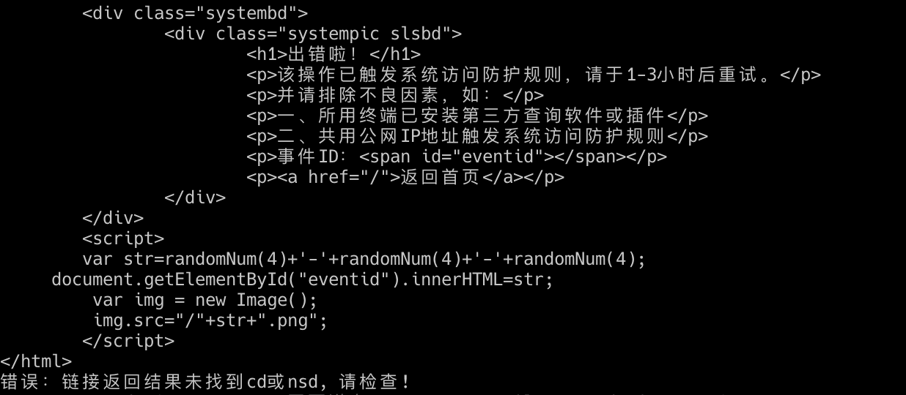

**开源兄弟项目(补环境框架sdenv)：[sdenv](https://github.com/pysunday/sdenv)**

## 0. 声明

该项目下代码仅用于个人学习、研究或欣赏。通过使用该仓库相关代码产生的风险与仓库代码作者无关！

该项目的研究网站仅做参考，项目不鼓励直接请求该研究网站，可通过以下两种方式研究：

1. 直接使用`example`目录下的样例文件，如：`node main.js makecookie`，既使用项目默认用例的外层虚拟机代码文件+ts文件。
2. 使用-j和-f命令指定本地外层虚拟机代码文件+ts文件(可通过makecode -u自动获取)，如：`node main.js makecookie -j ./path/to/main.js -f ./path/to/ts.json`

注意1：如果目标网站为存在额外debugger版本，且basearr中没有做适配，请确认-f对应配置文件是否存在hasDebug配置项，如不存在可手动添加或者执行makecode命令自动生成。

注意2：如果目标网站为存在额外debugger版本，但是实际并未开启该功能，由于无法判断，因此报错后可使用--no-has-debug或--has-debug=false配置项手动关闭。

## 1. 博客文章

1. [瑞数vmp-代码格式化后无法正常运行原因分析](https://blog.howduudu.tech/article/420dc80bfb66280ddbb93d87864cadd1/)
2. [瑞数vmp-动态代码生成原理](https://blog.howduudu.tech/article/95f60638eaa0647bcf327fb4f2c2887c/)
3. [补环境-document.all的c++方案1](https://blog.howduudu.tech/article/00bb5f4a997c39858e25fa962e8cd5b8/)
4. [补环境-document.all的c++方案2](https://blog.howduudu.tech/article/de942bdea377f7f3ce6878fc04a8c76c/)

## 2. 瑞数算法还原

**`npx rs-reverse *`与在当前目录下运行`node main.js *`相对应, 当然也支持npm全局安装(`npm install -g rs-reverse`)，npm全局安装后也可以直接使用命令`rs-reverse`**

如npx运行的包不是最新的，可以加上-p参数后执行如：`npx -p rs-reverse@latest rs-reverse makecookie`，非官方源可能存在版本不同步问题，建议拉取时使用官方源：`--registry=https://registry.npmjs.org`。

### 2.1. makecode子命令

执行子命令`makecode`生成动态代码, 可以传入包含`$_ts.nsd`和`$_ts.cd`的文本文件或者直接给url让程序自己去拿，命令示例:

1. npx方式：`npx rs-reverse makecode`
2. 文件方式：`node main.js makecode`

**命令后不接参数则从example文件中取**

```bash
$ npx rs-reverse makecode -h
rs-reverse makecode

根据传入的ts文件、网站地址、js文件地址等，生成全量ts文本、静态文本、内外层虚拟机
代码等文件

Options:
  -h             显示帮助信息                                          [boolean]
  -f, --file     含有nsd, cd值的json文件,
                 额外配置项：from（来源）、hasDebug（额外debugger）     [string]
  -j, --jsurls   瑞数加密的js文件链接或者本地js文件路径                  [array]
  -u, --url      瑞数返回204状态码的请求地址                            [string]
  -o, --output   输出文件目录                     [string] [default: "./output"]
  -l, --level    日志打印等级，参考log4js，默认为warn                   [string]
  -v, --version  显示版本号                                            [boolean]

Examples:
  main.js makecode
  main.js makecode -f /path/to/ts.json
  main.js makecode -u https://url/index.html
  main.js makecode -u https://url/index.html -f /path/to/ts.json
  main.js makecode -j https://url/main.js -f /path/to/ts.json
  main.js makecode -j /path/to/main.js -f /path/to/ts.json
```

调用示例：

```bash
$ npx rs-reverse makecode
代码还原成功！用时：22ms

  原始$_ts：output/makecode/ts.json
  外层虚拟机生成的$_ts：output/makecode/ts-full.json
  静态文本：output/makecode/immucfg.json
  内层虚拟机代码：output/makecode/dynamic.js
```

```bash
$ npx rs-reverse makecode -u https://www.riversecurity.com/
代码还原成功！用时：19ms

  原始$_ts：output/makecode/ts.json
  外层虚拟机生成的$_ts：output/makecode/ts-full.json
  静态文本：output/makecode/immucfg.json
  html代码：output/makecode/index.html
  外层虚拟机代码：output/makecode/ctqNgbzk9niG.294cc83.js
  内层虚拟机代码：output/makecode/ctqNgbzk9niG.294cc83-dynamic.js
```

```bash
$ npx rs-reverse makecode -j ./example/codes/main.js -f ./example/codes/\$_ts.json
代码还原成功！用时：22ms

  原始$_ts：output/makecode/ts.json
  外层虚拟机生成的$_ts：output/makecode/ts-full.json
  静态文本：output/makecode/immucfg.json
  外层虚拟机代码：output/makecode/rs-reverse
  内层虚拟机代码：output/makecode/main-dynamic.js
```

### 2.2. makecookie子命令

执行子命令`makecookie`生成cookie, 调用方式与`makecode`类型，调用示例：

1. npx方式：`npx rs-reverse makecookie`
2. 文件方式：`node main.js makecookie`

该命令首先会执行`makecode`子命令拿到完整的`$_ts`值，再运行`makecookie`的还原算法生成cookie。

```bash
$ npx rs-reverse makecookie -h
rs-reverse makecookie

生成cookie字符串，包含后台返回+程序生成，可直接复制使用

Options:
  -h               显示帮助信息                                        [boolean]
  -f, --file       含有nsd, cd值的json文件,
                   额外配置项：from（来源）、hasDebug（额外debugger）   [string]
  -j, --jsurls     瑞数加密的js文件链接或者本地js文件路径                [array]
  -u, --url        瑞数返回204状态码的请求地址                          [string]
  -o, --output     输出文件目录                   [string] [default: "./output"]
  -l, --level      日志打印等级，参考log4js，默认为warn                 [string]
  -c, --config     配置对象，传入对象或者json文件路径                   [string]
      --has-debug  如网站是额外debugger版本，但是未真正使用，可使用--has-debug=f
                   alse或--no-has-debug关闭                            [boolean]
  -v, --version    显示版本号                                          [boolean]

Examples:
  main.js makecookie
  main.js makecookie -f /path/to/ts.json
  main.js makecookie -u https://url/index.html
  main.js makecookie -u https://url/index.html -f /path/to/ts.json
  main.js makecookie -j https://url/main.js -f /path/to/ts.json
  main.js makecookie -j /path/to/main.js -f /path/to/ts.json
```

调用示例：

```bash
$ npx rs-reverse makecookie
成功生成cookie（长度：257），用时：456ms
cookie值: NOh8RTWx6K2dT=0_V5qiWgmVpYed7n0xt0sh.qObwemlYfrevBXDxzYHeQqxa2kKv7JibnYvC2hp9cIyZUkogzr_7SHRptTqZQ8nvhvmsmS96BQE2P9FdVPC33JkJrvG0bLZM6QTffPrAej_w3vj3GYGFsHj3eSNAtz3IDboDjZMPUxYtWgtduwLrqSEVfE.uYgl5OpVtfp7DEVrouVExqfoAbFnpkfJjXJ4mcwHyZujiXcVrDA6rM9mjCsb_s_e.nvxZiPf1eITc1D
```

```bash
$ npx rs-reverse makecookie -u https://www.riversecurity.com/
存在meta-content值：wzJz1uYec7CI5jjpz9Lak3E964C23aPH8tm9ImbiS.eX0hC5E1Wldc6_I_acluob
解析结果：https://www.riversecurity.com/

成功生成cookie（长度：236），用时：464ms
cookie值: gshewq7j5KkrT=0_w_p.2MoSNVgsA0i1dqj1GBrSPJNJa_zXxBTFg0fTroT86Vu8f2JnT.RrjwaHop96SuNZX7wjqneFWm4Roc4xfLcHVtn9LgeUF6EBG0rtXljOPJkt2Ta96drYf__E7pLNQ4TdC.JVIwecImpyvGcVUz1d4DQyut2tmOdURCI1v0HwI7c6FVM0HEDPZptfOBYC6dg9w4Qrjxm1q.x0_lHrouirj3U.nb_JoCfqE7dsha;gshewq7j5KkrO=60jCcRUIfPmOmKX_m56jocvOA42Izkd5V5w._3wd7GHycIQg8RptPMjaMKZtE7SSMmyKgG0ULySpC2Dc7GYynzdA
```

```bash
$ npx rs-reverse makecookie -j ./example/codes/main.js -f ./example/codes/\$_ts.json
成功生成cookie（长度：257），用时：464ms
cookie值: NOh8RTWx6K2dT=02_0u8OKt0AiMF7SS9i2986rQ3AnPTlIxpPhIMNCwcwiu2cgZzxzYYqjzG.CPF7XiGj3fabsWYtVSr4jdvDAmRboRcsDMZvtptPCPh5E1mT5WurboBn_q7kQ0vtHw0D9b5H87ZuZfrGzPAfx8SvRK90UhnZoHcHYAw54pp1F6aPZEFkdgH817oR8MYau_enDxXFDuouHqpe8DE31e7QKY7c6VW07i2Fx3d3Zhm5VyrlBADxgarS3DmvXAHXbKq3A2
```

### 2.3. makecode-high子命令

执行子命令`makecode-high`生成网站代码，解码两次请求返回的网站代码(功能涵盖makecode子命令)，调用示例：

1. npx方式：`npx rs-reverse makecode-high -u url`
2. 文件方式：`node main.js makecode-high -u url`

该命令第一次请求生成cookie带入第二次请求，将两次请求返回的加密代码及动态代码解码后保存到`output/makecode-high`目录中，和makecode命令区别为该命令只提供-u方式执行!

需要注意的是，请避免连续执行该命令以免触发风控报错，报错如：



```bash
$ npx rs-reverse makecode-high -h
rs-reverse makecode-high

接收网站地址，生成两次请求对应的全量ts文本、静态文本、内外层虚拟机代码等文件

Options:
  -h               显示帮助信息                                        [boolean]
  -m
  -u, --url        瑞数返回204状态码的请求地址               [string] [required]
  -o, --output     输出文件目录                   [string] [default: "./output"]
  -l, --level      日志打印等级，参考log4js，默认为warn                 [string]
      --has-debug  如网站是额外debugger版本，但是未真正使用，可使用--has-debug=f
                   alse或--no-has-debug关闭                            [boolean]
  -v, --version    显示版本号                                          [boolean]

Examples:
  main.js makecode-high -u https://url/index.html
```

调用示例：

```bash
$ npx rs-reverse makecode-high -u https://zhaopin.sgcc.com.cn/sgcchr/static/home.html
代码还原成功！用时：911ms


第1次请求保存文件：

  原始$_ts：output/makecode-high/first/ts.json
  静态文本：output/makecode-high/first/immucfg.json
  外层虚拟机生成的$_ts：output/makecode-high/first/ts-full.json
  html代码：output/makecode-high/first/home.html
  外层虚拟机代码：output/makecode-high/first/xJahSVSLf92v.d07207d.js
  内层虚拟机代码：output/makecode-high/first/xJahSVSLf92v.d07207d-dynamic.js

第2次请求保存文件：

  原始$_ts：output/makecode-high/second/ts.json
  静态文本：output/makecode-high/second/immucfg.json
  外层虚拟机生成的$_ts：output/makecode-high/second/ts-full.json
  html代码：output/makecode-high/second/home.html
  外层虚拟机代码：output/makecode-high/second/acRLbC1q9RHN.d07207d.js
  内层虚拟机代码：output/makecode-high/second/acRLbC1q9RHN.d07207d-dynamic.js
```

### 2.4. exec子命令

exec子命令用于开发中或者演示时使用。命令示例：

1. npx方式：`npx rs-reverse exec -c 'gv.cp2'`
2. 文件方式：`node main.js exec -c 'gv.cp2'`

```bash
$ npx rs-reverse exec -h
rs-reverse exec

直接运行代码，用于开发及演示时使用

Options:
  -h                  显示帮助信息                                     [boolean]
  -f, --file, --file  含有nsd, cd值的json文件,
                      额外配置项：from（来源）、hasDebug（额外debugger）[string]
  -j, --jsurls        瑞数加密的js文件链接或者本地js文件路径             [array]
  -l, --level         日志打印等级，参考log4js，默认为warn              [string]
  -c, --code          要运行的代码，如：gv.cp2，即打印cp2的值[string] [required]
  -v, --version       显示版本号                                       [boolean]

Examples:
  main.js exec -f /path/to/ts.json -c gv.cp0
```

调用示例：

```bash
$ npx rs-reverse exec -c '+ascii2string(gv.keys[21])'
输入：+ascii2string(gv.keys[21])
  输出：1757038222
```

```bash
$ npx rs-reverse exec -c '+ascii2string(gv.keys[21])' -j ./example/codes/main.js -f ./example/codes/\$_ts.json
输入：+ascii2string(gv.keys[21])
  输出：1757038222
```

## 3. 其它

### 3.1. 网站适配情况

从 [Issues:瑞数vmp网站征集](https://github.com/pysunday/rs-reverse/issues/1) 中获取。

**其中cookie可行性验证可执行makecode-high子命令，无报错则可行性验证验证通过。**

名称 | makecode | makecookie | makecode-high
---- | -------- | ---------- | -------------
[riversecurity.com](https://www.riversecurity.com/) | 👌 | 👌 | 👌
[epub.cnipa.gov.cn](http://epub.cnipa.gov.cn) | 👌 | 👌 | 👌
[zhaopin.sgcc.com.cn](https://zhaopin.sgcc.com.cn/sgcchr/static/home.html) | 👌 | 👌 | 👌
[njnu.edu.cn](http://www.njnu.edu.cn/index/tzgg.htm) | 👌 | 👌 | 👌
[ems.com.cn](https://www.ems.com.cn/) | 👌 | 👌 | 👌
[jf.ccb.com](https://jf.ccb.com/exchangecenter/search/product.jhtml) | 👌 | 👌 | 👌
[customs.gov.cn](http://www.customs.gov.cn/) | 👌 | 👌 | 👌
[fangdi.com.cn](https://www.fangdi.com.cn/) | 👌 | 👌 | 👌
[nmpa.gov.cn](https://www.nmpa.gov.cn/xxgk/ggtg/index.html) | 👌 | 👌 | 👌

**备注**：

1. njnu.edu.cn: 直接执行会返回明文，但是添加代理后会返回rs加密密文，可能和请求头参数有关本项目不做探讨，感兴趣可以自行研究。

### 3.2. 网站适配

版本1.10+适配只需要增加在目录`src/handler/basearr/`下增加适配文件即可，如文件：[len123.js](https://github.com/pysunday/rs-reverse/blob/main/src/handler/basearr/len123.js)

在文件底部需要加入适配信息，如：

```javascript
Object.assign(getBasearr, {
  adapt: ["XFRKF1pWVBdaVw==", "U18XWlpbF1pWVA=="],
  "XFRKF1pWVBdaVw==": {
    lastWord: 'P',
    flag: 4114,
    devUrl: 'UU1NSUoDFhZOTk4XXFRKF1pWVBdaVxY='
  },
  "U18XWlpbF1pWVA==": {
    lastWord: 'T',
    flag: 4113,
    devUrl: "UU1NSUoDFhZTXxdaWlsXWlZUFlxBWlFYV15cWlxXTVxLFkpcWEtaURZJS1ZdTFpNF1NRTVRV",
  },
  lens: 123,
  example: [3,49,1,0,33,128,159,173,0,238,8,77,97,99,73,110,116,101,108,0,0,6,74,52,0,0,0,1,0,0,0,0,0,0,0,3,190,0,150,4,55,6,192,0,0,0,0,0,0,0,0,10,19,1,13,104,247,77,223,132,182,40,134,0,8,94,52,6,14,91,114,4,7,12,1,0,0,0,0,0,0,0,16,18,246,60,0,1,0,6,16,1,0,0,0,0,1,127,21,128,139,16,104,13,0,0,0,2,4,181,203,11,102,9,5,11,100,0,0,0,13,1,0]
});
```

参数说明（非必需项根据项目情况使用）：

实际使用：

1. adapt（必需）：目标网站hostname的数组集合，为减少项目中出现适配网站明文需要通过simpleCrypt加解密处理；
2. encryptLens：标记第一层加密后的数组长度，某些网站时间和随机数的不同，会出现错误的结果，程序会多次尝试生成正确的位数；
3. hasDebug: 生成内层虚拟机代码是否增加额外的debugger文本, 默认情况下内层虚拟机只会出现两处debugger文本，与-f命令配置项hasDebug同效;
4. lastWord: 默认字母T，cookie键的最后一个字母，来自`$_ts.cp[0]`，没有找到取值规律，可通过浏览器cookie中查看，已经有T和P的情况；
5. flag: 4位数字，每个网站都是不同的的，可能是rs对客户网站的序列号。

协助开发（实际无使用）：

1. lens：标记basearr数组长度；
2. exmaple：浏览器真实生成的basearr，用于记录和开发对比；
3. devUrl: 开发该适配器的目标网站。

**注意：basearr的适配需要开发人员自己逆，不过内容大差不差（适配一个网站大概用时1天）**

## 4. 技术交流

加作者微信进技术交流群: `howduudu_tech`(备注rs-reverse)

订阅号不定时发表版本动态及技术文章：码功

