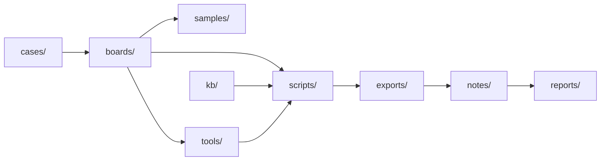

# ReverseLab AI Usage Guide

## 0. 环境快照协议（每次会话开始先执行）

按 [AGENTS.md「环境快照协议」](AGENTS.md) 路由：检查
`~/.open-reverselab/env/env.md`（Windows: `%USERPROFILE%\.open-reverselab\env\env.md`）。
存在且 `protocol_version` 匹配、`probe_time` 距今 ≤ 7 天 → 读取全文后继续；
不存在 / 过期 / 版本不符 → 按 AGENTS.md 探测流程用你的工具探测本机环境并生成
env.md 后再继续。env.md 是本机级快照、跨项目共享，只写本机路径，禁止写入或提交到仓库。

这是给 AI/Agent 的全局操作入口。任何任务先判断所属板块，再沿 board、case、tools、kb、reports 的链路推进；不要只在当前目录里孤立工作。

## 1. 任务路由

| 任务类型 | 主入口 | 工具入口 | 知识/模板 |
|---|---|---|---|
| Web / Website CTF / CVE 链 | `boards/ctf-website/README.md` | `tools/ctf-website/` | `kb/ctf-website/README.md` |
| Android / APK / DEX / Frida | `boards/android/README.md` | `tools/android/` | `templates/notes/android-apk-analysis.md` |
| Windows / PE / crackme / malware triage | `boards/windows/README.md` | `tools/windows/`, `tools/common/` | `templates/notes/windows-pe-analysis.md` |
| General / crypto / protocol / firmware / IoT / radio / AI | `boards/general/README.md` | `tools/general/` | `kb/general/README.md` |
| MCP / skills / lab health / automation | `boards/misc/README.md` | `tools/skills/README.md` | `reports/misc/`, `scripts/misc/` |
| 跨板块综合案件 | `cases/README.md` | 链接各板块 tools/scripts | `templates/cases/` |

## 2. AI 默认工作流

1. **识别板块**：Web/Android/Windows/Misc；不确定时从 `boards/README.md` 选择最接近的入口。
2. **生成任务上下文**：运行 `python scripts/misc/ai_context.py "<task>" --save`。
3. **查知识库路由**：对有明确信号的 Web 目标，运行 `python scripts/ctf-website/kb_router.py "<信号>"`。
4. **建立或更新 case**：复杂任务在 `cases/<case>/` 维护轻量索引。
5. **读取本地说明**：先看目标目录的 `README.md` / `AI-USAGE.md`。
6. **工具路由**：先运行 `python scripts/misc/ai_tool.py plan "<task>"`，再按 ID 调用工具。
7. **证据落盘**：原始输出进 `exports/<board>/`，笔记进 `notes/<board>/`，最终报告进 `reports/<board>/`。
8. **可回放**：记录关键输入、输出路径、版本和时间。

## 2.1 Claude Code / Codex 长跑模式

本仓库首先是给 Claude Code / Codex 读取的工作文件夹。需要“24 小时不中断 CTF”
时，不要只靠提示词，也不要让单个 workflow 阻塞 24 小时；使用：

```
/loop
  ├─ 单目标: .claude/workflows/ctf-24h-round.js
  └─ 多目标: .claude/workflows/ctf-24h-fleet.js → N × ctf-24h-round
        ↓
      cases/<case>/ai_manifest.json
```

规则：

1. `/loop` 是外层调度器，负责重复调用单轮任务。
2. 单目标用 `/loop /ctf-24h <target> [case]`；多目标用 `/loop /ctf-24h-fleet <targets> [fleet]`。
3. `ctf-24h-round` 每次只做一轮有界动作；`ctf-24h-fleet` 按 batch 并行调度多个 round。
4. 每个 workflow 必须输出 `STATUS: CONTINUE|DONE|EXHAUSTED`。
5. 每个目标的 `ai_manifest.json` 是唯一恢复点；每轮都要写 `autopilot.rounds[]`、`evidence[]`、
   `dead_ends[]` 和 `next_actions[]`。
6. 中断/重启后，Claude Code 或 Codex 先读同一个 manifest，再继续下一轮，不从头开始。
7. 真实 target、请求响应、flag、截图和日志只留在本地 `cases/` / `exports/` / `reports/`，
   不进入公开提交。

无人值守 runner 配置：

```bash
python3 scripts/misc/setup_unattended_ctf_runner.py --overwrite
```

该脚本在本文件夹内生成本地 `.codex/` 配置和 `.claude/settings.local.json`：

- Codex: `approval_policy = "never"`，`sandbox_mode = "danger-full-access"`。
- Claude Code: 本地 settings 允许 Bash、文件读写、搜索和 Web 工具。
- 这些文件是本地运行配置，不作为公开制品提交。

## 2.2 公共仓库边界

不要把私人工作区的 `cases/`、samples、日志、真实目标、凭据、用户目录或个人信息
迁入本仓库。通用发现应去标识化后写入 `kb/`；发布前运行
`python scripts/misc/public_release_check.py`。详细规则见 `PUBLICATION.md`。

## 3. 跨板块联动规则



- Web CTF 发现版本指纹后，联动 CVE 查找和图谱生成。
- Android/Windows 发现加密、壳、混淆后，脚本复现放 `scripts/<area>/`，解包产物放 `samples/unpacked/`。
- 恶意/高风险样本先放隔离目录；分析目标是行为、IOC、检测规则和复现证据。
- exploitdb、payload、PoC 类文件可能触发杀软；默认保存在 lab 目录，记录来源和用途。

## 3.1 迭代模式（Lab → KB → Sync）

当任务目标是"打靶场 → 提取知识 → 同步公开"时，按此闭环推进：

```
打靶 (自动化)     提取增量            写/改制品             同步公开库
─────────  →  ─────────  →  ──────────────────────  →  ───────────
Playwright     判断是否新增      kb/   技术文档        git commit
攻破 Lab        技术点           scripts/ 自动化脚本    git push
截图验收       仅增强有差异的     templates/ 模板       案例不推
              无则不硬改        tools/   工具          制品开源
```

**规则**：
1. **打靶**：浏览器自动化攻破 Lab，截图验收，存 `cases/<date>-<slug>/`。
2. **提取**：判断攻破过程中是否用到制品未覆盖的**新技巧**。没有增量就不硬改。
3. **写制品**：在现有技术文件末尾追加或插入小节；保持原文 H1→编号章节→代码块→攻击链→MCP 映射 的风格。制品可以是技术文档、脚本、模板或工具。
4. **同步**：制品修改同步到 `open-reverseLab`，commit 只包含技术制品变更；`cases/`、samples、凭据 永远不推。
5. **开源边界**：案例细节留在私库；通用化技术写入制品后随 open-reverseLab 开源。

## 4. 完成标准

一个任务不能只说"应该可以"，必须有当前状态证据：

- 文件存在：绝对路径。
- 工具可用：版本输出或 toolcheck 报告。
- 分析结论：对应样本 hash、地址、字符串、请求/响应、日志或截图。
- 漏洞/CVE：指纹证据、CVE 数据、EPSS/KEV、利用链假设和验证结果。
- 交付物：`reports/<area>/` 或 `cases/<case>/` 中可复查。

## 5. 常用自检

```powershell
python scripts/misc/lab_healthcheck.py
python scripts/misc/ai_toolcheck.py
```
