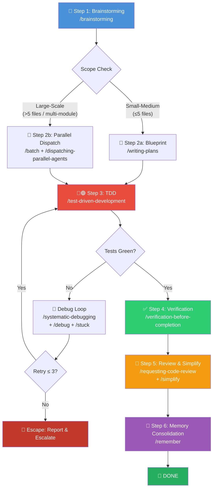

# 🚀 New Feature Development Workflow (新功能开发组合包)

You are executing the **New Feature Development Workflow** bundle — a fully automated, end-to-end skill chain that takes a feature from idea to production-verified, documented code in a single uninterrupted run.

> [!CAUTION]
> **P0 AUTO-PILOT MANDATE**: Do NOT stop and wait for the user between steps **unless explicitly gated** (see Gate Points below). You must stringently execute the entire pipeline automatically and continuously. Achieve the desired effect entirely in one go.

---

## Process Flow Overview (流程总览)



---

## 🔑 Gate Points (用户确认卡口)

These are the **ONLY** moments where you pause for user approval:

| Gate | When | What to Present | Resume Condition |
|------|------|-----------------|------------------|
| **G1** | After Step 1 (Brainstorm) produces a design spec | Spec doc link + closed-form multi-option proposal | User approves or picks an option |
| **G2** | After Step 2 (Blueprint) produces an implementation plan | Plan doc link + execution method choice (Subagent vs Inline) | User approves plan |

> [!IMPORTANT]
> All other transitions are **fully autonomous** — no stopping, no asking, no waiting.

---

## Step 1: 📝 Brainstorming & Intent Clarification (头脑风暴)

**Skill**: `/brainstorming`

**Actions**:
1. Explore current project context — files, `CLAUDE.md`, `docs/短期记忆.md`, recent commits.
2. Ask **one clarifying question at a time** (prefer closed/multiple-choice).
3. Propose **2–3 approaches** with trade-offs and a clear recommendation.
4. Present the design section-by-section; get user approval after each section.
5. Write the validated spec to `docs/superpowers/specs/YYYY-MM-DD-<topic>-design.md`.
6. Run spec self-review (placeholder scan, consistency, ambiguity check).
7. **⏸️ GATE G1**: Present spec to user for final approval.

**Output**: A committed design spec document.

---

## Step 2: 📐 Blueprint & Planning (施工图)

**Route by scale**:

### 2a. Standard Features (≤5 files)
**Skill**: `/writing-plans`

- Generate a bite-sized, TDD-structured implementation plan.
- Every step must include exact file paths, complete code blocks, and expected test output.
- **Zero placeholders** — no "TBD", no "add appropriate handling".
- Save plan to `docs/superpowers/plans/YYYY-MM-DD-<feature-name>.md`.
- **⏸️ GATE G2**: Present plan + offer execution choice (Subagent-Driven vs Inline).

### 2b. Large-Scale Features (>5 files / multi-module)
**Skills**: `/batch` + `/dispatching-parallel-agents`

- Decompose the plan into independent, stateless slices.
- Spin up parallel execution for non-dependent tasks.
- Each slice still follows TDD internally.
- **⏸️ GATE G2**: Present decomposition plan for user approval.

**Output**: Approved implementation plan with execution strategy.

---

## Step 3: 🔴🟢 Test-Driven Development (红绿重构)

**Skill**: `/test-driven-development`

Execute the plan task-by-task using the **Iron Law**:

```
NO PRODUCTION CODE WITHOUT A FAILING TEST FIRST
```

For each task:
1. **RED** — Write one minimal failing test. Run it. **Watch it fail**.
2. **GREEN** — Write the smallest code to make the test pass.
3. **REFACTOR** — Clean up while keeping all tests green.
4. **COMMIT** — Small, atomic commits after each green.

### ⚠️ Debug Branching (异常分支处理)

When tests fail unexpectedly or environment issues arise:

1. **Invoke** `/systematic-debugging` — 4-phase root cause analysis (reproduce → pattern → hypothesis → fix).
2. **If environment-level** — Escalate to `/debug` + `/stuck` for full-stack leak capture.
3. **Retry budget**: Maximum **3 distinct fix attempts** per issue.
4. **If 3 attempts exhausted** →
   > [!WARNING]
   > **ESCAPE HATCH ACTIVATED**: Generate a structured `《排障分析报告》` containing:
   > - Error evidence (logs, stack traces, screenshots)
   > - All 3 attempted strategies and their outcomes
   > - Root-cause hypothesis
   >
   > Suspend the blocked task. Escalate to user via `notify_user`. Continue any unblocked parallel work.

**Blind guessing is STRICTLY PROHIBITED.** Every fix attempt must be backed by a stated hypothesis.

---

## Step 4: ✅ Verification & E2E Validation (全量验证)

**Skill**: `/verification-before-completion`

> [!CAUTION]
> **Subjectively declaring completion is ABSOLUTELY FORBIDDEN.** You must present hard, objective evidence.

**Actions**:
1. Run the **full test suite** — capture stdout, confirm `0 failures`, `exit 0`.
2. Run **linter/type checker** — confirm `0 errors`.
3. Run **build** — confirm successful compilation.
4. *(If applicable)* For browser-facing features, invoke `/claude-in-chrome` for E2E UI/crawler validation.
5. **Line-by-line requirement checklist** — re-read the original spec/plan and verify each requirement has been met with test evidence.

**Evidence format**:
```
✅ Unit Tests:    47/47 pass  (npm test — exit 0)
✅ Lint:          0 errors    (npm run lint — exit 0)
✅ Build:         Success     (npm run build — exit 0)
✅ Requirements:  8/8 met     (checklist verified)
```

**No "should pass", "probably fixed", or "looks correct".** Only verified output.

---

## Step 5: 🧹 Code Review & Simplification (评审与简化)

**Skills**: `/requesting-code-review` + `/simplify`

### 5a. Code Review
1. Capture the git diff range (`BASE_SHA` → `HEAD_SHA`).
2. Dispatch code-reviewer with the complete diff context.
3. Respond to feedback:
   - **Critical** → Fix immediately
   - **Important** → Fix before proceeding
   - **Minor** → Note for future

### 5b. Code Simplification
Launch a parallel 3-agent review against all changed files:

| Agent | Focus |
|-------|-------|
| **Reuse** | Duplicate utilities, reinvented wheels, existing helpers missed |
| **Quality** | Redundant state, parameter sprawl, copy-paste, leaky abstractions, unnecessary comments |
| **Efficiency** | N+1 patterns, missed concurrency, hot-path bloat, memory leaks |

Fix all valid findings. Skip false positives with a note.

---

## Step 6: 🧠 Memory Consolidation (记忆固化)

**Skill**: `/remember`

**Actions**:
1. Extract all valuable insights from this development session:
   - New architectural decisions
   - Debugging pitfalls encountered
   - Convention changes
   - WIP state if session is interrupted
2. Classify into the 4-tier memory system:

| Destination | Content |
|-------------|---------|
| `CLAUDE.md` | New global conventions, red-line rules, tech stack decisions |
| `docs/短期记忆.md` | WIP breakpoints, immediate next steps for continuation |
| `docs/长期记忆.md` | Epic milestones, roadmap adjustments, architecture evolution |
| `docs/永久记忆.md` | Deep debugging lessons, root-cause analyses, refactoring wins |

3. Present the proposal report with `[CORE1]`, `[SHORT1]`, `[LONG1]`, `[PERM1]` action IDs.
4. Apply approved changes (auto-create missing files/directories).

---

## 🔥 Hard Rules (铁律)

1. **Full Pipeline Execution**: All 6 steps must be executed. None can be skipped, reordered, or abbreviated.
2. **Evidence Over Claims**: Every completion assertion MUST be backed by captured stdout/stderr showing success.
3. **TDD Is Non-Negotiable**: No production code without a prior failing test. Code written before tests must be **deleted and restarted**.
4. **Anti-Shirking**: When tests fail, you may NOT blame the existing codebase without proving it via a clean-sandbox baseline run.
5. **Long-Running Resilience**: For tasks >2 minutes, build active polling loops. Report progress at intervals. Never abandon background processes.
6. **Escape Hatch**: 3 failed fix attempts on the same issue → structured report + user escalation. No infinite loops.
7. **Skill Invocation is Mandatory**: You must actually invoke the named skills (e.g., `/brainstorming`, `/writing-plans`), not just "follow the spirit" ad-hoc. The skills contain critical process logic, anti-patterns, and checklists that ad-hoc execution will miss.
