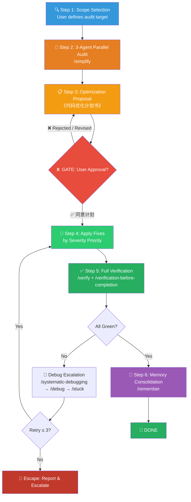

# 🏥 Quality Check Workflow (代码质量审查组合包)

You are executing the **Quality Check Workflow** bundle — a rigorous two-phase process that audits code health, generates an evidence-based optimization proposal for user approval, then autonomously applies all fixes with full verification.

> [!CAUTION]
> **TWO-PHASE GATE MODEL**: This workflow has a **hard stop** between Phase 1 and Phase 2.
> - **Phase 1** (Audit & Propose) → You MUST stop and present the plan. **Zero code modifications allowed.**
> - **Phase 2** (Execute & Verify) → Triggered **ONLY** when the user explicitly approves. Then run to completion autonomously.

---

## Process Flow Overview (流程总览)



---

## 🔑 Gate Points (用户确认卡口)

| Gate | When | What to Present | Resume Condition |
|------|------|-----------------|------------------|
| **G1** | After Step 3 (Optimization Proposal) | 完整的《代码优化计划书》with 7-dimension analysis + severity-ranked finding list | User replies "同意计划" or provides revision feedback |

> [!IMPORTANT]
> G1 is the **ONLY** gate. Before G1: no code changes. After G1: fully autonomous execution until completion.

---

## Phase 1: Audit & Propose (审计与提案)

### Step 1: 🔍 Scope Selection (审计范围确认)

Before auditing, establish the target scope:

1. **If user specifies targets** → Use those exact files/directories/modules.
2. **If user says "全量检测"** → Audit the entire project (exclude `node_modules`, `dist`, `.git`).
3. **If ambiguous** → Present a closed-form scope proposal:

```
我建议审计以下范围，请确认或调整：
□ A. 仅最近变更文件 (git diff HEAD~10)
□ B. 指定目录: [src/, lib/, scripts/]
□ C. 全量项目扫描
```

---

### Step 2: 🧹 Three-Agent Parallel Audit (三路并行审查)

**Skill**: `/simplify`

Launch **3 review agents concurrently**, each scanning all files within the audit scope:

| Agent | Focus Area | What It Catches |
|-------|-----------|-----------------|
| **🔁 Reuse** | Code duplication & reinvention | Duplicate utilities, hand-rolled logic where helpers exist, missed shared abstractions |
| **🎯 Quality** | Structural code smells | Redundant state, parameter sprawl, copy-paste variations, leaky abstractions, stringly-typed code, unnecessary nesting, dead comments |
| **⚡ Efficiency** | Performance & resource waste | N+1 queries, missed concurrency, hot-path bloat, unbounded data structures, memory leaks, TOCTOU anti-patterns, overly broad operations |

> [!WARNING]
> **DO NOT apply any fixes in this step.** Collect findings only. All changes happen in Phase 2.

---

### Step 3: 📋 Optimization Proposal (代码优化计划书)

Synthesize all 3 agents' findings into a structured **《代码优化计划书》** containing:

#### 3a. Severity Triage (严重性分级)

Classify every finding using this priority system:

| Severity | Criteria | Action Timeline |
|----------|----------|-----------------|
| 🔴 **CRITICAL** | Crashes, data loss, security vulnerabilities, race conditions | Fix immediately |
| 🟠 **HIGH** | Performance bottlenecks (>2x overhead), broken abstractions, N+1 queries | Fix in this cycle |
| 🟡 **MEDIUM** | Code duplication, parameter sprawl, redundant state, missed utilities | Fix in this cycle |
| 🔵 **LOW** | Style inconsistencies, minor naming issues, unnecessary comments | Fix if time permits |

#### 3b. 7-Dimension Analysis (七维分析)

For each finding (or logical group of related findings), provide:

| # | Dimension | Description |
|---|-----------|-------------|
| 1 | **优化动因** | Why does this need fixing? What is the core underlying problem? |
| 2 | **精确定位** | Exact file paths, function names, line numbers. *The more precise, the better.* |
| 3 | **当前负面影响** | What harm is this causing right now? (Performance? Maintainability? Correctness?) |
| 4 | **预期改进** | What specific improvement will the fix deliver? |
| 5 | **量化预估** | How much improvement? (e.g., "~40% reduction in duplicate code", "eliminates O(n²) loop") |
| 6 | **短期风险** | What could go wrong during the fix? Any regression risk or breaking changes? |
| 7 | **容错与修复难度** | If the fix itself introduces a bug, how hard is it to detect and revert? |

#### 3c. Execution Roadmap (执行路线图)

Group findings into an ordered execution sequence:

```markdown
### 执行批次规划

**Batch 1 (🔴 CRITICAL)** — 必须立即修复
- [C1] <finding description> → <file:line> → <planned fix>
- [C2] ...

**Batch 2 (🟠 HIGH)** — 本轮必修
- [H1] ...

**Batch 3 (🟡 MEDIUM)** — 本轮修复
- [M1] ...

**Batch 4 (🔵 LOW)** — 视时间修复
- [L1] ...
```

#### 3d. Gate Prompt (审批提示)

> [!CAUTION]
> **⏸️ HARD STOP.** Present the complete proposal and prompt:
>
> _"请审阅以上《代码优化计划书》。如果同意全部修复，请回复『同意计划』。如果需要调整范围，请指出需要修改的条目编号（如 '跳过 L1, L3'）。我将按批次优先级开始执行修复并完成全量验证。"_

Wait for explicit user approval. Do NOT proceed until received.

---

## Phase 2: Automated Execution (自动化执行)

> **Trigger**: User replies "同意计划" (or variant approval).

### Step 4: 🔧 Apply Targeted Fixes (按批次修复)

Execute fixes in **severity order** (Critical → High → Medium → Low):

1. **Per-batch workflow**:
   - Apply all fixes in the current severity batch.
   - Run targeted tests covering the modified code.
   - Commit with descriptive message: `fix(quality): [C1] <brief description>`.
   - Proceed to next batch only after current batch is green.

2. **Fix principles**:
   - One logical change per commit. Atomic and revertable.
   - Follow existing codebase conventions (do not introduce new patterns unilaterally).
   - If a fix requires >50 lines of change, decompose into sub-steps.

3. **If a fix proves unsafe during execution**:
   - Revert the change immediately (`git checkout -- <file>`).
   - Document the issue in the batch report.
   - Continue with remaining fixes.

---

### Step 5: ✅ Full Verification (全量验证)

**Skills**: `/verify` + `/verification-before-completion`

> [!CAUTION]
> **Subjectively declaring "all clean" is ABSOLUTELY FORBIDDEN.** You must present hard evidence.

**Verification sequence**:

1. **Run full test suite** — capture stdout, confirm `0 failures`.
2. **Run linter** — confirm `0 errors`, `0 warnings` (or document accepted warnings).
3. **Run build** — confirm `exit 0`.
4. **Diff review** — `git diff` to verify only intended changes were made.
5. **Requirement cross-check** — verify each approved proposal item was addressed.

**Evidence output format**:
```
📊 Quality Audit Results
========================
✅ Tests:        62/62 pass     (npm test — exit 0)
✅ Lint:         0 errors       (npm run lint — exit 0)
✅ Build:        Success        (npm run build — exit 0)
✅ Findings:     12/14 fixed    (L1, L3 skipped per user request)

📝 Batch Summary:
  🔴 CRITICAL:  2/2 fixed  ✅
  🟠 HIGH:      4/4 fixed  ✅
  🟡 MEDIUM:    6/6 fixed  ✅
  🔵 LOW:       0/2 fixed  (skipped)
```

### ⚠️ Debug Escalation Ladder (排障升级阶梯)

When verification fails, follow this escalation path:

```
Level 1: /systematic-debugging
         → 4-phase root cause analysis (reproduce → pattern → hypothesis → fix)

Level 2: /debug
         → Full-stack environment trace, deep process inspection

Level 3: /stuck
         → Emergency kill, environment recovery, port/process cleanup
```

**Rules**:
- Maximum **3 retry cycles** per issue across all escalation levels.
- Each retry must use a **distinct approach** (not the same fix twice).
- If 3 retries exhausted:

> [!WARNING]
> **ESCAPE HATCH**: Generate a structured `《排障分析报告》` containing:
> - Error evidence (logs, stack traces)
> - All 3 attempted strategies and their outcomes
> - Root-cause hypothesis
> - Recommendation (revert? architectural change? user investigation?)
>
> Suspend the blocked item. Escalate to user. Continue fixing unblocked items.

---

### Step 6: 🧠 Memory Consolidation (记忆固化)

**Skills**: `/remember` + `/writing-skills`

1. **Extract all insights** from this quality audit session:
   - Architecture faults discovered
   - Recurring bad patterns (these become future `/simplify` detection rules)
   - Debugging pitfalls encountered
   - Convention changes established

2. **Classify and persist**:

| Destination | What to Write |
|-------------|---------------|
| `CLAUDE.md` | New conventions, red-line rules discovered during audit |
| `docs/短期记忆.md` | WIP if audit was interrupted mid-batch |
| `docs/长期记忆.md` | Systemic architecture concerns for future refactoring |
| `docs/永久记忆.md` | Deep debugging lessons, root-cause analyses |

3. **If patterns are reusable** → Invoke `/writing-skills` to package them as a persistent skill.

---

## 🔥 Hard Rules (铁律)

1. **Phase 1 is Read-Only**: Zero code modifications before user approval. Not even "quick fixes". Not even "obvious" changes.
2. **7-Dimension Analysis is Mandatory**: Every finding in the proposal must be analyzed across all 7 dimensions. No shortcuts.
3. **Severity Triage Before Execution**: Fixes must be applied in severity order. Never skip a CRITICAL to work on a LOW.
4. **Evidence Over Claims**: Every verification assertion must be backed by captured stdout/stderr. No "should be fine now".
5. **Atomic Commits**: One logical fix per commit. Always revertable.
6. **Anti-Shirking**: Test failures after your changes are YOUR responsibility until proven otherwise with baseline evidence.
7. **Escape Hatch**: 3 failed fix attempts on the same issue → structured report + user escalation. No infinite loops.
8. **Complete Pipeline**: All 6 steps must execute. None can be skipped. Phase 1 always precedes Phase 2.
