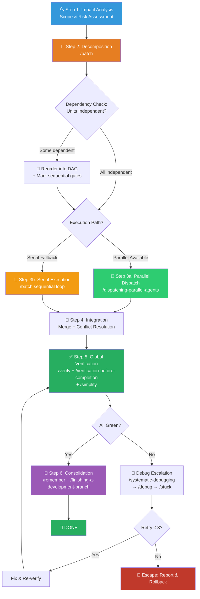
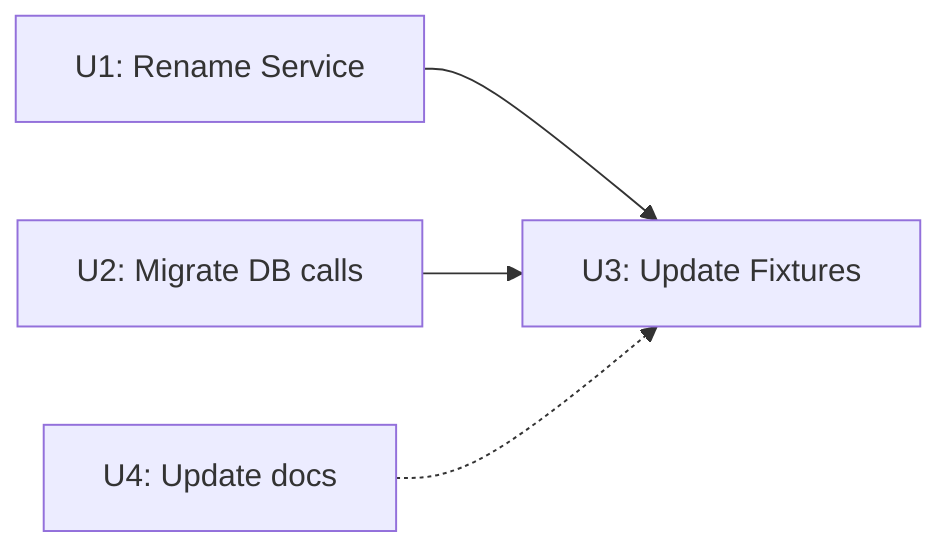

# ⚡ Massive Refactoring Workflow (大规模并行重构组合包)

You are executing the **Massive Refactoring Workflow** bundle — a high-risk, high-throughput pipeline that decomposes large-scale codebase changes into independent work units, executes them via parallel (or serial fallback) agents, and merges with full verification.

> [!CAUTION]
> **DANGER ZONE**: Large-scale refactoring is the riskiest category of code change. Every step in this workflow has built-in safety gates, rollback protocols, and verification checkpoints. **Cutting corners here will cause catastrophic regressions.**

---

## Process Flow Overview (流程总览)



---

## 🔑 Gate Points (用户确认卡口)

| Gate | When | What to Present | Resume Condition |
|------|------|-----------------|------------------|
| **G1** | After Step 2 (Decomposition Plan) | Complete work unit list + risk matrix + execution path recommendation | User approves plan |
| **G2** | After Step 4 (Integration) — *only if conflicts detected* | Conflict resolution proposal with options | User picks resolution strategy |

> [!IMPORTANT]
> G1 is mandatory. G2 is conditional (only on conflicts). All other transitions are fully autonomous.

---

## Step 1: 🔍 Impact Analysis & Risk Assessment (影响分析)

Before decomposing, assess the blast radius:

### 1a. Scope Discovery

1. **Search all affected files** — Use `grep_search` / `find_by_name` to find every file, import, function signature, and call site impacted by the refactor.
2. **Count the damage** — Record:
   - Total files affected
   - Total lines to change
   - Number of modules/packages touched
   - External API surface changes (breaking changes?)

### 1b. Risk Assessment Matrix

Classify the refactoring risk:

| Factor | 🟢 Low | 🟡 Medium | 🔴 High |
|--------|--------|-----------|---------|
| **Files affected** | ≤10 | 11–50 | >50 |
| **Cross-module** | Single module | 2–3 modules | >3 modules |
| **API surface** | Internal only | Shared interfaces | Public API/exports |
| **Test coverage** | Well-tested (>80%) | Partial (40–80%) | Low (<40%) |
| **Reversibility** | Easy revert | Moderate complexity | Hard to undo |

**Risk Score** = Count of 🔴 factors:
- **0–1**: Proceed normally
- **2–3**: Proceed with caution — increase checkpoint frequency
- **4–5**: **MANDATORY user confirmation** with explicit risk acknowledgment before proceeding

### 1c. Safety Checkpoint

Before proceeding, create a **safety bookmark**:
```bash
git stash  # or ensure working tree is clean
git tag refactor-baseline  # mark the pre-refactor state
```

> [!WARNING]
> If no safety bookmark exists, you MUST create one. This is the rollback anchor for the entire operation.

---

## Step 2: 📐 Decomposition & Planning (任务拆解)

**Skill**: `/batch`

### 2a. Work Unit Decomposition

Break the refactor into **5–30 independent, self-contained work units**:

| # | Unit Name | Files | Estimated LOC | Dependencies | Risk |
|---|-----------|-------|---------------|--------------|------|
| U1 | Rename `UserService` → `AccountService` | `src/services/user.ts`, `src/api/routes.ts` | ~40 | None | 🟢 |
| U2 | Migrate `db.query()` → `db.execute()` in auth module | `src/auth/*.ts` | ~25 | None | 🟢 |
| U3 | Update all test fixtures for new naming | `tests/**/*.test.ts` | ~80 | U1, U2 | 🟡 |

**Decomposition rules**:
- Each unit modifies a **disjoint set of files** (no two units touch the same file).
- If two units MUST touch the same file, mark them as **sequential-dependent** and order in the DAG.
- Each unit must include its own targeted test verification.
- No unit should exceed **200 LOC** of changes.

### 2b. Dependency Graph Validation



- **Independent units** (no incoming edges) → Can run in parallel.
- **Dependent units** → Must wait for predecessors to complete.
- **Circular dependencies** → Decomposition is WRONG. Re-decompose.

### 2c. Execution Path Selection

| Condition | Execution Path | Skill |
|-----------|---------------|-------|
| All units independent + tooling supports parallel agents | **Parallel Dispatch** | `/dispatching-parallel-agents` |
| Some dependencies OR no parallel agent support | **Serial Execution** | `/batch` sequential loop |
| Mixed: some independent clusters + some sequential chains | **Hybrid** | Parallel clusters, serial within chains |

**⏸️ GATE G1**: Present the complete decomposition plan (unit table + dependency graph + risk matrix + recommended execution path) to the user for approval.

---

## Step 3: 🚀 Execution (执行)

### Path 3a: Parallel Dispatch (并行分发)

**Skill**: `/dispatching-parallel-agents`

For each independent work unit, dispatch a focused agent:

**Agent prompt template**:
```markdown
## Task: [Unit Name]
**Scope**: Modify ONLY these files: [file list]
**Changes**: [Exact description of mechanical transformation]
**Constraints**:
- DO NOT touch files outside your scope
- DO NOT refactor beyond the specified change
- Run targeted tests after your changes
**Verification**: Run `[test command]` — must be green
**Output**: Return a summary of: (1) what changed, (2) test results, (3) any issues found
```

**Monitoring**:
- Track each agent's status via polling.
- If an agent stalls >5 minutes, check status. If dead, restart or fall back to serial.
- Log each agent's completion to `docs/短期记忆.md` for progress tracking.

### Path 3b: Serial Execution (串行执行)

**Skill**: `/batch` sequential loop

For each unit in dependency order:
1. **Edit** — Apply mechanical changes.
2. **Test** — Run targeted tests for this unit.
3. **Commit** — `git commit -m "refactor(unit-N): <description>"`.
4. **Checkpoint** — Mark unit as `[x]` in task.md.
5. **Context refresh** — If >10 files modified so far, explicitly re-read affected imports to avoid stale context.

> [!TIP]
> If a unit fails tests and the fix isn't obvious within 2 minutes, **skip it**, mark as `[BLOCKED]`, and continue with the next independent unit. Return to blocked units after all others complete.

---

## Step 4: 🔀 Integration & Conflict Resolution (集成)

### 4a. Merge All Changes

If parallel dispatch was used:
1. Collect all agent outputs/commits.
2. Merge into the main refactor branch sequentially.
3. After each merge, run a quick `git diff --check` for conflict markers.

### 4b. Conflict Resolution Protocol

| Conflict Type | Resolution Strategy |
|---------------|-------------------|
| **Trivial** (whitespace, import order) | Auto-resolve using git merge strategy |
| **Mechanical** (both agents renamed the same symbol) | Take the lexically correct version, verify |
| **Semantic** (agents made contradictory logic changes) | **⏸️ GATE G2** — Present both versions to user, ask for decision |

### 4c. Post-Merge Sanity

```bash
# Verify no conflict markers remain
git diff --check
grep -rn "<<<<<<" src/ tests/ || echo "No conflict markers found ✅"
```

---

## Step 5: ✅ Global Verification (全量验证)

**Skills**: `/verify` + `/verification-before-completion` + `/simplify`

> [!CAUTION]
> **Declaring "refactor complete" without full verification is ABSOLUTELY FORBIDDEN.**

### 5a. Test & Build Verification

1. **Full test suite** — `npm test` (or equivalent) — capture stdout, confirm `0 failures`.
2. **Linter** — confirm `0 errors`.
3. **Build** — confirm `exit 0`.
4. **Type checker** — (if applicable) confirm `0 type errors`.

### 5b. Code Quality Sweep

Invoke `/simplify` on the entire refactor diff to catch:
- New duplication introduced by mechanical changes
- Missed rename sites (old name still referenced)
- Over-engineering or unnecessary abstractions

### 5c. Diff Audit

```bash
# Verify only intended changes exist
git diff refactor-baseline..HEAD --stat
```

Review the stat output. Any unexpected files → investigate immediately.

### 5d. Evidence Output

```
📊 Refactoring Verification
=============================
✅ Tests:      124/124 pass  (npm test — exit 0)
✅ Lint:        0 errors     (npm run lint — exit 0)
✅ Build:       Success      (npm run build — exit 0)
✅ Types:       0 errors     (npx tsc --noEmit — exit 0)
✅ Conflicts:   0 markers    (grep check — clean)
✅ Units:       12/12 complete

📝 Diff Summary:
  Files changed:  34
  Insertions:     +287
  Deletions:      -312
  Net:            -25 lines (cleaner!)
```

### ⚠️ Debug Escalation Ladder (排障升级阶梯)

When verification fails after integration:

```
Level 1: /systematic-debugging
         → Identify which unit's changes caused the regression
         → git bisect between unit commits to isolate

Level 2: /debug
         → Deep process-level trace if runtime environment is broken

Level 3: /stuck
         → Emergency recovery if system is hung/deadlocked
```

**Retry budget**: Maximum **3 attempts** per issue.

> [!WARNING]
> **ESCAPE HATCH**: If 3 attempts exhausted:
> 1. Generate `《排障分析报告》` with all evidence.
> 2. **Rollback** the failing unit(s): `git revert <unit-commit>`.
> 3. Re-run verification on the remaining changes.
> 4. Escalate to user with the report + partial success summary.
>
> **A partial successful refactor is better than a broken codebase.**

---

## Step 6: 🧠 Consolidation & Closure (固化与收尾)

**Skills**: `/remember` + `/finishing-a-development-branch`

### 6a. Memory Consolidation

| Destination | What to Write |
|-------------|---------------|
| `CLAUDE.md` | New architecture shapes, naming conventions established, patterns deprecated |
| `docs/短期记忆.md` | Any `[BLOCKED]` units that need follow-up |
| `docs/长期记忆.md` | Architecture evolution notes, module boundary changes |
| `docs/永久记忆.md` | Refactoring lessons learned, gotchas encountered, rollback experiences |

### 6b. Branch Closure

Invoke `/finishing-a-development-branch`:
1. Verify final green state.
2. Remove the safety tag if refactor is fully successful: `git tag -d refactor-baseline`.
3. Prepare for merge/PR (summarize changes for commit message).
4. Clean up any worktrees created by parallel agents.

---

## 🔥 Hard Rules (铁律)

1. **Safety Bookmark First**: NEVER start a refactor without `git tag refactor-baseline`. This is the rollback anchor.
2. **Disjoint File Sets**: No two parallel work units may touch the same file. If unavoidable, they MUST be sequenced.
3. **≤200 LOC Per Unit**: Any unit exceeding 200 lines of change must be re-decomposed.
4. **Test After Every Unit**: Each unit must pass its targeted tests before being marked complete. No batching "test later".
5. **Evidence Over Claims**: Verification must show captured stdout. No "should be fine".
6. **Rollback Over Breakage**: If a unit's fix cannot be resolved in 3 attempts, **revert it** and proceed with remaining units. A 90% successful refactor beats a 100% broken codebase.
7. **Anti-Shirking**: Test failures after your changes are YOUR responsibility until proven otherwise with baseline evidence.
8. **No Scope Creep**: Do NOT "improve" code beyond the specified refactoring scope. No "while I'm here" changes. Save them for a separate `/a3-quality` run.
9. **Full Pipeline**: All 6 steps must execute. None can be skipped or reordered.
