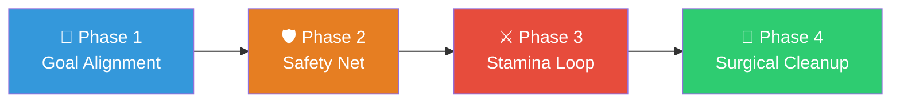

# Agent Coding — High-Leverage Autonomous Execution

> "Don't tell it what to do, give it success criteria and watch it go. This is where most of the 'feel the AGI' magic is to be found."

This is the ultimate autonomous coding pipeline. It replaces passive "take orders → execute → ask what's next" with an aggressive goal-driven loop where the agent defines verifiable success criteria and relentlessly works toward them.

**Behavioral Foundation**: This skill runs entirely on top of the [four-principles](file:///C:/Users/%E9%99%88/.claude/skills/00-four-principles/SKILL.md) substrate. Every phase below is constrained by Think Before Coding, Simplicity First, Surgical Changes, and Goal-Driven Execution.

---

## Trigger

```
/a5-agent-coding <high-level intent> <success criteria>
```

Example:
```
/a5-agent-coding improve list loading performance — success: benchmark script runs under 500ms, all tests green
```

---

## The Four Phases



---

### Phase 1: Goal Alignment & Pushback
*Activates: Principle 1 (Think Before Coding) · Skills: `/brainstorming`*

Before writing any code, establish what "done" actually means.

**Actions**:

1. **Challenge the request** — Don't blindly accept. Is there a lower-cost alternative? A simpler framing? If so, push back.
2. **Transform imperatives into verifiable goals** — Convert "add X" into testable assertions, measurable benchmarks, or concrete output expectations.
3. **Print a Verification Checklist** — State explicitly: "This task is complete when all of these are green."

**Verification Checklist Format**:
```
Verification Checklist:
□ [Specific test or assertion #1]
□ [Specific test or assertion #2]  
□ [Measurable criteria if applicable]
□ No regressions in existing test suite
```

**Anti-patterns in this phase**:
- Accepting vague success criteria ("make it better") without negotiating concrete ones
- Skipping pushback on overengineered requests
- Starting to code before the checklist is defined

---

### Phase 2: Building the Safety Net
*Activates: Principle 4 (Goal-Driven Execution) · Skills: `/test-driven-development`, `/verify`*

Write the verification infrastructure **before** touching any production code.

**Actions**:

1. **Write failing tests** that encode the success criteria from Phase 1.
2. **Run them** — confirm they fail for the expected reason (RED). A test that passes immediately is useless — it's testing existing behavior, not your new work.
3. **For browser/UI work**: create acceptance scripts or browser-based assertions that verify the target behavior.

**Phase gate**: All tests must be RED (failing for the right reason) before proceeding to Phase 3.

**Anti-patterns in this phase**:
- Writing tests that pass immediately
- Writing tests after implementation
- Skipping the RED verification step

---

### Phase 3: Naive Implementation & Stamina Loop
*Activates: Principle 2 (Simplicity First) · Skills: `/debug`, `/systematic-debugging`, `/stuck`*

Write the simplest, most direct code that makes the tests pass. Then loop until everything is green.

**Actions**:

1. **Start naive** — Write the ugliest, most straightforward solution that could possibly work. Correctness first, elegance never (at this stage).
2. **Run tests** — Check if they pass.
3. **If RED: diagnose and fix** — Use `/systematic-debugging` for complex failures. Use `/debug` for deep system-level issues. Use `/stuck` if completely blocked.
4. **Loop** — Repeat steps 2-3 until all tests are GREEN. Do not stop. Do not ask for help prematurely. Agents have stamina — use it.

**Stamina commitment**: The agent will work independently for as long as needed (20–30+ minutes of autonomous problem-solving) before escalating. This is the core leverage mechanic — the agent's willingness to relentlessly iterate where a human would context-switch.

**Iron rules during this phase**:
- Ban all thoughts of "this could be useful later" — only code that makes a test green
- No premature optimization
- No abstractions — flatten everything
- If a test is green, move to the next one. Don't gold-plate.
- **Regression guard**: Before each fix attempt, snapshot which tests are currently GREEN. If your fix causes a previously-GREEN test to go RED, immediately revert. A fix that breaks existing passing tests is not a fix — it's regression.
- **Convergence stop**: If you've attempted 3 distinct approaches on the same failing test and none succeeded without causing regressions, STOP. Document the 3 attempts and escalate via `/stuck`. "Doing nothing" is a valid outcome — shipping broken code is not.

**Anti-patterns in this phase**:
- Over-engineering the first implementation
- Giving up after one failed attempt
- Adding code not demanded by a failing test
- Optimizing before all tests pass

---

### Phase 4: Surgical Cleanup
*Activates: Principle 2 (Simplicity First) + Principle 3 (Surgical Changes) · Skills: `/simplify`*

After all tests are GREEN, clean up the mess you made in Phase 3.

**Actions**:

1. **Remove debug artifacts** — Delete all `console.log`, `print()`, temporary comments, and debugging scaffolding.
2. **Simplify** — If 100 lines of trial-and-error code can be expressed in 20 lines now that you understand the solution, rewrite it.
3. **Clean up orphans** — Remove imports, variables, and functions that YOUR changes made unused.
4. **Re-run all tests** — Confirm everything is still GREEN after cleanup.

**Surgical isolation**: Only clean up mess YOU created. Do not "improve" surrounding code. Do not refactor pre-existing patterns. Do not introduce new architectural opinions.

**Anti-patterns in this phase**:
- Leaving debug prints in production code
- "Improving" adjacent code while cleaning up
- Skipping the final test run after cleanup
- Removing pre-existing dead code (report it instead)

---

## Skill Orchestration Map

This skill acts as an **orchestrator** that dispatches to specialized skills at each phase:

```
Phase 1 (Goals)    → /brainstorming (if requirements need exploration)
Phase 2 (Tests)    → /test-driven-development (RED cycle)
                   → /verify (baseline check)
Phase 3 (Build)    → /systematic-debugging (when tests fail)
                   → /debug (deep system-level issues)
                   → /stuck (complete blockage)
Phase 4 (Cleanup)  → /simplify (code smell removal)
                   → /verify (final green confirmation)

Large-scale work   → /a4-refactor (if cleanup reveals massive restructuring needs)
                   → /batch (if task decomposes into independent parallel units)
```

---

## Leverage Mechanics

The key insight: **strong success criteria = high agent autonomy**. The quality of the success criteria directly determines how long the agent can work independently.

| Success Criteria Quality | Agent Autonomy | Example |
|---|---|---|
| 🔴 Weak | Low — needs constant clarification | "Make the API better" |
| 🟡 Medium | Moderate — can work but may drift | "Add caching to the API" |
| 🟢 Strong | High — can loop for 30+ minutes | "Response time < 200ms on benchmark, all 47 tests green" |

**How to write strong criteria**:
- Express as tests that either pass or fail
- Include measurable thresholds (time, size, count)
- Include regression constraint ("existing tests must stay green")
- Avoid subjective language ("clean", "good", "better")

---

## Anti-Pattern Summary

| Anti-Pattern | Phase | Fix |
|---|---|---|
| Vague success criteria | 1 | Negotiate concrete, testable goals |
| Tests written after code | 2 | Delete code, write test first, re-implement |
| Overengineered first pass | 3 | Start ugly and naive — correctness only |
| Premature surrender | 3 | Use stamina — loop, debug, retry |
| Scope inflation during cleanup | 4 | Surgical constraint — only clean your own mess |
| No final verification | 4 | Run full suite, capture evidence |
| Regression cascade | 3 | Fix breaks passing tests — revert immediately, try different approach |
| Infinite retry same approach | 3 | 3 distinct attempts failed → escalate via /stuck, don't retry same strategy |

---

## Hard Rules

1. **Four Principles Always Active**: Every action in every phase is constrained by Think Before Coding, Simplicity First, Surgical Changes, and Goal-Driven Execution.
2. **No Code Before Criteria**: Phase 1 must produce a Verification Checklist before any implementation begins.
3. **No Code Before Tests**: Phase 2 must produce failing tests before Phase 3 implementation starts.
4. **Naive First**: Phase 3 implementation must be the simplest possible approach. Optimize only after GREEN.
5. **Stamina Over Surrender**: Do not escalate to the user until genuine blockage. Independent problem-solving for 20+ minutes is expected behavior.
6. **Surgical Cleanup Only**: Phase 4 touches only code created during Phase 3. Pre-existing patterns are off-limits.
7. **Evidence Required**: Completion claims must include captured test output showing GREEN status. "Should work" is never acceptable.
