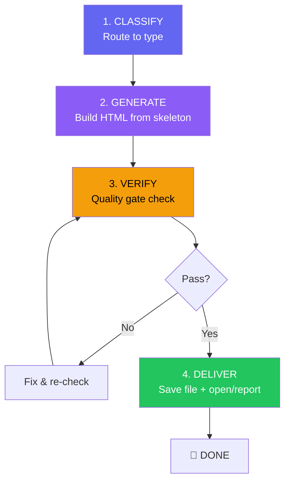

# 🖥️ HTML Visualize — Artifact Compiler (HTML 直观演示)

> `html-visualize` is an **artifact compiler**: it compiles user intent into readable, scannable, interactive, exportable single-file HTML.
> It does NOT pursue freestyle frontend creation. It pursues **stable routing, reusable design system, verifiable interactions, and reversible output**.

> [!CAUTION]
> **NOT "everything in HTML"**: This skill triggers on explicit user request OR when the content clearly demands visual richness. Plain explanations, short answers, and code snippets stay as text/markdown. Do not turn every response into an HTML page.

**Design Philosophy** (from Karpathy + Thariq + Elliot Chen):
- **Karpathy**: ~1/3 of the brain is a massively parallel visual processor. Vision is the 10-lane superhighway of information into the brain. HTML sits at the sweet spot of the output format evolution: `raw text → markdown → HTML → neural simulation`.
- **Thariq**: HTML's advantage is information density, visual clarity, ease of sharing, and two-way interaction. The trick is knowing *what* the artifact should do, not mechanically outputting HTML.
- **Elliot Chen**: HTML is the engineering local optimum — rich enough, cheap enough, standard enough, reversible enough. It will stay for 3-5 years because `git diff`, `review`, `save`, `edit` all work.

**Behavioral Foundation**: This skill executes on top of the `a1-four-principles` substrate.

---

## ⚡ Trigger Rules (触发规则)

**Explicit triggers** (always activate):
- `/html`, `/visualize`
- "生成 HTML", "做个可视化", "HTML 报告", "做个交互演示", "做个演示页面"

**Contextual triggers** (activate when content demands it):
- Output requires diagrams, architecture charts, or data flow visualization
- Output requires comparison matrices, side-by-side layouts, or A/B options
- Output requires UI mockups, component demos, or design explorations
- Output requires interactive controls (sliders, knobs, toggles) for parameter tuning
- Output requires exportable/copyable structured data (JSON, config, prompt)
- Output is a report, plan, or spec intended for sharing beyond the terminal

**Never triggers** (stay in text/markdown):
- Simple Q&A, short explanations, code snippets
- Terminal-only workflows (git commands, file operations)
- Content shorter than ~50 lines of equivalent markdown

---

## 📋 The Pipeline (生成流程)



### Step 1: CLASSIFY — Route to Type (类型路由)

Determine which of the 6 types best fits the user's intent:

| Type | When to Use | Default If Unclear |
|------|------------|-------------------|
| **📄 Document** | Specs, plans, reports, PR writeups, research, explainers, **presentations/decks** | ← **YES, this is the fallback** |
| **📊 Diagram** | Architecture, data flow, process flow, comparison matrices, entity relationships | |
| **🎨 Prototype** | UI mockups, design explorations, component demos, animation prototypes | |
| **📈 Dashboard** | Data panels, metrics overview, KPI reports, status pages | |
| **🎛️ Playground** | Parameter tuning, algorithm visualization, A/B comparison, live preview | |
| **✏️ Editor** | Custom one-time editing tools, drag-sort, structured config editors, prompt tuners | |

**Routing rules**:
- User explicitly names a type → use it
- User doesn't specify → model selects based on content, but MUST declare the choice in the HTML `<meta name="artifact-type">` tag
- If uncertain → default to **Document** (safest, most universal)
- **Presentation / Slideshow** is a layout variant of **Document**, not a separate type. Use `<section class="slide">` within a Document skeleton.

### Step 2: GENERATE — Build the HTML (生成 HTML)

1. **Read the type-specific skeleton** from `templates.md`
2. **Inline the design system CSS** from `design-system.css` into `<style>`
3. **Fill content** into the skeleton structure
4. **Add interactive elements** if the type calls for them (Playground, Editor)
5. **Add export/copy buttons** for any type that produces reusable output

**Iron rules during generation**:
- File MUST be **completely self-contained**. Zero external JS, CSS, CDN fonts, or network requests.
- Font stack: `Inter, ui-sans-serif, system-ui, -apple-system, BlinkMacSystemFont, "Segoe UI", sans-serif` — NO Google Fonts CDN.
- All user-provided text MUST be HTML-escaped. No raw `innerHTML` injection of unsanitized content.
- No `eval()`, `new Function()`, or remote `fetch()` unless user explicitly requests it.
- Copy/export buttons MUST have clipboard fallback (textarea/select method) for `file://` protocol compatibility.
- Buttons and interactive controls MUST be keyboard-accessible.
- Semantic heading hierarchy (`h1` → `h2` → `h3`), proper `<label>` associations.

### Step 3: VERIFY — Quality Gate (质量门禁)

After generating, run this checklist. **ALL items must pass**.

```
□ SELF-CONTAINED: Zero external dependencies (no CDN, no fetch, no external font/script/style)
□ DESIGN SYSTEM: Inline CSS includes full design-system.css content
□ THEME SUPPORT: Both dark and light themes work (CSS variables, prefers-color-scheme)
□ RESPONSIVE: Readable on mobile viewport (min-width 320px)
□ ESCAPE: All user-provided text is HTML-escaped, no innerHTML injection
□ NO EVAL: No eval / new Function / remote fetch (unless explicitly requested)
□ CLIPBOARD FALLBACK: Copy/export buttons work on file:// (textarea fallback, not just navigator.clipboard)
□ ACCESSIBLE: Semantic headings, keyboard-operable buttons, readable color contrast
□ INTERACTIVE: All controls functional (sliders, toggles, tabs, buttons)
□ EXPORT CHAIN: If type has export — copy/export button produces valid output (JSON, Markdown, Prompt, or diff)
□ FILE SIZE: < 500KB
```

### Step 4: DELIVER — Save and Report (交付)

1. Save the HTML file to the workspace (suggested path: `./artifacts/YYYY-MM-DD-<topic>.html` or user-specified location)
2. **If browser tool available**: Open the file in the browser and verify rendering + console errors. Report any issues found.
3. **If browser tool NOT available**: Explicitly state "未做浏览器实测，已完成静态自检" — do NOT claim browser verification without actually doing it.
4. Report to user:

```
✅ HTML Artifact Generated
📄 Type:     [Document | Diagram | Prototype | Dashboard | Playground | Editor]
📁 Path:     ./artifacts/2026-05-12-example.html
📊 Size:     XX KB
🎨 Theme:    Dark (default) + Light (via toggle or prefers-color-scheme)
🔗 Open:     file:///path/to/file.html
🧪 Verified: [浏览器实测通过 | 静态自检通过，未做浏览器实测]
```

---

## 🎨 Design System Overview (设计系统概览)

Full CSS lives in `design-system.css`. Key specs:

| Property | Dark Mode | Light Mode |
|----------|-----------|------------|
| Background | `#0a0b14` | `#f8fafc` |
| Surface | `#13141f` | `#ffffff` |
| Border | `#1e2035` | `#e2e8f0` |
| Text Primary | `#e2e8f0` | `#1e293b` |
| Text Secondary | `#94a3b8` | `#64748b` |
| Accent | `#6366f1` | `#4f46e5` |
| Success | `#22c55e` | `#16a34a` |
| Warning | `#f59e0b` | `#d97706` |
| Danger | `#ef4444` | `#dc2626` |

**Component classes**: `.card`, `.card-grid`, `.tab-container`, `.tab-button`, `.table-container`, `.metric-card`, `.metric-row`, `.code-block`, `.diagram-container`, `.slider-control`, `.toggle-switch`, `.copy-button`, `.export-button`, `.slide` (for presentations), `.tooltip`, `.badge`, `.progress-bar`.

**Theme toggle**: Every generated HTML includes a theme toggle button in the top-right corner. Default follows `prefers-color-scheme`; user can override manually.

> [!TIP]
> **For weak models**: Just use the correct class names from the design system. The CSS handles all visual quality. You do NOT need to write custom CSS.
> **For strong models**: You may extend the design system with custom styles, but the base system MUST be included intact.

---

## 🔗 Integration with Other Skills (与其他技能协作)

| Skill | How html-visualize integrates |
|-------|------------------------------|
| `/brainstorming` | Generate approach comparison pages (side-by-side cards with pros/cons) |
| `/writing-plans` | Output implementation plans as interactive HTML with collapsible sections |
| `/verify` | Generate visual test result dashboards |
| `/requesting-code-review` | Generate annotated diff HTML with inline comments and severity coloring |
| `/remember` | Generate visual timeline of debugging lessons |
| Standalone | Any time user wants richer output than markdown |

This skill is an **output format upgrade** — it does not replace any existing skill's logic, only its presentation layer.

---

## 🔥 Hard Rules (铁律)

1. **Self-Contained or Die**: Every HTML file must work with zero network connectivity (except system fonts). No CDN, no fetch, no external anything.
2. **Design System is Mandatory**: The inline CSS from `design-system.css` must be included in EVERY generated file. No custom-only styling.
3. **Route Before Generate**: Always classify into one of the 6 types before writing HTML. No freestyle.
4. **Clipboard Fallback is Non-Negotiable**: `navigator.clipboard` fails on `file://`. Every copy/export button MUST have a textarea/select fallback.
5. **No Fake Verification**: If you didn't open the file in a browser, say so. "浏览器验证通过" without actually opening it = a lie.
6. **Escape All User Content**: User-provided text inserted into HTML must be escaped. `innerHTML = userText` is forbidden.
7. **Dark + Light**: Both themes must work. Use CSS variables. Default follows `prefers-color-scheme`.
8. **Document is the Default**: When in doubt about type, use Document. It's the safest, most universal type.
9. **Export Closes the Loop**: Playground and Editor types MUST have export/copy functionality. An interactive page without export is a dead end.
10. **Not Everything is HTML**: Simple answers, short explanations, and code snippets stay as text. Don't turn every response into an HTML page.
