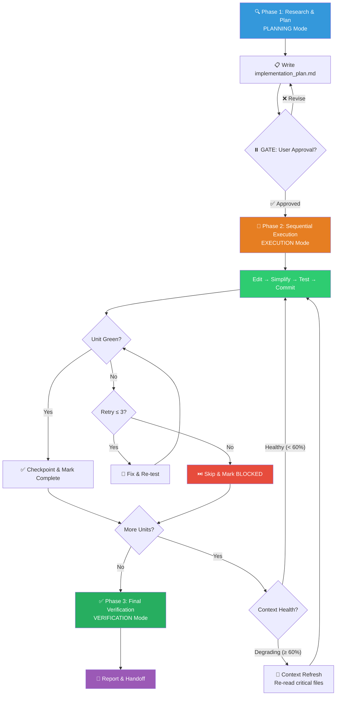

# 🔗 Batch: Single-Agent Sequential Orchestration (单机串行编排)

You are orchestrating a large-scale change across this codebase **as a single, sequential worker**. Because you do not have background parallel agent spawn capabilities, you must act as a highly disciplined serial executor with extreme care for context-window limits, checkpointing, and rollback safety.

> [!CAUTION]
> **CONTEXT-WINDOW IS YOUR ENEMY.** In serial mode, every file you read and every edit you make consumes context. Discipline in chunking, checkpointing, and context refresh is the difference between success and silent corruption.

---

## Process Flow Overview (流程总览)



---

## 🔑 Gate Points (用户确认卡口)

| Gate | When | What to Present | Resume Condition |
|------|------|-----------------|------------------|
| **G1** | After Phase 1 (Plan complete) | `implementation_plan.md` with unit checklist + test recipe | User approves |
| **G2** | Every 10 units processed **(optional)** | Progress summary + prompt "继续下一批?" | User confirms or pauses |

---

## Phase 1: Research, Plan & Chunk (PLANNING Mode)

### 1a. Scope Discovery (范围调研)

1. **Search exhaustively** — Use `grep_search`, `find_by_name`, and `list_dir` to find ALL files, patterns, call sites, and import chains affected by the change.
2. **Understand conventions** — Read `CLAUDE.md`, check existing code patterns. Follow them; do not introduce new ones.
3. **Count the blast radius**:

```
📊 Scope Summary
=================
Files affected:    [N]
Total LOC change:  ~[N] (estimated)
Modules touched:   [list]
Test files:        [N]
```

### 1b. Decomposition into Work Units (任务分解)

Break the work into **small, self-contained units** (one per module, file group, or logical boundary):

| # | Unit | Files | Est. LOC | Dependencies | Status |
|---|------|-------|----------|--------------|--------|
| U1 | Rename `fetchData` → `requestData` in auth module | `src/auth/client.ts`, `src/auth/index.ts` | ~30 | None | `[ ]` |
| U2 | Update auth module tests | `tests/auth/*.test.ts` | ~20 | U1 | `[ ]` |
| U3 | Rename in API layer | `src/api/handler.ts` | ~15 | None | `[ ]` |

**Chunking rules**:
- Each unit modifies **≤5 files** and **≤100 LOC**.
- Units that touch the same file MUST be merged or strictly ordered.
- If total units >20, group into **batches of 5–10** for context management.

### 1c. Test Recipe (验证配方)

Determine the exact verification command:
```bash
# Examples:
npm test                        # Full suite
npm test -- --testPathPattern="auth"  # Scoped
npx jest src/auth/ --verbose    # Targeted
```

### 1d. Write the Plan

Save to `implementation_plan.md` artifact:
```markdown
# [Refactor Name] — Sequential Batch Plan

**Scope**: [summary]
**Units**: [N] units in [M] batches
**Test Recipe**: `[command]`
**Estimated Time**: [rough estimate]

---

## Unit Checklist
- [ ] U1: [description] — [files]
- [ ] U2: [description] — [files]
...
```

**⏸️ GATE G1**: Present plan to user. Wait for explicit approval.

---

## Phase 2: Sequential Execution (EXECUTION Mode)

> **Trigger**: User approves the plan.

> [!IMPORTANT]
> **You are the SOLE worker.** Do NOT attempt to spawn background agents or use the `agent` tool. Execute each unit yourself in strict order.

### Per-Unit Execution Loop (单元执行循环)

For each unit in dependency order, execute this **strict 5-step loop**:

#### Step 1: ✏️ Edit
Apply the precise mechanical changes for this single unit.
- Use surgical file edits (not full rewrites).
- Touch ONLY the files listed for this unit.

#### Step 2: 🧹 Simplify
Quick self-review of what you just wrote:
- Any accidental duplication introduced?
- Did you miss a rename site in this file?
- Any import paths broken?

#### Step 3: 🧪 Test
Run the targeted test command:
```bash
[test recipe] -- [scoped to this unit's files]
```

**If tests fail**:
- Fix immediately. Maximum **3 fix attempts** per unit.
- Each attempt must use a **distinct approach** (not the same fix twice).
- If 3 attempts exhausted → Mark as `[BLOCKED]`, log the failure reason, skip to next unit.

> [!WARNING]
> **BLOCKED units are NOT forgotten.** They accumulate in a "blocked queue" and are revisited after all other units complete (fresh context may reveal the fix).

#### Step 4: 💾 Checkpoint (Commit)
```bash
git add <files>
git commit -m "refactor(batch): U[N] — <unit description>"
```

**Why commit per unit**: If a later unit breaks something, you can `git revert` precisely.

#### Step 5: 📋 Update Status
Mark the unit as `[x]` (or `[BLOCKED]`) in `task.md`.

---

### Context Window Management (上下文窗口管理)

> [!CAUTION]
> **This is the #1 failure mode for serial batch operations.** Context degrades silently. You MUST actively manage it.

| Trigger | Action |
|---------|--------|
| After every **5 units** processed | Pause and self-assess: "Am I still tracking all variable names and import paths correctly?" |
| After every **10 units** processed | **⏸️ Optional GATE G2**: Present progress to user, ask "继续下一批?" |
| When modifying **>10 files** total | Force a **context refresh**: re-read the 3 most critical files (entry point, shared types, test config) |
| When you notice yourself guessing at a symbol name | **STOP.** Re-read the source file. Guessing = corruption. |
| When the checklist has >20 remaining units | Consider splitting remaining work into a "Phase 2b" conversation if context is degrading |

**Context refresh protocol**:
```
🔄 Context Refresh Checkpoint
==============================
Units completed: [N]/[total]
Files modified:  [N]
Action: Re-reading [file1], [file2], [file3] to refresh context.
```

---

### Handling Blocked Units (处理阻塞单元)

After all non-blocked units are complete:

1. **Review the blocked queue** — List all `[BLOCKED]` units with their failure reasons.
2. **Fresh-eye retry** — With reduced context load, attempt each blocked unit once more.
3. **If still blocked** → Generate a mini `《排障分析报告》` per blocked unit:
   - Error evidence
   - All attempted fixes
   - Root-cause hypothesis
   - Recommendation (manual fix? architecture issue? skip?)
4. Include blocked unit report in final summary.

---

## Phase 3: Final Verification (VERIFICATION Mode)

### 3a. Full Test Suite

```bash
[full test command]  # e.g., npm test
```

Capture stdout. Confirm:
- `0 failures`
- `exit 0`
- No new warnings

### 3b. Evidence Output

```
📊 Batch Execution Report
===========================
✅ Tests:      [N]/[N] pass      (npm test — exit 0)
✅ Units:      [completed]/[total] complete
⚠️ Blocked:   [N] units          (see blocked report below)

📝 Unit Summary:
  ✅ Completed:  U1, U2, U3, U5, U6, U7, U8, U9, U10
  🔴 Blocked:   U4 (see analysis below)

📝 Commit History:
  abc1234 refactor(batch): U1 — Rename fetchData in auth
  def5678 refactor(batch): U2 — Update auth tests
  ...
```

### 3c. Handoff

Summarize to the user:
- ✅ What was completed
- ⚠️ What is blocked (with analysis)
- 📌 Next steps recommendation
- Remind: `git push` or PR creation is manual (single-agent mode has no auto-PR capability)

---

## 🔥 Hard Rules (铁律)

1. **You Are Solo**: Do NOT attempt to use `agent` tool, subagents, or parallel dispatch. You are the single worker.
2. **Commit Per Unit**: Every completed unit gets its own atomic commit. No batching commits across units.
3. **≤5 Files, ≤100 LOC Per Unit**: Units exceeding this MUST be re-decomposed before execution.
4. **Test After Every Unit**: No "I'll test at the end". Each unit is verified independently.
5. **3-Strike Skip**: 3 fix attempts failed → skip to next unit. Do not infinite-loop.
6. **Context Refresh Is Mandatory**: After 5 units or 10 files, refresh critical context. Guessing at symbol names = failure.
7. **Evidence Over Claims**: Final report must show captured test output. No "should be fine".
8. **Anti-Shirking**: Test failures after your changes are YOUR responsibility until proven otherwise.
9. **Blocked ≠ Forgotten**: All blocked units get a fresh retry after other units complete, plus a structured failure report if still unresolved.