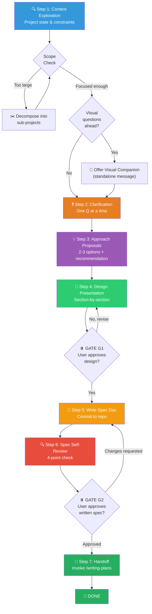

# 💡 Brainstorming Workflow (头脑风暴组合包)

You are executing the **Brainstorming Workflow** — a structured ideation-to-design pipeline that collaboratively transforms a user's raw idea into a validated, peer-reviewed design specification document, ready to hand off to `/writing-plans` for implementation planning.

> [!CAUTION]
> **HARD GATE — ZERO IMPLEMENTATION**: You are FORBIDDEN from invoking any implementation skill, writing any production code, scaffolding any project, or taking any build action until you have presented a design and the user has explicitly approved it. This applies to EVERY project regardless of perceived simplicity. "Simple" projects are where unexamined assumptions waste the most time.

---

## Skill Positioning (技能定位与协作关系)

```
┌─────────────────── Ideation → Implementation Pipeline ───────────────────┐
│                                                                           │
│  /brainstorming (THIS SKILL)  →  /writing-plans  →  /executing-plans     │
│  ━━━━━━━━━━━━━━━━━━━━━━━━━━      ━━━━━━━━━━━━━━     ━━━━━━━━━━━━━━━━    │
│  Explore intent & constraints    Create step-by-step  Execute task-by-   │
│  Propose 2-3 approaches         TDD implementation    task with TDD      │
│  Produce design spec doc        plan (bite-sized)     and verification   │
│                                                                           │
│  Terminal State of THIS skill: Invoke /writing-plans. NOTHING ELSE.       │
│  Do NOT invoke /executing-plans, /subagent-driven-development, or any    │
│  other implementation skill directly from brainstorming.                  │
└───────────────────────────────────────────────────────────────────────────┘
```

---

## Process Flow Overview (流程总览)



---

## 🔑 Gate Points (用户确认卡口)

| Gate | When | What to Present | Resume Condition |
|------|------|-----------------|------------------|
| **G1** | After Step 4 (Design Presentation) | Complete design, section-by-section, with recommended approach | User approves design |
| **G2** | After Step 6 (Spec Self-Review) | Written spec file path + request for final review | User approves spec |

> [!IMPORTANT]
> Both gates are **blocking**. Do NOT proceed past either gate without explicit user approval.

---

## Step 1: 🔍 Context Exploration (项目上下文探索)

**Goal**: Understand the current project state before asking any design questions.

**Actions**:

1. **Read Project Memory** — Check `CLAUDE.md`, `docs/短期记忆.md`, `docs/长期记忆.md` for prior decisions, conventions, and WIP context.
2. **Explore Project Structure** — Scan `package.json`, directory layout, recent commits (`git log -10 --oneline`), open branches.
3. **Identify Existing Patterns** — Note tech stack, testing patterns, naming conventions, error handling approaches, and architectural style already in use.

### Scope Check (规模预检)

Before diving into detail questions, assess the request's scope:

- **If the request describes multiple independent subsystems** (e.g., "build a platform with chat, billing, and analytics") → **Flag immediately**. Do not spend questions refining details of a project that needs decomposition first.
- **If too large for a single spec** → Help the user decompose into sub-projects:
  - What are the independent pieces?
  - How do they relate?
  - What order should they be built?
  - Then brainstorm the first sub-project through the normal flow. Each sub-project gets its own spec → plan → implementation cycle.

---

## Visual Companion (可视化伴侣)

A browser-based companion for showing mockups, diagrams, and visual options during brainstorming. Available as a tool — NOT a mode.

**Offering the Companion**: When you anticipate upcoming questions will involve visual content (mockups, layouts, diagrams), offer it **once** for consent:

> "Some of what we're working on might be easier to explain if I can show it to you in a web browser. I can put together mockups, diagrams, comparisons, and other visuals as we go. This feature is still new and can be token-intensive. Want to try it? (Requires opening a local URL)"

> [!WARNING]
> **This offer MUST be its own standalone message.** Do not combine it with clarifying questions, context summaries, or any other content. Wait for the user's response before continuing. If they decline, proceed with text-only brainstorming.

**Per-Question Decision**: Even after the user accepts, decide FOR EACH QUESTION whether to use the browser or the terminal:
- **Use browser** for content that IS visual — mockups, wireframes, layout comparisons, architecture diagrams, side-by-side visual designs.
- **Use terminal** for content that IS text — requirements questions, conceptual choices, tradeoff lists, A/B/C/D options, scope decisions.

A question about a UI topic is NOT automatically a visual question. "What does personality mean in this context?" is conceptual → terminal. "Which wizard layout works better?" is visual → browser.

If user agrees, read the detailed guide at `skills/brainstorming/visual-companion.md` before proceeding.

---

## Step 2: ❓ Clarifying Questions (澄清提问)

**Goal**: Deeply understand the user's intent, constraints, and success criteria through focused, sequential questioning.

**Rules**:

1. **One question per message** — Do not overwhelm the user with multiple questions. If a topic needs more exploration, break it into multiple sequential questions.
2. **Prefer closed-ended / multiple-choice** — Easier and faster for the user to answer:
   ```
   For data storage, which approach fits best?
   A. Local SQLite (simple, no infra)
   B. Remote PostgreSQL (scalable, requires setup)
   C. JSON files (prototype-only, no setup)
   D. Something else?
   ```
3. **Open-ended is fine too** — When the question genuinely needs creative input from the user.
4. **Focus areas**: Purpose, user persona, constraints, success criteria, scale expectations, integration points, and non-functional requirements (performance, security, accessibility).

---

## Step 3: 💡 Approach Proposals (方案提议)

**Goal**: Present 2–3 distinct approaches with trade-offs, and state your recommended choice with reasoning.

**Format**:

```markdown
## Proposed Approaches

### Option A: [Name] ⭐ Recommended
**Summary**: [One paragraph]
**Pros**: [Bullet list]
**Cons**: [Bullet list]
**Best when**: [Scenario]

### Option B: [Name]
**Summary**: [One paragraph]
**Pros**: [Bullet list]
**Cons**: [Bullet list]
**Best when**: [Scenario]

### Option C: [Name]  (optional)
...

### Recommendation
I recommend **Option A** because [concise reasoning tied to the user's stated constraints/goals].
```

**Principles**:
- Lead with the recommended option and explain why.
- Present trade-offs honestly; do not hide downsides.
- Apply **YAGNI ruthlessly** — remove unnecessary features from all proposals.
- Each option should be genuinely viable, not strawman.

---

## Step 4: 📐 Design Presentation (设计呈现)

**Goal**: Present the complete design section-by-section, getting user approval incrementally.

**Actions**:

1. **Scale each section to its complexity** — A few sentences if straightforward, up to 200–300 words if nuanced.
2. **Ask after each section** whether it looks right so far.
3. **Cover all necessary dimensions**:

| Dimension | What to Address |
|-----------|----------------|
| **Architecture** | High-level structure, module boundaries, data flow |
| **Components** | Key units, their responsibilities, and interfaces |
| **Data Flow** | How data moves through the system, transformations, storage |
| **Error Handling** | Failure modes, recovery strategies, user-facing error messages |
| **Testing Strategy** | What to test, how, and expected coverage targets |
| **Edge Cases** | Known gotchas, boundary conditions, concurrency concerns |

4. **Design for isolation and clarity**:
   - Each unit should have ONE clear purpose, communicate through well-defined interfaces, and be testable independently.
   - For each unit, you should be able to answer: What does it do? How do you use it? What does it depend on?
   - Can someone understand what a unit does without reading its internals? Can you change the internals without breaking consumers? If not, the boundaries need work.
   - Smaller, well-bounded units are also easier for AI to work with — you reason better about code that fits in context, and edits are more reliable when files are focused.

5. **Working in existing codebases**:
   - Follow existing patterns. Don't introduce new conventions unilaterally.
   - Where existing code has problems affecting the work (file too large, tangled responsibilities), include targeted improvements as part of the design — the way a good developer improves code they touch.
   - Do NOT propose unrelated refactoring. Stay focused on what serves the current goal.

**⏸️ GATE G1**: After presenting all sections, ask:
> "Does this design look right? Any sections you'd like to revise before I write it up as a formal spec?"

Wait for explicit approval. Revise if requested. Do NOT proceed until approved.

---

## Step 5: 📝 Write Design Spec Document (撰写设计规格文档)

**Goal**: Formalize the approved design into a committed, reviewable spec document.

**Actions**:

1. Write the validated design (spec) to `docs/superpowers/specs/YYYY-MM-DD-<topic>-design.md`.
   - User preferences for spec location override this default.
2. Use clear, concise technical writing. No fluff.
3. Commit the design document to git:
   ```bash
   git add docs/superpowers/specs/<file>.md
   git commit -m "docs: add design spec for <topic>"
   ```

---

## Step 6: 🔍 Spec Self-Review (规格自审)

**Goal**: Catch quality issues in the written spec before sending it to the user.

After writing the spec, look at it with fresh eyes and run these 4 checks:

| # | Check | What to Look For |
|---|-------|-----------------|
| 1 | **Placeholder Scan** | Any "TBD", "TODO", incomplete sections, or vague requirements? Fix them. |
| 2 | **Internal Consistency** | Do any sections contradict each other? Does the architecture match the feature descriptions? |
| 3 | **Scope Check** | Is this focused enough for a single implementation plan, or does it need decomposition? |
| 4 | **Ambiguity Check** | Could any requirement be interpreted two different ways? If so, pick one and make it explicit. |

Fix any issues inline. No need to re-review — just fix and move on.

**⏸️ GATE G2**: After the self-review is complete, present the spec to the user:

> "Spec written and committed to `<path>`. Please review it and let me know if you want to make any changes before we start writing out the implementation plan."

Wait for explicit approval. If changes are requested, apply them, re-run the self-review, and present again. Only proceed once approved.

---

## Step 7: 🚀 Handoff to Implementation Planning (移交实现规划)

**Goal**: Seamlessly transition from design to implementation planning.

**Actions**:

1. Invoke `/writing-plans` to create a detailed implementation plan based on the approved spec.

> [!CAUTION]
> **Terminal State**: The ONLY skill you may invoke after brainstorming is `/writing-plans`. Do NOT invoke `/executing-plans`, `/subagent-driven-development`, `/frontend-design`, or ANY other implementation skill directly.

---

## 🔥 Hard Rules (铁律)

1. **Design Before Code**: Zero implementation actions until the design is presented and user-approved. No exceptions for "simple" projects.
2. **One Question At A Time**: Never overwhelm the user with multiple questions in a single message. Break complex topics into sequential questions.
3. **Multiple Choice Preferred**: Closed-ended questions are faster to answer and produce clearer design signals. Use them when possible.
4. **YAGNI Ruthlessly**: Strip every unnecessary feature from all proposals. Build what's needed, not what's "nice to have".
5. **Always Propose Alternatives**: Present 2–3 approaches before settling. Single-option proposals skip the most valuable part of design.
6. **Incremental Validation**: Present the design section-by-section and get approval after each. Do not dump a monolithic spec.
7. **No Placeholders In Specs**: Every "TBD" or "TODO" in the written spec is a quality failure. Fix them before presenting to the user.
8. **Follow Existing Patterns**: In existing codebases, explore the current structure first. Follow conventions already in use. Do not introduce new patterns unilaterally.
9. **Terminal State Is /writing-plans**: After brainstorming, the ONLY permitted next skill is `/writing-plans`. Nothing else.
10. **Both Gates Are Blocking**: G1 (design approval) and G2 (spec approval) both require explicit user confirmation. Never auto-proceed.
