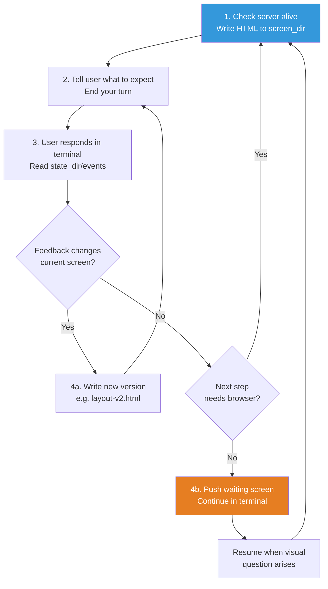

# 🎨 Visual Companion Guide (可视化伴侣指南)

Browser-based visual brainstorming companion for showing mockups, diagrams, and options during design sessions. This is a **tool**, not a mode — decide per-question whether to use the browser or the terminal.

---

## When to Use vs. Terminal (使用判断标准)

The test: **Would the user understand this better by seeing it than reading it?**

| Use Browser ✅ | Use Terminal ✅ |
|---------------|----------------|
| UI mockups — wireframes, layouts, navigation structures, component designs | Requirements and scope questions — "what does X mean?", "which features are in scope?" |
| Architecture diagrams — system components, data flow, relationship maps | Conceptual A/B/C choices — picking between approaches described in words |
| Side-by-side visual comparisons — two layouts, two color schemes, two design directions | Tradeoff lists — pros/cons, comparison tables |
| Design polish — questions about look and feel, spacing, visual hierarchy | Technical decisions — API design, data modeling, architectural approach |
| Spatial relationships — state machines, flowcharts, entity relationships | Clarifying questions — anything where the answer is words, not a visual preference |

> [!IMPORTANT]
> A question *about* a UI topic is not automatically a visual question.
> - "What kind of wizard do you want?" → **Conceptual** → Terminal
> - "Which of these wizard layouts feels right?" → **Visual** → Browser

---

## Starting a Session (启动会话)

```bash
# Start server with persistence (mockups saved to project)
scripts/start-server.sh --project-dir /path/to/project

# Returns: {"type":"server-started","port":52341,"url":"http://localhost:52341",
#           "screen_dir":"/path/to/project/.superpowers/brainstorm/12345-1706000000/content",
#           "state_dir":"/path/to/project/.superpowers/brainstorm/12345-1706000000/state"}
```

Save `screen_dir` and `state_dir` from the response. Tell the user to open the URL.

**Finding connection info:** The server writes startup JSON to `$STATE_DIR/server-info`. If you launched the server in the background and didn't capture stdout, read that file for the URL and port. When using `--project-dir`, check `<project>/.superpowers/brainstorm/` for the session directory.

**Note:** Pass the project root as `--project-dir` so mockups persist in `.superpowers/brainstorm/` and survive server restarts. Without it, files go to `/tmp` and get cleaned up. Remind the user to add `.superpowers/` to `.gitignore` if not already there.

### Platform-Specific Launch (各平台启动方式)

| Platform | Command | Notes |
|----------|---------|-------|
| **Claude Code (macOS/Linux)** | `scripts/start-server.sh --project-dir /path/to/project` | Default mode — script backgrounds the server itself |
| **Claude Code (Windows)** | Same command, but set `run_in_background: true` on Bash tool call | Windows auto-detects and uses foreground mode. Read `$STATE_DIR/server-info` on next turn for URL/port |
| **Codex** | Same command, no extra flags | Codex reaps background processes. Script auto-detects `CODEX_CI` and switches to foreground mode |
| **Gemini CLI** | `scripts/start-server.sh --project-dir /path/to/project --foreground` | Set `is_background: true` on shell tool call for cross-turn survival |
| **Other environments** | Use `--foreground` + your platform's background mechanism | Server must stay running across conversation turns |

If the URL is unreachable from the user's browser (common in remote/containerized setups):

```bash
scripts/start-server.sh \
  --project-dir /path/to/project \
  --host 0.0.0.0 \
  --url-host localhost
```

Use `--url-host` to control the hostname printed in the returned URL JSON.

---

## The Main Loop (主循环)



### Step-by-Step Detail

1. **Check server is alive, then write HTML** to a new file in `screen_dir`:
   - Before each write, check that `$STATE_DIR/server-info` exists. If it doesn't (or `$STATE_DIR/server-stopped` exists), the server has shut down — restart with `start-server.sh`. The server auto-exits after 30 minutes of inactivity.
   - Use semantic filenames: `platform.html`, `visual-style.html`, `layout.html`.
   - **Never reuse filenames** — each screen gets a fresh file.
   - Use the Write tool — **never use cat/heredoc** (dumps noise into terminal).
   - Server automatically serves the newest file.

2. **Tell user what to expect and end your turn**:
   - Remind them of the URL (every step, not just first).
   - Give a brief text summary of what's on screen (e.g., "Showing 3 layout options for the homepage").
   - Ask them to respond in the terminal: "Take a look and let me know what you think. Click to select an option if you'd like."

3. **On your next turn** — after the user responds in the terminal:
   - Read `$STATE_DIR/events` if it exists — contains browser interactions (clicks, selections) as JSON lines.
   - Merge with the user's terminal text to get the full picture.
   - Terminal message is the **primary** feedback; `state_dir/events` provides structured interaction data.

4. **Iterate or advance**:
   - If feedback changes current screen → write a new file (e.g., `layout-v2.html`). Only move to the next question when the current step is validated.
   - If next step doesn't need the browser → push a waiting screen to clear stale content:

   ```html
   <!-- filename: waiting.html (or waiting-2.html, etc.) -->
   <div style="display:flex;align-items:center;justify-content:center;min-height:60vh">
     <p class="subtitle">Continuing in terminal...</p>
   </div>
   ```

   This prevents the user from staring at a resolved choice while the conversation has moved on.

---

## Writing Content Fragments (编写内容片段)

Write just the content that goes inside the page. The server wraps it in the frame template automatically (header, theme CSS, selection indicator, interactive infrastructure).

> [!TIP]
> **Content fragments vs full documents:** If your HTML file starts with `<!DOCTYPE` or `<html>`, the server serves it as-is (just injects the helper script). Otherwise, the server auto-wraps it. **Write content fragments by default.** Only write full documents when you need complete control.

### Minimal Example

```html
<h2>Which layout works better?</h2>
<p class="subtitle">Consider readability and visual hierarchy</p>

<div class="options">
  <div class="option" data-choice="a" onclick="toggleSelect(this)">
    <div class="letter">A</div>
    <div class="content">
      <h3>Single Column</h3>
      <p>Clean, focused reading experience</p>
    </div>
  </div>
  <div class="option" data-choice="b" onclick="toggleSelect(this)">
    <div class="letter">B</div>
    <div class="content">
      <h3>Two Column</h3>
      <p>Sidebar navigation with main content</p>
    </div>
  </div>
</div>
```

No `<html>`, no CSS, no `<script>` tags needed. The server provides all of that.

---

## CSS Classes Reference (可用 CSS 类参考)

The frame template provides these CSS classes for your content:

### Options (A/B/C Choices)

```html
<div class="options">
  <div class="option" data-choice="a" onclick="toggleSelect(this)">
    <div class="letter">A</div>
    <div class="content">
      <h3>Title</h3>
      <p>Description</p>
    </div>
  </div>
</div>
```

**Multi-select:** Add `data-multiselect` to the container for multi-select. Each click toggles the item. Indicator bar shows count.

```html
<div class="options" data-multiselect>
  <!-- same option markup — users can select/deselect multiple -->
</div>
```

### Cards (Visual Designs)

```html
<div class="cards">
  <div class="card" data-choice="design1" onclick="toggleSelect(this)">
    <div class="card-image"><!-- mockup content --></div>
    <div class="card-body">
      <h3>Name</h3>
      <p>Description</p>
    </div>
  </div>
</div>
```

### Mockup Container

```html
<div class="mockup">
  <div class="mockup-header">Preview: Dashboard Layout</div>
  <div class="mockup-body"><!-- your mockup HTML --></div>
</div>
```

### Split View (Side-by-Side)

```html
<div class="split">
  <div class="mockup"><!-- left --></div>
  <div class="mockup"><!-- right --></div>
</div>
```

### Pros/Cons

```html
<div class="pros-cons">
  <div class="pros"><h4>Pros</h4><ul><li>Benefit</li></ul></div>
  <div class="cons"><h4>Cons</h4><ul><li>Drawback</li></ul></div>
</div>
```

### Mock Elements (Wireframe Building Blocks)

```html
<div class="mock-nav">Logo | Home | About | Contact</div>
<div style="display: flex;">
  <div class="mock-sidebar">Navigation</div>
  <div class="mock-content">Main content area</div>
</div>
<button class="mock-button">Action Button</button>
<input class="mock-input" placeholder="Input field">
<div class="placeholder">Placeholder area</div>
```

### Typography and Sections

| Element | Usage |
|---------|-------|
| `h2` | Page title |
| `h3` | Section heading |
| `.subtitle` | Secondary text below title |
| `.section` | Content block with bottom margin |
| `.label` | Small uppercase label text |

---

## Browser Events Format (浏览器事件格式)

When the user clicks options in the browser, interactions are recorded to `$STATE_DIR/events` (one JSON object per line). The file is **cleared automatically** when you push a new screen.

```jsonl
{"type":"click","choice":"a","text":"Option A - Simple Layout","timestamp":1706000101}
{"type":"click","choice":"c","text":"Option C - Complex Grid","timestamp":1706000108}
{"type":"click","choice":"b","text":"Option B - Hybrid","timestamp":1706000115}
```

The full event stream shows the user's exploration path — they may click multiple options before settling. The **last** `choice` event is typically the final selection, but the pattern of clicks can reveal hesitation or preferences worth asking about.

If `$STATE_DIR/events` doesn't exist, the user didn't interact with the browser — use only their terminal text.

---

## Design Tips (设计贴士)

| Principle | Guidance |
|-----------|----------|
| **Scale fidelity** | Wireframes for layout questions, polish for polish questions |
| **Explain the question** | Each page should have a clear prompt: "Which layout feels more professional?" not just "Pick one" |
| **Iterate before advancing** | If feedback changes the current screen, write a new version before moving forward |
| **2–4 options max** | Per screen — more than that overwhelms the user |
| **Use real content** | For a photography portfolio, use actual images (Unsplash). Placeholder content obscures design issues |
| **Keep mockups simple** | Focus on layout and structure, not pixel-perfect design |

---

## File Naming Rules (文件命名规则)

| Rule | Example |
|------|---------|
| Use semantic names | `platform.html`, `visual-style.html`, `layout.html` |
| Never reuse filenames | Each screen must be a new file |
| Append version suffix for iterations | `layout-v2.html`, `layout-v3.html` |
| Server serves newest file by modification time | No manual ordering needed |

---

## Cleaning Up (清理)

```bash
scripts/stop-server.sh $SESSION_DIR
```

If the session used `--project-dir`, mockup files persist in `.superpowers/brainstorm/` for later reference. Only `/tmp` sessions get deleted on stop.

---

## Reference (参考)

| File | Purpose |
|------|---------|
| `scripts/frame-template.html` | Frame template (CSS reference) |
| `scripts/helper.js` | Helper script (client-side) |
