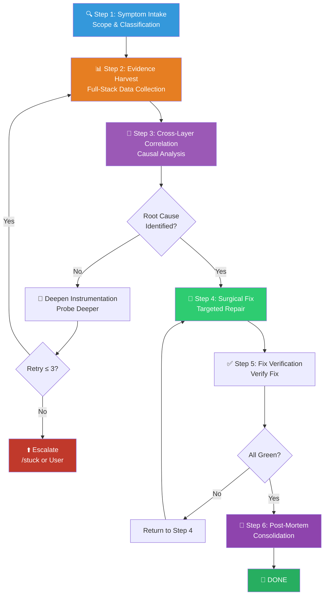

# 🔬 Deep Debug Workflow (深层排障调试组合包)

You are executing the **Deep Debug Workflow** — a structured, evidence-first diagnostic pipeline for hunting down complex crashes, environment-level failures, resource leaks, and infrastructure-layer errors that resist conventional debugging.

> [!CAUTION]
> **ZERO-GUESS MANDATE**: You are FORBIDDEN from proposing ANY fix before completing Phase 1 (Evidence Collection). Every hypothetical cause statement must cite a specific log line, stack frame, metric reading, or reproduction step. Guessing is a terminal failure mode.

---

## Skill Positioning (技能定位与协作关系)

```
┌──────────────────────────── Debugging Skill Ecosystem ────────────────────────────┐
│                                                                                    │
│  /systematic-debugging          /debug (THIS SKILL)        /stuck                  │
│  ━━━━━━━━━━━━━━━━━━━━          ━━━━━━━━━━━━━━━           ━━━━━━                   │
│  App-level logic bugs          Low-level & Infra           Completely frozen/hung   │
│  Test failure root cause       Process-level & resource    Emergency escape         │
│  4-phase scientific method     Full-stack log analysis     Process kill & port free │
│                                                                                    │
│  ← Logic Layer ────────────── Infra Layer ─────────────── Emergency Layer →       │
│                                                                                    │
│  Escalation Path: /systematic-debugging ──→ /debug ──→ /stuck                      │
└────────────────────────────────────────────────────────────────────────────────────┘
```

**When to use this skill instead of others**:
- The error originates not from app logic, but from the runtime environment, dependency services, or system resources → **/debug**
- Infrastructure-level symptoms occur (e.g., zombie processes, port conflicts, resource exhaustion) → **/debug**
- The 4-phase analysis of `/systematic-debugging` is completed but still cannot locate the issue → escalate to **/debug**
- The system is completely unresponsive or the process is frozen and inoperable → escalate directly to **/stuck**

---

## Process Flow Overview (流程总览)



---

## Phase 1: Evidence Collection (证据收集 — 只读阶段)

> [!IMPORTANT]
> Phase 1 is strictly **read-only**. You are FORBIDDEN from making code modifications, configuration changes, or process adjustments. Actions are limited solely to observation and recording.

### Step 1: 🔍 Symptom Intake & Classification (症状采集与分类)

Before gathering evidence, establish the failure traits:

**Actions**:

1. **Collect user symptom description**:
   - If the user has described the problem → extract structurally.
   - If the user only said `/debug` → proactively ask (prefer closed-ended multiple choice):
     ```
     Please select the most accurate symptom type:
     A. Crash/Abnormal Exit (with error messages)
     B. Hang/Unresponsive (no errors but stuck)
     C. Misbehavior (runs but produces incorrect results)
     D. Performance (too slow/memory spike/CPU 100%)
     E. Environment (dependency fail/port in use/permission error)
     F. Other (please describe)
     ```

2. **Create Failure Trait Card**:

   ```markdown
   ## 🏷️ Failure Trait Card
   - **Symptom Type**: [Crash | Hang | Misbehavior | Performance | Environment]
   - **First Occurrence**: [Time/Condition]
   - **Reproducibility**: [Always | Sometimes | Once | Unknown]
   - **Blast Radius**: [Single Process | Multi-Service | System-Wide]
   - **User Tried**: [Troubleshooting steps already taken]
   - **Correlated Changes**: [Recent code/config/environment changes]
   ```

3. **Select Diagnostic Strategy by Type** (auto-route, do not ask user):

| Symptom Type | Primary Focus | Primary Tools |
|---------|----------|---------|
| **Crash** | Stack trace + Error logs + Core dump | Log search + Dependency check |
| **Hang** | Process state + Threads/Locks + I/O wait | Process tree + Port/Resource check |
| **Misbehavior** | Data flow tracing + State diff | Escalate to `/systematic-debugging` |
| **Performance** | Resource monitoring + Hotspot analysis | CPU/Memory profiling |
| **Environment** | Dependency versions + Permissions + Paths | Env var scan + Dependency tree |

---

### Step 2: 📊 Evidence Harvest (全栈证据收割)

Collect diagnostic data from multiple dimensions without interfering with the system.

Based on the failure type, you **MUST execute** applicable evidence collection modules:

#### 2a. Logs and Error Capture

```powershell
# Search for error keywords in project logs
Get-ChildItem -Recurse -Include *.log,*.txt | Select-String -Pattern "ERROR|FATAL|Exception|Traceback|WARN" -Context 3,3

# Most recently modified log files
Get-ChildItem -Recurse -Include *.log | Sort-Object LastWriteTime -Descending | Select-Object -First 5
```

- Read all available error logs (app logs, system logs, build logs).
- Extract the full stack trace (do NOT truncate! Copy every frame perfectly).
- Note error codes / exit codes / signals.

#### 2b. Process and Resource State

```powershell
# Windows Process Diagnostics
Get-Process | Where-Object { $_.CPU -gt 60 -or $_.WorkingSet64 -gt 1GB } | Format-Table Name,Id,CPU,WorkingSet64,StartTime

# Port Occupancy
netstat -ano | findstr "LISTENING"

# Specific Port Check
netstat -ano | findstr ":3000 :8080 :5173 :9229"
```

- Identify high CPU / high memory processes.
- Check for port conflicts.
- Check for zombie/orphan processes.

#### 2c. Dependencies and Environment

```powershell
# Node.js Environment
node --version; npm --version
npm ls --depth=0 2>&1

# Python Environment
python --version
pip list 2>&1

# Environment Variable Scan (Sanitized)
Get-ChildItem Env: | Where-Object { $_.Name -match "PATH|NODE|PYTHON|PORT|HOME|TEMP" }
```

- Check if runtime versions match.
- Verify dependency tree integrity.
- Ensure critical environment variables are correctly set.

#### 2d. File System and Permissions

```powershell
# Disk Space
Get-PSDrive -PSProvider FileSystem | Format-Table Name,Used,Free

# Temp file accumulation check
(Get-ChildItem $env:TEMP -Recurse -ErrorAction SilentlyContinue | Measure-Object).Count

# Critical Directory Permissions
Get-Acl "." | Format-List
```

#### 2e. Configuration Review

- Project configuration files (`package.json`, `tsconfig.json`, `.env`, `vite.config.*`, etc.).
- Project-level memories (`CLAUDE.md`, `docs/短期记忆.md`).
- Git state (`git status`, `git log -5 --oneline`, `git diff --stat`).

> [!WARNING]
> **Evidence Preservation Principle**: All raw diagnostic data must be completely recorded. Subjective filtering or summary dismissal is forbidden. If log volume is massive, record line ranges and key excerpts, while noting the full file path for backtracking.

---

### Step 3: 🧬 Cross-Layer Correlation Analysis (跨层关联分析)

Stitch scattered evidence into a causal chain to pinpoint the Root Cause of the failure.

**Analytical Methods**:

1. **Timeline Reconstruction** — Arrange all events and log entries chronologically:
   ```
   T-5min: User executes npm run dev
   T-4min: vite starts successfully, port 5173
   T-3min: HMR connection established
   T-2min: User edits App.tsx
   T-1min: HMR update triggered
   T-0:    Browser white screen, console reports TypeError
   ```

2. **Cross-Layer Causal Tracing** — trace backwards from the symptom layer to the root cause layer:
   ```
   Symptom Layer: Browser white screen
     ↓
   App Layer:     React render crash → TypeError: Cannot read property 'x' of undefined
     ↓
   Data Layer:    API returned null instead of expected object
     ↓
   Service Layer: Backend endpoint 500 → Database connection timeout
     ↓
   Infra Layer:   Database process OOM killed → Out of Memory
   ```

3. **Delta Comparison** — If the issue is "it worked before, but is broken now":
   - `git diff` for changes.
   - Env var / dependency version diffs.
   - Configuration changes.

4. **Form Root Cause Hypothesis** (must satisfy format requirements):

   ```markdown
   ## 🎯 Root Cause Hypothesis
   - **Hypothesis**: [One-sentence statement of the root cause]
   - **Supporting Evidence**:
     1. [Log line X shows...]
     2. [Process PID Y state is...]
     3. [Config file Z value is...]
   - **Excluded Alternatives**:
     - [Hypothesis A] — Reason for exclusion: [...]
     - [Hypothesis B] — Reason for exclusion: [...]
   - **Confidence**: [HIGH | MEDIUM | LOW]
   - **If Confidence is LOW**: Additional evidence needed: [...]
   ```

> [!CAUTION]
> **A hypothesis MUST have evidence**. If you cannot cite at least 2 specific pieces of evidence to support the hypothesis, the confidence MUST be marked as LOW, and you MUST return to Step 2 for more diagnostics. Entering the fix phase with LOW confidence is forbidden.

---

## Phase 2: Surgical Repair (精准修复)

> **Entry Condition**: Phase 1 yielded a MEDIUM or HIGH confidence root cause hypothesis.

### Step 4: 🔧 Surgical Fix (精准手术修复)

**Repair Principles**:

1. **Minimize Changes** — Fix exactly one explicit root cause per attempt. No piggybacked refactoring, no stylistic tweaks.
2. **Backup Before Modification** — For files/configs about to be modified, record their current state (values, content) to guarantee rollback safety.
3. **Categorized Execution**:

| Failure Type | Typical Fix Actions |
|---------|-------------|
| **Port Conflict** | Terminate occupying process / Change port config |
| **Missing Dep** | `npm install` / `pip install` + Version lock |
| **Config Error** | Correct config value + Add validation |
| **Resource Leak** | Add resource release logic (close/dispose/finally) |
| **Permission Denied** | Adjust file/directory permissions |
| **Version Incompat** | Lock compatible version + Update lockfile |
| **Zombie Process** | Clean zombie processes + Add graceful shutdown |

4. **Run Minimal Verification Immediately After Fix**:
   ```
   Apply Fix → Run relevant command → Observe results → Record pass/fail
   ```

### ⚠️ Retry Budget & Escalation (重试预算与升级)

- **Maximum 3** fix attempts with distinct strategies.
- Each retry must use a **different approach** than previous attempts.
- After the 3rd failure:

> [!WARNING]
> **ESCAPE HATCH ACTIVATED**: Generate a structured `Troubleshooting Analysis Report` (排障分析报告):
> - Full symptom description & Failure Trait Card
> - Summary of all collected evidence
> - 3 fix attempts (strategies and outcomes)
> - Root cause hypothesis & confidence evaluation
> - Recommended next step (Escalate to `/stuck`? Require user intervention? Architecture change?)
>
> Present to user via `notify_user`.

---

### Step 5: ✅ Fix Verification (修复验证)

> [!CAUTION]
> **Subjective claims of "it's fixed" are ABSOLUTELY FORBIDDEN.** Objective evidence must be presented.

**Verification Checklist**:

1. **Symptom Elimination Verification** — Reproduce the original failure steps; confirm the symptom no longer occurs.
2. **Regression Verification** — Run the relevant test suite; confirm no new failures.
3. **Resource State Verification** — Re-check the anomalous metrics found in Step 2 (ports, processes, memory, etc.); confirm recovery to normal.
4. **Build Verification** — If code or config was modified, run the build to confirm it compiles.

**Evidence Output Format**:
```
📊 Debug Fix Verification
==========================
✅ Original Symptom: Eliminated (Reproduction steps ran → No error)
✅ Regression Test:  12/12 pass (npm test — exit 0)
✅ Resource State:   Port 5173 available, no zombie processes
✅ Build:            Success    (npm run build — exit 0)
```

**Unacceptable phrasing**: "Should be fixed", "Looks normal now", "Theoretically fine". Only empirical evidence backed by stderr/stdout intercepts is accepted.

---

### Step 6: 🧠 Post-Mortem & Memory Consolidation (事后复盘与记忆固化)

**Skill**: `/remember`

**Actions**:

1. **Distill Core Lessons from the Debugging Session**:
   - What was the root cause? Why wasn't it discovered immediately?
   - Which diagnostic means were most effective? Which wasted time?
   - Are safeguards needed to prevent recurrence?

2. **Categorize and Persist to 4-Tier Memory System**:

| Destination | Content to Write |
|-------------|---------|
| `CLAUDE.md` | Newly discovered environment constraints, infra red lines |
| `docs/短期记忆.md` | Progress and next steps if debugging was interrupted |
| `docs/长期记忆.md` | Recurring architectural flaws, systemic risks |
| `docs/永久记忆.md` | Deep root-cause analysis, deadlock experiences, fix techniques |

3. **Preventative Recommendations** (Optional but recommended):
   - Is a health check script needed?
   - Should monitoring/alerting logic be added?
   - Are there debugging patterns that can be encapsulated via `/skillify`?

---

## 🔥 Hard Rules (铁律)

1. **Evidence Before Action**: Phase 1 is strictly read-only. Modifying anything before completing evidence collection is forbidden.
2. **No Blind Guessing**: Every root cause hypothesis must cite ≥2 specific pieces of evidence. A hypothesis without evidence cannot enter the fix phase.
3. **Surgical Precision**: Fix exactly one factor per attempt. Strictly no piggybacking refactors or cleanups.
4. **Full Evidence Capture**: Diagnostic data must be completely recorded. Discarding "seemingly irrelevant" logs is forbidden — they might be the key clues.
5. **Retry Budget**: Maximum 3 fix attempts per issue using different strategies. If budget exceeded → structured report + escalate.
6. **Anti-Shirking**: Shifting blame to "existing codebase problems" without presenting baseline evidence is forbidden.
7. **Verification Is Mandatory**: Post-fix verification must have objective outputs. "Should be fixed" is not verification.
8. **Escalation Path**: If this skill cannot resolve the issue → `/stuck`. If it turns out to be an app logic issue → revert to `/systematic-debugging`. Route bidirectionally, do not get stuck in a dead end.
9. **Long-Running Resilience**: If the diagnostic process exceeds 2 minutes, a polling probe loop must be established to report progress periodically. Silent waiting is forbidden.
10. **Complete Pipeline**: All 6 steps must be executed completely. Skipping, reordering, or shortening is not permitted.