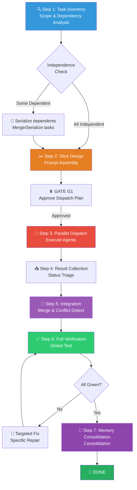

# ⚡ Parallel Agent Dispatch Workflow (并行智能体分发组合包)

You are executing the **Parallel Agent Dispatch Workflow** — a structured concurrency orchestration pattern that decomposes work into independent slices and dispatches them to isolated agents for simultaneous execution, then integrates and verifies all results.

> [!CAUTION]
> **INDEPENDENCE IS THE IRON GATE**: You may ONLY dispatch tasks in parallel if they are provably independent. If two tasks touch the same file, share mutable state, or have a causal dependency — they MUST be serialized or merged. Violating this creates merge conflicts and silent corruption.

---

## Skill Positioning (技能定位与协作关系)

```
┌─────────────────────── Orchestration Skill Ecosystem ───────────────────────┐
│                                                                              │
│  /dispatching-parallel-agents       /batch            /subagent-driven-dev  │
│  ━━━━━━━━━━━━━━━━━━━━━━━━━━━       ━━━━━━            ━━━━━━━━━━━━━━━━━━━━  │
│  Multi-task parallel execution      Single-machine seq. Dual-stage subagents│
│  Independent stateless slices       Ordered dep chain   Plan driven + Spec  │
│  Speed priority                     Context priority    Quality priority    │
│                                                                              │
│  Use when: ≥3 independent tasks,    Use when: Dep chain Use when: Full plan │
│            No shared state          Low context window  Spec compliance req │
│                                                                              │
│  Routing Decisions:                                                          │
│  Q1: Are tasks independent? ──No──→ /batch (serial) or /subagent-driven-dev │
│  Q2: Are there ≥3 tasks? ──No──→ Execute inline, skip this skill            │
│  Q3: Edit same file? ──Yes──→ Merge into single task or serialize           │
│  All passed → ✅ Use this skill                                             │
└──────────────────────────────────────────────────────────────────────────────┘
```

---

## Process Flow Overview (流程总览)



---

## 🔑 Gate Points (用户确认卡口)

| Gate | When | What to Present | Resume Condition |
|------|------|-----------------|------------------|
| **G1** | After Step 2 (Slice Design) | Dispatch Plan: Task slice list + independence proof + Agent Prompt summary | User approves dispatch |

> [!IMPORTANT]
> G1 is the **only** gate. Once approved, the workflow runs fully autonomously until completion.

---

## Step 1: 🔍 Task Inventory & Dependency Analysis (任务清点与依赖分析)

**Goal**: Exhaustively list all pending tasks and prove their independence.

**Actions**:

1. **Inventory Task Sources**:
   - Explicit user requests.
   - Test failure reports (grouped by file / subsystem).
   - Implementation plan steps marked as parallelizable.
   - Code review feedback with independent fix items.

2. **Build Dependency Matrix**:

   ```markdown
   ## 📊 Task Dependency Matrix

   | Task | Files Touched | Read Deps | Write Target | Conflict with others? |
   |------|---------|---------|---------|---------------|
   | T1: Fix auth tests | `src/auth/*.ts`, `tests/auth/*.ts` | auth config | auth code | ❌ No conflict |
   | T2: Fix API error handling | `src/api/handler.ts` | API schema | API code | ❌ No conflict |
   | T3: Fix DB pool leak | `src/db/pool.ts` | DB config | DB code | ❌ No conflict |
   | T4: Update auth middleware | `src/auth/middleware.ts` | auth config | auth code | ⚠️ Shares auth dir with T1 |
   ```

3. **Conflict Resolution**:
   - **File-level conflict** (two tasks write to the same file) → **Merge** into a single task.
   - **Directory-level coupling** (same dir, different files, no import crossover) → Usually parallelizable, mark risk.
   - **Logical dependency** (T2 input depends on T1 output) → **Serialize**, T1 must run first.

4. **Output Independence Proof**:

   ```markdown
   ## ✅ Independence Proof
   - T1 ↔ T2: No shared files, no data dep ✅
   - T1 ↔ T3: No shared files, no data dep ✅
   - T2 ↔ T3: No shared files, no data dep ✅
   - T4: Merged into T1 (shared auth dir) ⚠️→✅

   Safe parallel tasks: T1(inc. T4), T2, T3
   ```

---

## Step 2: ✂️ Slice Design & Prompt Assembly (切片设计与 Prompt 组装)

**Goal**: Construct a complete, self-contained Agent Prompt for each parallel task, ensuring the Agent can execute independently without requiring external context.

### 2a. Agent Prompt Golden Template

Each Agent's prompt **MUST** contain the following 7 sections:

```markdown
# 🎯 Task [Number]: [One-sentence task name]

## 1. Objective
[Precise paragraph describing what to achieve and acceptance criteria]

## 2. Scope Constraints
- ✅ Allowed modification files: [Exact list]
- ❌ Forbidden files: [Exact list or "all files not listed above"]
- ⚠️ Read-only reference files: [Files to read but not modify]

## 3. Context
[All background info the Agent needs — do not make the Agent search for it]
- Relevant code snippets (pasted completely, don't just reference paths)
- Error messages / Stack traces (full copy)
- Relevant conventions and rules

## 4. Execution Strategy
[Step-by-step guidance]
1. First read [file] and understand [what]
2. Modify [what] because [reason]
3. Run [test command] to verify

## 5. Verification
- Commands to run: `[Exact test command]`
- Expected results: [e.g., 5/5 passing / exit code 0 / key output]

## 6. Anti-Patterns
- Do not [common pitfall 1]
- Do not [common pitfall 2]
- If you encounter [situation], stop and do not guess

## 7. Expected Output
Return a report in the following format:
- **Status**: DONE | DONE_WITH_CONCERNS | BLOCKED
- **Change Summary**: [What was modified, why]
- **Test Results**: [Pass/Fail count + stdout excerpt]
- **Lingering Concerns**: [If any]
```

### 2b. Prompt Quality Gates

> [!WARNING]
> Before dispatching, run these checks against every Agent Prompt:

| Check | Passing Criteria |
|--------|---------|
| **Self-Contained** | Can the Agent understand the task without reading any external files? |
| **Strict Scope** | Are allowed and forbidden files precisely listed? |
| **Test Commands** | Are concrete verification commands provided (not just "run tests")? |
| **Anti-Patterns** | Are known pitfalls and forbidden actions explicitly highlighted? |
| **Output Format** | Is a structured return report explicitly requested? |
| **No Placeholders** | Are there zero vague terms like "TBD", "<to be determined>", or "handle appropriately"? |

If any check fails → fix it before dispatching.

### 2c. Dispatch Plan Table

Synthesize and present to the user:

```markdown
## 📋 Parallel Dispatch Plan

| # | Agent Task | Files Touched | Est. Complexity | Independence |
|---|-----------|---------|-----------|--------|
| A1 | Fix auth tests + middleware | auth/*.ts | Medium | ✅ Verified |
| A2 | API error handling | api/handler.ts | Low | ✅ Verified |
| A3 | DB pool leak fix | db/pool.ts | High | ✅ Verified |

Total Parallel Instances: 3 agents
Estimated Duration: Maximum of the slowest Agent (not the sum of all 3)
```

**⏸️ GATE G1**: Present dispatch plan. Wait for explicit user approval before dispatching.

---

## Step 3: 🚀 Parallel Dispatch (并行分发执行)

> **Entry Condition**: User approves dispatch plan.

**Dispatch Action**:

Launch all Agents simultaneously (via `browser_subagent` or available parallel execution features):

```
Agent A1 → [dispatch with full prompt from Step 2a template]
Agent A2 → [dispatch with full prompt from Step 2a template]
Agent A3 → [dispatch with full prompt from Step 2a template]
// All launched concurrently, independent of each other
```

**Your Duties During Dispatch** (Coordinator Role):
- ❌ Do not modify files assigned to any active Agent yourself.
- ❌ Do not "help" Agents while they are running.
- ✅ Monitor Agent execution states.
- ✅ If an Agent reports NEEDS_CONTEXT, provide it immediately and re-dispatch.
- ✅ If an Agent reports BLOCKED, record it and handle it during the integration phase.

---

## Step 4: 📥 Result Collection & Status Triage (结果回收与状态分拣)

When all Agents return, triage their statuses:

| Agent Status | Handling Strategy |
|-----------|---------|
| **DONE** | ✅ Assimilate changes, queue for integration |
| **DONE_WITH_CONCERNS** | ⚠️ Review concerns — If correctness is at risk, fix then integrate. If just a recommendation, record and proceed. |
| **NEEDS_CONTEXT** | 🔄 Supply missing context and re-dispatch (same or new Agent) |
| **BLOCKED** | 🔴 Assess blocker: Insufficient context? Task too large? Flawed plan? Address cause accordingly. |

**Result Recovery Report**:

```markdown
## 📥 Agent Execution Results

| Agent | Status | Change Summary | Test Results |
|-------|------|---------|---------|
| A1 | ✅ DONE | Fixed 3 tests, updated middleware | 15/15 pass |
| A2 | ✅ DONE | Added unified error wrapper | 8/8 pass |
| A3 | ⚠️ DONE_WITH_CONCERNS | Fixed leak, added pool.destroy() | 6/6 pass, concern: high concurrency untested |
```

---

## Step 5: 🔀 Integration & Conflict Detection (冲突检测与合并)

**Goal**: Merge all Agent outputs into a consistent codebase state.

**Actions**:

1. **Conflict Scanning** — Check if any Agent accidentally modified files outside its scope:
   ```
   Compare Agent's actual changed files vs pre-assigned allowed scope.
   Out-of-scope changes → Flag in red, evaluate if acceptable.
   ```

2. **Cross-Impact Detection** — Even if files don't overlap, check:
   - Did an Agent modify a shared type/interface used by another Agent?
   - Did an Agent introduce conflicting imports?
   - Did an Agent modify global config/env variables?

3. **Merge Strategies**:
   - **No Conflict** → Directly merge all changes.
   - **Minor Conflict** (import ordering, type extensions) → Resolve manually, one-shot.
   - **Severe Conflict** (logical contradictions, incompatible APIs) → Revert offending changes, re-coordinate, and execute serially.

---

## Step 6: ✅ Full Verification (全量验证)

> [!CAUTION]
> **Subjective claims of successful integration are ABSOLUTELY FORBIDDEN.** Objective evidence must be presented.

**Verification Sequence**:

1. **Run Full Test Suite** — Not just the individual Agent tests, but tests for the **entire project**:
   ```bash
   npm test  # or equivalent full suite command
   ```
   Capture stdout. Confirm `0 failures`, `exit 0`.

2. **Lint / Type Check** — Confirm no new errors:
   ```bash
   npm run lint   # if available
   npx tsc --noEmit  # TypeScript project
   ```

3. **Build Verification** — Confirm successful compilation:
   ```bash
   npm run build  # if available
   ```

4. **Diff Audit** — Summarize all combined Agent changes, ensuring only intended logic was altered.

**Evidence Output Format**:

```
📊 Parallel Dispatch Integration Report
=========================================
✅ Tests:       62/62 pass    (npm test — exit 0)
✅ Lint:        0 errors      (npm run lint — exit 0)
✅ Build:       Success       (npm run build — exit 0)

📝 Agent Summary:
  ✅ A1: auth module — 3 tests fixed, middleware updated
  ✅ A2: API layer — error handling unified
  ✅ A3: DB pool — leak fixed, pool.destroy() added
  🔀 Conflicts: 0
  ⚠️ Concerns:  A3 high concurrency untested

⏱️ Efficiency: 3 tasks parallelized, took time of max(t) instead of sum(t)
```

**If Verification Fails**:
- Identify which Agent's change caused the failure.
- Conduct a targeted fix for that Agent's specific scope (manually or by re-dispatching).
- Re-run full verification.
- Maximum **3 fix loops**. If exceeded → structured report + escalate to user.

---

## Step 7: 🧠 Memory Consolidation (记忆固化)

**Skill**: `/remember`

**Actions**:

1. **Extract Parallel Execution Insights**:
   - Was the dispatch strategy efficient? What can be optimized?
   - Was there unexpected cross-Agent interference? How to prevent it next time?
   - Are there improvements needed in the Agent Prompt templates?

2. **Persist to 4-Tier Memory System**:

| Destination | Content to Write |
|-------------|---------|
| `CLAUDE.md` | Fencing rules for parallel dispatch, newly discovered shared bounds |
| `docs/短期记忆.md` | Any BLOCKED agents requiring follow-up |
| `docs/长期记忆.md` | Codebase modularity assessment, parallelization capability map |
| `docs/永久记忆.md` | Conflict resolution experience, Agent Prompt optimization techniques |

---

## 🔥 Hard Rules (铁律)

1. **Independence Is Sacred**: Non-independent tasks MUST NEVER be dispatched in parallel. Serialize rather than risking conflicts.
2. **Agent Prompt Must Be Self-Contained**: An Agent should never have to search for files or guess context. Supply everything fully in the Prompt.
3. **7-Section Prompt Template Is Mandatory**: Every Agent Prompt must contain all 7 sections. Missing one → fix before dispatching.
4. **Scope Fencing**: Every Agent must be given a precise allowed/forbidden file list. Vague bounds = conflict hazard.
5. **Coordinator Does Not Touch Agent Files**: As the coordinator, you are forbidden from editing an active Agent's assigned files.
6. **Full-Suite Verification After Integration**: After merging, you must test the entire project, not just individual Agent scopes.
7. **Evidence Over Claims**: Verification outputs must contain intercepted stdout/stderr. "Looks fine" is not valid output.
8. **3-Strike Escalation**: If verification fails 3 times after merging → structured report + user escalation. No infinite loops.
9. **Anti-Shirking**: Test failures post-merge are your responsibility as the coordinator unless proven otherwise via baseline.
10. **Long-Running Monitoring**: If Agents run longer than 2 minutes, establish a polling loop to report progress. Silent waiting is forbidden.
