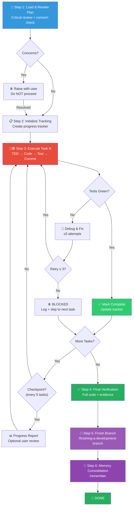

# 🏗️ Plan Executor Workflow (计划执行组合包)

You are executing the **Plan Executor Workflow** — a disciplined, checkpoint-driven execution engine that takes an approved implementation plan and implements it task-by-task with TDD enforcement, atomic commits, structured progress tracking, and automated verification.

> [!CAUTION]
> **PLAN IS LAW**: You execute what the plan says. Do NOT deviate, skip steps, reorder tasks, or add unplanned features. If the plan is wrong, raise the issue — do not silently "improve" it.

**Announce at start:** _"I'm using the executing-plans skill to implement this plan."_

---

## Skill Positioning (技能定位)

```
┌─────────────────── Plan Execution Skill Ecosystem ───────────────────┐
│                                                                       │
│  /writing-plans              /executing-plans        /finishing-a-    │
│  (upstream)                  (THIS SKILL)            development-     │
│  ━━━━━━━━━━━━━              ━━━━━━━━━━━━━━          branch           │
│  Creates the plan            Executes it inline      (downstream)     │
│                              task-by-task            Merge / PR /     │
│                                                      Cleanup          │
│                                                                       │
│  Alternative executor: /subagent-driven-development                  │
│  → Use when subagent support is available (higher quality, isolated   │
│    context per task, dual-stage review)                               │
│                                                                       │
│  Related: /batch                                                     │
│  → Use for mechanical sweeping changes with ≤5 files/unit            │
└───────────────────────────────────────────────────────────────────────┘
```

---

## Process Flow Overview (流程总览)



---

## 🔑 Gate Points (用户确认卡口)

| Gate | When | What to Present | Resume Condition |
|------|------|-----------------|------------------|
| **G1** | Step 1 — Plan has critical concerns | Concerns list with specific issues | User resolves concerns or updates plan |
| **G2** | Every 5 tasks completed (optional) | Progress report + prompt "继续下一批?" | User confirms or pauses |

> [!IMPORTANT]
> G1 is **blocking** — never proceed with a flawed plan. G2 is **advisory** — skip if the user has set auto-continue preference.

---

## Step 1: 📖 Load & Critical Review (加载与批判性审查)

**Goal**: Thoroughly understand the plan and identify any issues BEFORE writing a single line of code.

**Actions**:

1. **Read the plan file completely** — every task, every step, every code block. Do not skim.

2. **Run a 5-point critical review**:

   | # | Check | What to Look For |
   |---|-------|-----------------|
   | 1 | **Completeness** | Are there tasks with missing steps, empty code blocks, or "TBD" placeholders? |
   | 2 | **Consistency** | Do function names, types, and import paths match across tasks? (e.g., `clearLayers()` in Task 3 vs `clearFullLayers()` in Task 7) |
   | 3 | **Dependencies** | Are tasks ordered correctly? Does Task N depend on outputs from Task M where M > N? |
   | 4 | **Testability** | Does every task have concrete test commands with expected outputs? |
   | 5 | **Feasibility** | Are there any steps that assume tools, APIs, or dependencies that may not exist? |

3. **If concerns found** → **⏸️ GATE G1**:
   ```markdown
   ⚠️ Plan Review — Issues Found:
   
   1. [CRITICAL] Task 4 references `UserService.validate()` but this function 
      is not defined in any prior task.
   2. [MINOR] Task 7 test command uses `jest` but project uses `vitest`.
   
   Please resolve before I begin execution.
   ```
   **Do NOT proceed until resolved.** Guessing through a flawed plan guarantees rework.

4. **If no concerns** → Initialize tracking and proceed.

---

## Step 2: 📋 Initialize Progress Tracking (初始化进度追踪)

**Goal**: Create a structured tracker so progress is always visible and resumable.

**Actions**:

1. **Extract all tasks** from the plan with their full descriptions.
2. **Create the progress tracker** in `task.md`:

   ```markdown
   # Plan Execution: [Feature Name]
   
   **Plan Source**: `docs/superpowers/plans/YYYY-MM-DD-feature.md`
   **Started**: [timestamp]
   **Total Tasks**: [N]
   
   ## Task Checklist
   - [ ] Task 1: [description]
   - [ ] Task 2: [description]
   - [ ] Task 3: [description]
   ...
   ```

3. **Identify the test recipe** — the exact verification commands for this project:
   ```bash
   # Scoped (per-task)
   npm test -- --testPathPattern="<pattern>"
   
   # Full suite (final verification)
   npm test
   ```

---

## Step 3: 🔴🟢 Task-by-Task Execution (逐任务执行)

**Goal**: Execute each task exactly as the plan specifies, enforcing TDD discipline at every step.

> [!CAUTION]
> **THE IRON LAW OF PLAN EXECUTION:**
> ```
> FOLLOW THE PLAN STEPS EXACTLY.
> DO NOT SKIP. DO NOT REORDER. DO NOT "IMPROVE".
> ```

### Per-Task Execution Protocol

For each task, in strict order:

#### 3a. Mark In-Progress
Update `task.md`: change `[ ]` → `[/]` for this task.

#### 3b. Execute Each Step
Follow the plan's steps **literally**:
- If the step says "write a failing test" → write it, run it, **watch it fail**.
- If the step says "run this command" → run the exact command shown.
- If the step has a code block → use that code, not your own version.

#### 3c. Verify
Run the test command specified in the plan for this task:
```bash
# Execute the exact command from the plan
<test command>
```

**Expected output must match the plan's expectations.** If the plan says "Expected: 3/3 pass", confirm exactly that.

#### 3d. Commit
```bash
git add <files from this task>
git commit -m "<commit message from plan, or generate: feat/fix/refactor(scope): description>"
```

**One atomic commit per task.** If a task has multiple sub-steps, commit after the final step of that task.

#### 3e. Mark Complete
Update `task.md`: change `[/]` → `[x]` for this task.

### ⚠️ When Tests Fail (异常处理)

When a step's verification fails:

1. **Read the error carefully** — the error message often contains the solution.
2. **Diagnose the root cause** — is it a plan bug, a typo, or an actual code issue?
3. **Fix with minimal changes** — touch only what's needed. Do NOT refactor.
4. **Re-run the verification** — confirm the fix works.

**Retry budget**: Maximum **3 distinct fix attempts** per task.

If 3 attempts fail:

> [!WARNING]
> **BLOCKED PROTOCOL**:
> - Mark task as `[BLOCKED]` in `task.md` with the failure reason
> - Log the error evidence (stack trace, stdout, test output)
> - **Skip to the next task** — do NOT infinite-loop
> - Blocked tasks are revisited after all other tasks complete (fresh context may help)

### 📊 Checkpoint Reports (检查点报告)

After every **5 completed tasks**, output a progress report:

```markdown
📊 Execution Progress — Checkpoint [N]
========================================
✅ Completed:  [X]/[total] tasks
🔴 Blocked:    [Y] tasks (see details)
⬜ Remaining:  [Z] tasks

Last 5 completed:
  ✅ Task 3: API endpoint handler
  ✅ Task 4: Request validation middleware
  ✅ Task 5: Error response formatter
  ✅ Task 6: Integration test (API → DB)
  ✅ Task 7: Rate limiter middleware

Blocked tasks:
  🔴 Task 2: Auth token refresh — TypeError in JWT library (3 attempts exhausted)

Test status: 24/24 pass (scoped runs)
```

**⏸️ Optional GATE G2**: If configured, pause for user confirmation before continuing.

---

## Step 4: ✅ Final Verification (最终全量验证)

> [!CAUTION]
> **Claiming completion without full verification is ABSOLUTELY FORBIDDEN.**

**After all tasks are attempted (completed or blocked):**

1. **Revisit blocked tasks** — with reduced context load, attempt each once more with fresh eyes.

2. **Run the full test suite**:
   ```bash
   npm test  # Full suite, not scoped
   ```
   Capture stdout. Confirm `0 failures`, `exit 0`.

3. **Run linter / type checker** (if applicable):
   ```bash
   npm run lint
   npx tsc --noEmit  # TypeScript projects
   ```

4. **Run build** (if applicable):
   ```bash
   npm run build
   ```

5. **Plan coverage check** — re-read the original plan and verify each task was addressed:

   ```markdown
   ## Plan Coverage Verification
   - [x] Task 1: ✅ Implemented + tested
   - [x] Task 2: ✅ Fixed after retry
   - [x] Task 3: ✅ Implemented + tested
   - [BLOCKED] Task 4: 🔴 See analysis below
   ```

6. **Evidence output**:

   ```
   📊 Plan Execution — Final Report
   ==================================
   ✅ Tests:       47/47 pass    (npm test — exit 0)
   ✅ Lint:        0 errors      (npm run lint — exit 0)
   ✅ Build:       Success       (npm run build — exit 0)
   ✅ Plan Tasks:  9/10 done     (1 blocked)
   
   📝 Task Summary:
     ✅ Completed:  Tasks 1–3, 5–10
     🔴 Blocked:   Task 4 (JWT library incompatibility — see report)
   
   📝 Commit History:
     abc1234 feat(auth): Task 1 — user login endpoint
     def5678 feat(auth): Task 2 — token validation
     ...
   ```

---

## Step 5: 🏁 Finish Branch (开发收尾)

**Skill**: `/finishing-a-development-branch`

After all verification passes:

1. Invoke `/finishing-a-development-branch`
2. Present the 4 standard options (merge locally / create PR / keep as-is / discard)
3. Execute the user's choice
4. Clean up worktree if applicable

---

## Step 6: 🧠 Memory Consolidation (记忆固化)

**Skill**: `/remember`

**Actions**:

1. **Extract execution insights**:
   - Which plan steps were unclear or caused friction?
   - What debugging patterns emerged?
   - Were there recurring issues that suggest architectural problems?
   - Any new conventions established during execution?

2. **Classify and persist**:

   | Destination | Content |
   |-------------|---------|
   | `CLAUDE.md` | New conventions, red-line rules discovered during execution |
   | `docs/短期记忆.md` | WIP state if execution was interrupted mid-plan |
   | `docs/长期记忆.md` | Architecture evolution, roadmap adjustments |
   | `docs/永久记忆.md` | Debugging lessons, plan quality observations |

3. **Feedback to upstream** — if the plan had quality issues, note them for improving future `/writing-plans` output.

---

## 🔥 Hard Rules (铁律)

1. **Plan Is Authoritative**: Execute exactly what the plan says. Deviations require user approval.
2. **Critical Review Before Execution**: Never start coding before completing the 5-point critical review. A flawed plan executed perfectly still produces flawed software.
3. **TDD Is Non-Negotiable**: If the plan says "write failing test first", you write the failing test first. No shortcuts.
4. **One Task, One Commit**: Every completed task gets its own atomic commit. No batching across tasks.
5. **3-Strike Skip**: 3 fix attempts on a single task → mark BLOCKED and move on. No infinite loops.
6. **Blocked ≠ Forgotten**: All blocked tasks get a fresh retry after other tasks complete, plus a structured failure report if still unresolved.
7. **Evidence Over Claims**: Final verification must show captured stdout/stderr. "Should pass" is not evidence.
8. **Anti-Shirking**: Test failures after your changes are YOUR responsibility until proven otherwise with baseline evidence.
9. **No Context Pollution**: Do NOT read irrelevant files or explore tangential code paths. Stay on the plan's scope to preserve context window.
10. **Complete Pipeline**: All 6 steps must execute. None can be skipped, reordered, or abbreviated.
