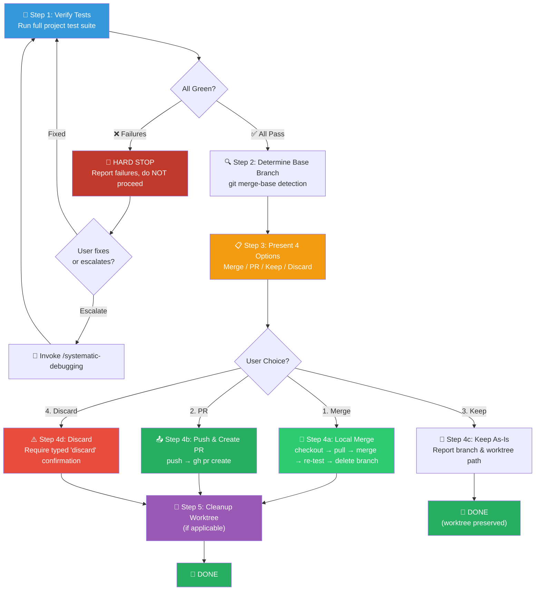

# 🏁 Finishing a Development Branch (开发分支收尾组合包)

You are executing the **Finishing a Development Branch Workflow** — a strict **Verify → Choose → Execute → Cleanup** pipeline that safely closes out a completed feature branch through user-chosen disposition (merge, PR, keep, or discard) with full guardrails against data loss.

> [!CAUTION]
> **NO GREEN, NO OPTIONS.** This skill's entire flow is gated behind a passing test suite. If any test fails, you are FORBIDDEN from presenting disposition options. Fix or escalate first.

**Announce at start:** *"Using the finishing-a-development-branch skill to complete this work."*

---

## Skill Positioning (技能定位与协作关系)

```
┌───────────────── Development Lifecycle: Branch Closure ──────────────────┐
│                                                                           │
│  /executing-plans              /finishing-a-development-branch           │
│  /subagent-driven-development  (THIS SKILL)                             │
│  (upstream callers)            ━━━━━━━━━━━━━━━━━━━━━━━━━━━━             │
│  ━━━━━━━━━━━━━━━━━━━━━        Verify tests → Present options →          │
│  Complete all plan tasks       Execute user's choice →                   │
│  Pass full verification        Cleanup worktree                         │
│                                                                           │
│  Paired skill: /using-git-worktrees                                     │
│  → This skill cleans up the worktree that /using-git-worktrees created  │
│                                                                           │
│  Downstream: /remember (memory consolidation, invoked by caller)         │
│                                                                           │
│  Terminal State: Branch is merged / PR'd / kept / discarded.             │
│  This skill has NO downstream skill to invoke — it is a leaf node.       │
└───────────────────────────────────────────────────────────────────────────┘
```

---

## Process Flow Overview (流程总览)



---

## 🔑 Gate Points (关键质量关卡)

| 步骤阶段 | 准入前提 (Entry Gate) | 必须满足的检查项 (Checklist) | 产出与通过标准 (Exit Gate) |
|----------|----------------------|----------------------------|--------------------------|
| **Step 1: Verify Tests** | 上游技能已声称开发完成 | ① 运行完整测试套件 ② 捕获 stdout/stderr ③ 确认 `exit 0` | 全部测试通过，`0 failures`。失败则 HARD STOP |
| **Step 2: Base Branch** | Step 1 通过 | ① `git merge-base` 检测 ② 如有歧义则向用户确认 | 确定唯一的 base branch 名称 |
| **Step 3: Present Options** | Step 2 完成 | ① 展示精确的 4 选项菜单 ② 不添加额外解释 | 收到用户明确的选项编号 |
| **Step 4: Execute** | 用户已选择选项 | ① 严格按选项对应流程执行 ② Option 1 合并后必须重跑测试 ③ Option 4 必须收到 `discard` 确认字符串 | 选项对应的 Git 操作全部完成 |
| **Step 5: Cleanup** | Step 4 完成（Options 1/2/4） | ① 检测是否在 worktree 中 ② 若是则安全移除 worktree | worktree 已清理或确认不适用 |

---

## Step 1: 🧪 Verify Tests (全量测试验证 — HARD GATE)

**Goal**: Prove that the codebase is green before any branch disposition action.

**Actions**:

1. **Detect the project's test command** — inspect `package.json` scripts, `Makefile`, `pyproject.toml`, or `go.mod`:
   ```bash
   # Auto-detect (pick the matching one):
   npm test                    # Node.js / TypeScript
   npx vitest run              # Vitest projects
   pytest                      # Python
   cargo test                  # Rust
   go test ./...               # Go
   ```

2. **Run the full suite and capture output**:
   ```bash
   <test-command> 2>&1
   echo "EXIT_CODE=$?"
   ```

3. **Evaluate result**:
   - **All pass** → Proceed to Step 2.
   - **Any failure** →

> [!CAUTION]
> **HARD STOP. Do NOT proceed to Step 2.** Report:
> ```
> ❌ Test Verification Failed
> ========================
> Total:    [N] tests
> Passed:   [X]
> Failed:   [Y]
> 
> Failing tests:
>   • <test name 1> — <error summary>
>   • <test name 2> — <error summary>
> 
> Cannot proceed with branch finishing until all tests pass.
> Please fix the failures or invoke /systematic-debugging.
> ```
> Wait for the user or upstream caller to resolve.

---

## Step 2: 🔍 Determine Base Branch (基线分支检测)

**Goal**: Identify which branch this feature branch was forked from, for merge/PR targeting.

**Actions**:

1. **Auto-detect via merge-base**:
   ```bash
   # Try 'main' first, fall back to 'master'
   git merge-base HEAD main 2>/dev/null || git merge-base HEAD master 2>/dev/null
   ```

2. **Store the result** as `<base-branch>` for all subsequent steps.

3. **If ambiguous** (neither `main` nor `master` found, or multiple candidates):
   ```
   This branch doesn't appear to fork from 'main' or 'master'.
   Which branch should I target for merge/PR? 
   ```
   Wait for user response. Do NOT guess.

4. **Record current branch name**:
   ```bash
   FEATURE_BRANCH=$(git branch --show-current)
   ```

---

## Step 3: 📋 Present Options (展示处置选项)

**Goal**: Give the user a clear, fixed set of disposition choices with zero fluff.

Display **exactly** this prompt — no extra explanation, no recommendations:

```
Implementation complete. All tests passing. Choose next step:

1. Merge back to <base-branch> locally
2. Push and create a Pull Request
3. Keep the branch as-is (I'll handle it later)
4. Discard this work

Which option?
```

Wait for the user's choice. Do NOT assume or suggest a default.

---

## Step 4: ⚡ Execute Choice (执行用户选择)

### Option 1: 🔀 Local Merge

```bash
# 1. Switch to base branch and update
git checkout <base-branch>
git pull origin <base-branch>

# 2. Merge feature branch (no-ff preserves history)
git merge --no-ff <feature-branch> -m "merge: <feature-branch> into <base-branch>"

# 3. MANDATORY: Re-run tests on merged result
<test-command>

# 4. Only delete branch if merge tests pass
git branch -d <feature-branch>
```

> [!WARNING]
> **If post-merge tests fail** → Do NOT delete the branch. Report the failure and let the user decide whether to revert (`git merge --abort` if still uncommitted, or `git revert HEAD` if committed).

→ Proceed to **Step 5** (cleanup worktree).

### Option 2: 📤 Push & Create PR

```bash
# 1. Push the feature branch
git push -u origin <feature-branch>

# 2. Generate a commit-based summary for the PR body
COMMIT_LOG=$(git log <base-branch>..<feature-branch> --oneline --no-decorate)

# 3. Create the Pull Request
gh pr create \
  --base <base-branch> \
  --title "<feature-branch>: <one-line summary from commits>" \
  --body "## Summary
$(git log <base-branch>..<feature-branch> --format='- %s' --no-decorate)

## Test Plan
- [x] Full test suite passing (verified locally)
- [ ] CI pipeline green
"
```

> [!TIP]
> If `gh` CLI is not installed or not authenticated, fall back to:
> ```
> Branch pushed to origin/<feature-branch>.
> Please create a PR manually at: <repo-url>/compare/<base-branch>...<feature-branch>
> ```

→ Proceed to **Step 5** (cleanup worktree).

### Option 3: 📌 Keep As-Is

Report exactly:

```
Keeping branch `<feature-branch>`. 
Worktree preserved at `<worktree-path>` (if applicable).
No further action taken.
```

**Do NOT cleanup worktree. Do NOT delete anything.** → Workflow ends here.

### Option 4: ⚠️ Discard (requires typed confirmation)

1. **Show destructive action warning with full impact assessment**:
   ```
   ⚠ DESTRUCTIVE ACTION — This will permanently delete:
     • Branch: <feature-branch>
     • Commits: 
       <commit-hash-1> <commit-message-1>
       <commit-hash-2> <commit-message-2>
       ...
     • Worktree at: <worktree-path> (if applicable)
   
   Type 'discard' to confirm. Any other input cancels.
   ```

2. **Wait for EXACT string `discard`**. Any other response → cancel and return to Step 3.

3. **Execute deletion**:
   ```bash
   git checkout <base-branch>
   git branch -D <feature-branch>
   ```

→ Proceed to **Step 5** (cleanup worktree).

---

## Step 5: 🧹 Cleanup Worktree (工作树清理)

**Applies to**: Options 1, 2, 4 only. **Option 3 NEVER triggers cleanup.**

**Actions**:

1. **Check if current work lives in a worktree**:
   ```bash
   WORKTREE_PATH=$(git worktree list --porcelain | grep -B2 "$(git branch --show-current 2>/dev/null || echo '<feature-branch>')" | grep "^worktree " | sed 's/^worktree //')
   ```

2. **If worktree detected** → Navigate out and remove:
   ```bash
   cd <main-repo-path>          # Exit the worktree first
   git worktree remove <worktree-path> --force
   ```

3. **If NOT in a worktree** → Skip. Report: *"No worktree cleanup needed."*

4. **Final status report**:
   ```
   ✅ Branch Finishing Complete
   ============================
   Action:     <Merged / PR Created / Discarded>
   Branch:     <feature-branch> → <disposition>
   Worktree:   <Cleaned up / Not applicable / Preserved (Option 3)>
   Tests:      All passing (verified)
   ```

---

## Decision Matrix (处置决策矩阵)

| Option | Merge | Push | Keep Worktree | Delete Branch | Re-test |
|--------|:-----:|:----:|:-------------:|:-------------:|:-------:|
| 1. Merge locally | ✓ | — | — | ✓ (safe `-d`) | ✓ (post-merge) |
| 2. Create PR     | — | ✓ | ✓ | — | — |
| 3. Keep as-is    | — | — | ✓ | — | — |
| 4. Discard       | — | — | — | ✓ (force `-D`) | — |

---

## 🔥 Hard Rules (铁律)

1. **No Green, No Options.** Tests must pass before Step 3. Zero exceptions. Zero workarounds.
2. **No Silent Deletes.** Option 4 requires the user to type the exact string `discard`. Any other input cancels.
3. **No Force-Push.** Never `git push --force` unless the user explicitly requests it with full awareness of consequences.
4. **Verify After Merge.** Option 1 MUST re-run the full test suite on the merged result before deleting the branch. If post-merge tests fail, do NOT delete the branch.
5. **Worktree Discipline.** Only cleanup worktrees for Options 1, 2, 4. Never cleanup for Option 3. Never cleanup a worktree belonging to a different branch.
6. **Exact Prompts.** Display Step 3's option menu verbatim. Do not add recommendations, explanations, or commentary.
7. **No Guessing Base Branch.** If `git merge-base` is ambiguous, ask the user. Do not assume.
8. **Leaf Node Discipline.** This skill does NOT invoke downstream skills. It completes and returns control to its caller.

---

## Integration Points (上游调用者)

| Caller Skill | Trigger Point |
|-------------|---------------|
| `/executing-plans` | Step 5 — after all plan tasks complete and final verification passes |
| `/subagent-driven-development` | Step 7 — after all subagent tasks complete |
| `/a2-feature` | Implicit — via executing-plans or subagent-driven-development |
| User (manual) | Any time a feature branch is ready for disposition |

**Pairs with:** `/using-git-worktrees` — this skill cleans up the worktree that `/using-git-worktrees` created.
