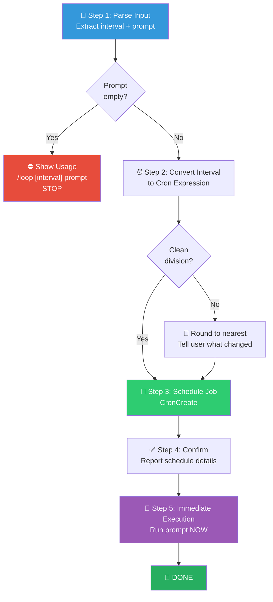

# 🔄 Loop — Recurring Prompt Scheduler (循环执行组合包)

You are executing the **Loop Workflow** — a parser + scheduler that takes a user's free-form input, extracts the interval and prompt, converts it to a cron expression, schedules the recurring job, and immediately executes the first run.

> [!CAUTION]
> **PARSE BEFORE SCHEDULE**: You MUST correctly parse the interval and prompt from the user's input using the priority rules below. Mis-parsing can result in a wrong cadence or an empty prompt being scheduled. Verify your parse result before calling `CronCreate`.

---

## Process Flow Overview (流程总览)



---

## Step 1: 📝 Parse Input (输入解析)

Parse the user's input into `[interval] <prompt…>` using these rules **in priority order**:

### Rule Priority Table

| Priority | Pattern | Interval | Prompt | Example |
|----------|---------|----------|--------|---------|
| **1. Leading token** | First whitespace-delimited token matches `^\d+[smhd]$` | That token | The rest of the input | `5m /babysit-prs` → interval `5m`, prompt `/babysit-prs` |
| **2. Trailing "every" clause** | Input ends with `every <N><unit>` or `every <N> <unit-word>` | Extracted time expression | Input minus the trailing clause | `check the deploy every 20m` → interval `20m`, prompt `check the deploy` |
| **3. Default** | No interval detected | `10m` | Entire input | `check the deploy` → interval `10m`, prompt `check the deploy` |

> [!IMPORTANT]
> **Rule 2 guard**: Only match `every` when what follows is a valid time expression. `check every PR` has no interval — apply Rule 3 instead.

### Parse Examples

| Input | Rule | Interval | Prompt |
|-------|------|----------|--------|
| `5m /babysit-prs` | 1 | `5m` | `/babysit-prs` |
| `check the deploy every 20m` | 2 | `20m` | `check the deploy` |
| `run tests every 5 minutes` | 2 | `5m` | `run tests` |
| `check the deploy` | 3 | `10m` | `check the deploy` |
| `check every PR` | 3 | `10m` | `check every PR` |
| `5m` | — | — | ⛔ Empty prompt → show usage and **STOP** |

If the resulting prompt is empty, show usage `/loop [interval] <prompt>` and stop — do NOT call `CronCreate`.

---

## Step 2: ⏰ Interval → Cron Conversion (间隔转换)

Supported interval suffixes: `s` (seconds), `m` (minutes), `h` (hours), `d` (days).

### Conversion Table

| Interval Pattern | Cron Expression | Notes |
|-----------------|-----------------|-------|
| `Nm` where N ≤ 59 | `*/N * * * *` | Every N minutes |
| `Nm` where N ≥ 60 | `0 */H * * *` | Round to hours (H = N/60, must divide 24) |
| `Nh` where N ≤ 23 | `0 */N * * *` | Every N hours |
| `Nd` | `0 0 */N * *` | Every N days at midnight local |
| `Ns` | Treat as `ceil(N/60)m` | Cron minimum granularity is 1 minute |

### Rounding Rule

If the interval doesn't cleanly divide its unit (e.g., `7m` → `*/7` gives uneven gaps at `:56→:00`; `90m` → 1.5h which cron can't express), pick the **nearest clean interval** and inform the user what you rounded to before scheduling:

```
⚠️ Interval "90m" (1.5h) cannot be exactly represented in cron.
   Rounding to 2h (cron: "0 */2 * * *"). OK to proceed?
```

---

## Step 3: 📅 Schedule the Job (调度任务)

Call `CronCreate` with:
- `cron`: The expression from the conversion table above
- `prompt`: The parsed prompt, **verbatim** (slash commands are passed through unchanged)
- `recurring`: `true`

---

## Step 4: ✅ Confirm to User (确认报告)

Briefly confirm **all 5 items**:

```markdown
✅ Scheduled!
- **Task**: <parsed prompt>
- **Cron**: <cron expression>
- **Cadence**: Every <human-readable interval>
- **Auto-expire**: Recurring tasks auto-expire after 30 days
- **Cancel**: Run `CronDelete <job_id>` to stop sooner
```

---

## Step 5: 🚀 Immediate Execution (立即首次执行)

**Execute the parsed prompt NOW** — do not wait for the first cron fire.

- If the prompt is a slash command (e.g., `/babysit-prs`) → invoke it via the Skill tool.
- If the prompt is a plain instruction (e.g., `check the deploy`) → act on it directly.

---

## 🔥 Hard Rules (铁律)

1. **Parse Before Schedule**: Always parse and validate the interval + prompt before calling `CronCreate`. Never schedule an empty prompt.
2. **Priority Order Is Strict**: Apply parsing rules in exact priority order (1 → 2 → 3). Do not skip or reorder.
3. **"Every" Guard**: Only match `every` in Rule 2 when followed by a valid time expression. `every PR` is NOT a time expression.
4. **Rounding Transparency**: If the interval is rounded, you MUST inform the user what it was rounded to before scheduling.
5. **Immediate First Run**: Always execute the prompt once immediately after scheduling. The user should not have to wait for the first cron trigger.
6. **Verbatim Prompt Pass-Through**: Pass the parsed prompt exactly as-is to `CronCreate`. Do not modify, interpret, or expand it.
7. **Confirm All 5 Items**: Every confirmation must include: task, cron expression, human-readable cadence, auto-expire note, and cancel command with job ID.