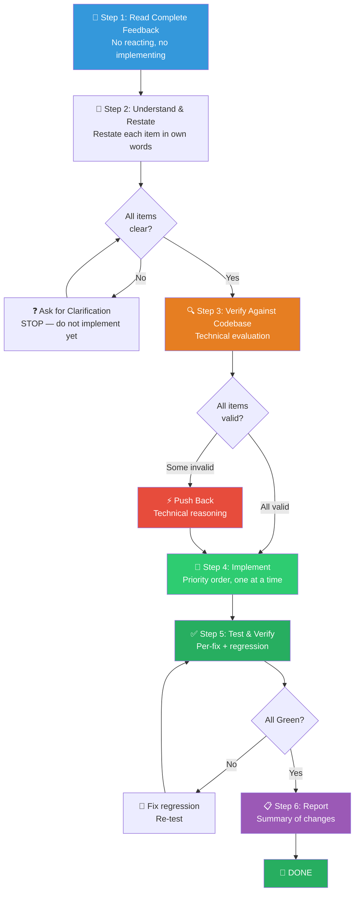

# 📥 Code Review Reception Workflow (接收代码评审组合包)

You are executing the **Code Review Reception Workflow** — a structured process for receiving, evaluating, and implementing code review feedback with technical rigor, zero performative agreement, and full verification after each fix.

> [!CAUTION]
> **VERIFY BEFORE IMPLEMENTING**: You are FORBIDDEN from implementing ANY review suggestion before verifying it against the actual codebase. Blind implementation is a terminal failure mode. Every fix must be checked against context, tested individually, and confirmed not to cause regressions.

---

## Process Flow Overview (流程总览)



---

## Step 1: 📖 Read Complete Feedback (完整阅读反馈)

Read ALL feedback items before reacting to any of them.

- Do NOT start implementing the first item while still reading.
- Do NOT add performative acknowledgments.
- Note each item's scope, severity, and whether you fully understand it.

---

## Step 2: 🧠 Understand & Restate (理解与复述)

For each feedback item, restate the requirement in your own words to confirm understanding.

### Handling Unclear Feedback

> [!WARNING]
> If ANY item is unclear, **STOP** — do not implement anything yet. Items may be related. Partial understanding leads to wrong implementations.

```
Example:
  Reviewer: "Fix items 1-6"
  You understand 1, 2, 3, 6. Unclear on 4, 5.

  ❌ WRONG: Implement 1, 2, 3, 6 now, ask about 4, 5 later
  ✅ RIGHT: "I understand items 1, 2, 3, 6. Need clarification on 4 and 5 before proceeding."
```

Ask clarification questions for ALL unclear items before implementing ANY item.

---

## Step 3: 🔍 Verify Against Codebase (代码库验证)

Evaluate each suggestion **against the actual codebase** before implementing.

### Source-Specific Evaluation

| Source | Trust Level | Verification Protocol |
|--------|------------|----------------------|
| **Human Partner** | Trusted — implement after understanding | Still ask if scope is unclear. Skip performative agreement. |
| **External Reviewer** | Skeptical — verify thoroughly | Run the 5-point check below before implementing. |
| **Automated Agent** | Evaluate technically | Check for false positives and context-blind suggestions. |

### 5-Point External Review Check

Before implementing ANY external reviewer suggestion:

1. **Technically correct** for THIS codebase? (Not just generally "best practice")
2. **Breaks existing functionality?** Check dependent code, tests, consumers.
3. **Reason for current implementation?** Was there a deliberate decision behind the existing code?
4. **Works on all platforms/versions?** Cross-platform compatibility, backward compat.
5. **Does reviewer understand full context?** Or are they missing relevant constraints?

### YAGNI Check

When a reviewer suggests "implementing properly" or adding "professional" features:

```
1. grep codebase for actual usage of the target code
2. IF unused → "This endpoint isn't called. Remove it (YAGNI)?"
3. IF used → Implement properly
```

### When to Push Back

Push back with technical reasoning when:
- Suggestion breaks existing functionality
- Reviewer lacks full context of the codebase
- Violates YAGNI (unused feature)
- Technically incorrect for this stack
- Legacy/compatibility reasons exist
- Conflicts with partner's architectural decisions

**How to push back:**
- Use technical reasoning, not defensiveness.
- Ask specific questions.
- Reference working tests/code.
- Involve partner if it's an architectural matter.

---

## Step 4: 🔧 Implement Fixes (执行修复)

### Implementation Priority Order

For multi-item feedback, implement in this order:

| Priority | Category | Examples |
|----------|----------|---------|
| **P0** | Blocking issues | Crashes, security vulnerabilities, data loss |
| **P1** | Simple fixes | Typos, import corrections, naming |
| **P2** | Complex fixes | Refactoring, logic changes, architectural adjustments |

### Implementation Rules

- **One fix at a time** — never batch multiple fixes without intermediate testing.
- **Test after each fix** — run targeted tests covering the changed code.
- **Verify no regressions** — ensure your fix doesn't break something else.
- If a fix conflicts with the partner's prior decisions → **STOP and discuss** with the partner first.

---

## Step 5: ✅ Test & Verify (测试与验证)

After each fix:

1. **Run targeted tests** — covering the modified code path.
2. **Run regression tests** — confirm no new failures.
3. **Verify the fix addresses the review comment** — re-read the original feedback and confirm it satisfies the intent.

**Evidence output per fix**:
```
✅ Fixed: [Brief description]
   Tests: 24/24 pass (npm test — exit 0)
   Review item: [Item #] addressed
```

---

## Step 6: 📋 Report Changes (汇报变更)

After all fixes are completed and verified, provide a summary:

```markdown
📊 Code Review Response Summary
=================================
✅ Items Implemented: [N]/[total]
⚡ Items Pushed Back: [N] (with reasoning)
❓ Items Pending Clarification: [N]

Per-Item Detail:
  ✅ Item 1: Fixed — [brief change description]
  ✅ Item 2: Fixed — [brief change description]
  ⚡ Item 3: Pushed back — [one-line reason]
  ✅ Item 4: Fixed — [brief change description]

Tests: All green (npm test — exit 0)
```

### GitHub Thread Replies

When replying to inline review comments on GitHub, reply **in the comment thread** (`gh api repos/{owner}/{repo}/pulls/{pr}/comments/{id}/replies`), not as a top-level PR comment.

---

## Response Language Rules (回应语言规范)

### Forbidden Responses

| ❌ Never Say | ✅ Say Instead |
|-------------|---------------|
| "You're absolutely right!" | Restate the technical requirement |
| "Great point!" / "Excellent feedback!" | Just start working — actions > words |
| "Thanks for catching that!" | "Good catch — [specific issue]. Fixed in [location]." |
| "Let me implement that now" (before verification) | Verify first, then fix silently |
| ANY gratitude expression | State the fix factually |

**Why no performative agreement:** Actions speak. The code itself proves you heard the feedback. Performative language wastes tokens and obscures technical content.

### Acknowledging Correct Feedback

```
✅ "Fixed. [Brief description of what changed]"
✅ "Good catch — [specific issue]. Fixed in [location]."
✅ [Just fix it and show the change in code]
```

### Correcting Your Own Pushback

If you pushed back and were wrong:

```
✅ "You were right — I checked [X] and it does [Y]. Implementing now."
✅ "Verified this and you're correct. My initial understanding was wrong because [reason]. Fixing."

❌ Long apology
❌ Defending why you pushed back
❌ Over-explaining
```

State the correction factually and move on.

---

## 🔥 Hard Rules (铁律)

1. **Read All Before Reacting**: Complete reading ALL feedback items before implementing any. No premature action.
2. **Clarify Before Implementing**: If ANY item is unclear, ask for clarification on ALL unclear items first. Do not partially implement.
3. **Verify Before Implementing**: Every suggestion must be checked against the actual codebase. Blind implementation is forbidden.
4. **One Fix At A Time**: Implement and test each fix individually. No batching without intermediate tests.
5. **Zero Performative Agreement**: No "great point", no "you're right", no gratitude expressions. State technical facts or just act.
6. **Push Back When Wrong**: If a suggestion is technically incorrect, push back with reasoning. Technical correctness over social comfort.
7. **YAGNI Enforcement**: If the target code is unused, question whether it should exist at all before "improving" it.
8. **Test After Every Fix**: Each individual fix must be verified with targeted tests before proceeding to the next.
9. **Partner Override**: If external feedback conflicts with the partner's prior decisions, STOP and discuss with the partner first.
10. **Evidence Over Claims**: All fix verifications must show test output. "Should be fixed" is not acceptable.
