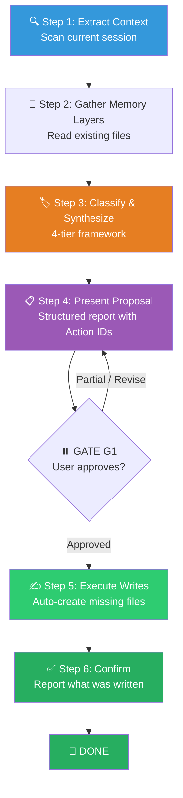

# 🧠 Memory Consolidation Workflow (四维记忆固化组合包)

You are executing the **Memory Consolidation Workflow** — a two-phase process that actively extracts valuable insights, context breakpoints, and troubleshooting pitfalls from the current session, classifies them into structured memory tiers, and persists them to the project's knowledge base after user approval.

> [!CAUTION]
> **PROPOSE FIRST, WRITE SECOND**: You are FORBIDDEN from modifying ANY memory file before presenting proposals and receiving explicit user approval. Phase 1 (Audit & Propose) must complete and be approved before Phase 2 (Execute) begins. No exceptions.

---

## Skill Positioning (技能定位与协作关系)

```
┌────────────────────── Memory Consolidation Ecosystem ──────────────────────┐
│                                                                             │
│  Every workflow invokes /remember at the end:                               │
│                                                                             │
│  /debug ──┐                                                                 │
│  /executing-plans ──┤                                                       │
│  /a4-refactor ──────┼──→  /remember (THIS SKILL)  ──→  Persistent Files    │
│  /a2-feature ───────┤                                                       │
│  /a3-quality ──┘                                                            │
│                                                                             │
│  Output Destinations:                                                       │
│  ├── CLAUDE.md            (Core rules & conventions)                        │
│  ├── docs/短期记忆.md      (WIP breakpoints & handover)                      │
│  ├── docs/长期记忆.md      (Epics & architecture roadmap)                    │
│  └── docs/永久记忆.md      (Permanent lessons & pitfalls)                    │
└─────────────────────────────────────────────────────────────────────────────┘
```

---

## Process Flow Overview (流程总览)



---

## 🔑 Gate Points (用户确认卡口)

| Gate | When | What to Present | Resume Condition |
|------|------|-----------------|------------------|
| **G1** | After Step 4 (Proposal Report) | Full proposal report with Action IDs | User approves (all or selectively) |

> [!IMPORTANT]
> G1 is **blocking**. Do NOT write to any file until the user explicitly approves.

---

## Phase 1: Audit & Propose (审计与提议)

### Step 1: 🔍 Extract Current Context (提取当前上下文)

Before looking at saved memories, actively scan the current conversation:

1. **Debugging Lessons** — Identify painful debugging sessions, root causes of resolved bugs, tool interactions, and diagnostic techniques that worked (or didn't).
2. **Architecture Decisions** — Capture any structural choices, pattern selections, or convention changes made during the session.
3. **Execution Breakpoints** — If the task is long-running and paused, capture the exact execution state: what is done, what is pending, what to do next.
4. **Convention Changes** — Note any new rules, naming patterns, or constraints that emerged.
5. **Transform** raw events into **actionable directives** or **context summaries** — never store raw conversation fragments.

---

### Step 2: 📖 Gather All Memory Layers (采集现有记忆)

Read the following core files (if any don't exist, note them for auto-creation in Phase 2):

| File | Purpose | If Missing |
|------|---------|------------|
| `CLAUDE.md` | Root dir — core architectural rules, tech stack, red-line constraints | Will be created |
| `docs/短期记忆.md` | WIP breakpoints, temporary context handovers | Will be created |
| `docs/长期记忆.md` | Epic (multi-stage) requirement breakdowns, architecture roadmap | Will be created |
| `docs/永久记忆.md` | Permanent troubleshooting records, refactoring experiences | Will be created |

> [!TIP]
> Also check `docs/日志.md` — some projects use this as an alias for `docs/永久记忆.md`.

**While reading**, identify:
- Stale entries that are no longer accurate.
- Duplicate entries across layers.
- Entries that belong in a different tier.

---

### Step 3: 🏷️ Classify & Synthesize (分类与综合)

For each new insight extracted in Step 1, classify it into the 4-Tier Memory Framework:

| Tier | Destination | What Belongs There | Examples |
|------|-------------|-------------------|----------|
| **[CORE]** | `CLAUDE.md` | Global project baseline, tech stack, codebase conventions, red-line rules | "API routes must use kebab-case", "Do not modify ETHOS.md" |
| **[SHORT]** | `docs/短期记忆.md` | Session WIP, immediate next steps, unmerged branches, temporary handover context | "Currently on auth module, stopped at OAuth callback. Next: implement token refresh." |
| **[LONG]** | `docs/长期记忆.md` | Multi-phase goals (Epics), project roadmaps, systemic architectural decisions | "Phase 2 will integrate Stripe. Current setup supports webhooks." |
| **[PERM]** | `docs/永久记忆.md` | Time-consuming traps, root causes of weird bugs, systemic refactor notes | "Bug #102: Prisma version mismatch. Always run `db push` after schema change." |

**Classification Rules**:
- If it's a **constraint that should never be violated** → `[CORE]`
- If it only matters for **this session or the next** → `[SHORT]`
- If it spans **multiple sessions or epics** → `[LONG]`
- If it's a **hard-won lesson from debugging** → `[PERM]`

### 架构决策记录（ADR · 原独立技能并入）

重大**架构决策**（框架/库/数据库/模式/API 设计选型）属于 `[LONG]`，除写进 `docs/长期记忆.md` 外，值得用**结构化 ADR 格式**留下"为什么"，供日后回看：

```markdown
# ADR-NNNN: [决策标题]
**Date**: YYYY-MM-DD  **Status**: proposed | accepted | deprecated | superseded by ADR-NNNN
## Context      [什么问题/约束促成这个决策，2-5 句]
## Decision     [决定做什么，1-3 句]
## Alternatives [考虑过的其它方案 + 各自 pros/cons + 为什么不选]
## Consequences [正面 / 负面 / 风险]
```

- **触发信号**：用户说「我们决定用 X 不用 Y」「记一下这个决策 / ADR this」，或对比两个框架/库得出结论时。
- **落盘**：项目已在用 `docs/adr/` 就写 `docs/adr/NNNN-标题.md` 并更新其 README 索引；否则并入 `docs/长期记忆.md` 的架构决策区。**先出草稿给用户确认再写文件**（口径同本技能 G1）。

---

### Step 4: 📋 Present Proposal Report (呈现提议报告)

Output a structured report using **Action IDs** so the user can approve selectively:

```markdown
🧠 Memory Consolidation Proposal
====================================

**🔵 1. Core Rules (CLAUDE.md)**
- [CORE1] **Convention**: [Actionable rule statement]
- [CORE2] **Constraint**: [Red-line rule statement]

**⚡ 2. Session Handover (docs/短期记忆.md)**
- [SHORT1] **WIP Context**: [Current status and next immediate step]
- [SHORT2] **Pending**: [Unfinished item to pick up next session]

**🗺️ 3. Architecture Roadmap (docs/长期记忆.md)**
- [LONG1] **Epic Milestone**: [Major goal completed / roadmap adjusted]

**💡 4. Permanent Lessons (docs/永久记忆.md)**
- [PERM1] **Gotcha**: [Actionable troubleshooting rule]
- [PERM2] **Pitfall**: [Root cause + prevention]

**🧹 5. Cleanup (Stale Entries to Remove/Update)**
- [C1] **Remove**: [Old entry] from [file] — Reason: [why it's stale]
- [C2] **Update**: [Old entry] in [file] — New value: [updated content]
```

End with:
> "Please review the proposals above. Reply 'Approve all' or specify which items to accept/reject (e.g., 'Approve CORE1, SHORT1, PERM1. Skip LONG1'). Missing files/directories will be auto-created."

**⏸️ GATE G1**: Wait for explicit user approval.

---

## Phase 2: Execution (执行 — 仅在审批后)

> **Entry Condition**: User has explicitly approved (all or selected items).

### Step 5: ✍️ Execute Writes (执行写入)

1. **Auto-Create Infrastructure** — If `docs/` directory or any target file does NOT exist, create them automatically via file creation tools. **Never fail because a file doesn't exist.**

2. **Apply Approved Changes**:
   - Inject approved items into logical sections of the appropriate files.
   - Append chronologically with timestamps for process logs.
   - Respect existing markdown formatting and structure.
   - For `[SHORT]` entries: **replace** stale WIP context rather than appending (a session handover should be current, not historical).
   - For `[CORE]` entries: **deduplicate** — check if a similar rule already exists before appending.

3. **Execute Cleanup Items** — Remove or update stale entries as approved.

### Step 6: ✅ Confirm Writes (确认写入)

Report to the user exactly what was done:

```markdown
✅ Memory Consolidation Complete
==================================
📝 Written:
  ✅ [CORE1] → CLAUDE.md (appended to Conventions section)
  ✅ [SHORT1] → docs/短期记忆.md (replaced WIP context)
  ✅ [PERM1] → docs/永久记忆.md (new entry added)

🧹 Cleaned:
  ✅ [C1] → Removed stale entry from docs/短期记忆.md

📁 Created:
  ✅ docs/ directory (was missing)
  ✅ docs/长期记忆.md (new file)
```

---

## 🔥 Hard Rules (铁律)

1. **Propose First, Write Second**: ALL proposals must be presented and approved before ANY file modification. No exceptions.
2. **Auto-Provision Infrastructure**: Automatically create missing `docs/` directories and memory files. Never fail because a path doesn't exist. Never ask for permission to create infrastructure files.
3. **Actionable Over Raw**: Transform conversation fragments into actionable directives or summaries. Never store raw chat history.
4. **Correct Tier Placement**: Each insight must go to the right tier. A debugging lesson is `[PERM]`, not `[CORE]`. A red-line constraint is `[CORE]`, not `[LONG]`.
5. **Deduplicate Before Appending**: Check existing content for similar entries before adding new ones to `CLAUDE.md`.
6. **Replace, Don't Stack WIP**: Short-term memory (`docs/短期记忆.md`) should reflect the CURRENT state, not accumulate historical states. Replace stale WIP entries.
7. **Cleanup Is Mandatory**: Always audit existing memory for stale, duplicate, or misplaced entries. Report cleanup proposals alongside new additions.
8. **Every Session Must Record**: ALL significant sessions must produce at least one memory entry in `docs/`. An unrecorded session is lost context.
9. **Timestamps on Process Logs**: Entries in `docs/永久记忆.md` and `docs/长期记忆.md` should include date stamps for traceability.
10. **Never Modify ETHOS.md**: Memory consolidation targets CLAUDE.md and docs/ files only. Project-level ETHOS or rule files are off-limits.
