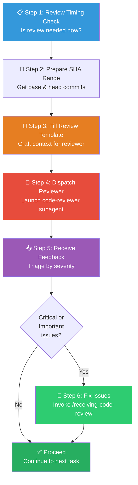

# 📤 Requesting Code Review Workflow (发起代码评审组合包)

You are executing the **Requesting Code Review Workflow** — a structured process for dispatching a focused code-reviewer subagent with precisely crafted context, receiving its evaluation, and triaging the results before proceeding.

> [!IMPORTANT]
> **Core Principle**: Review early, review often. The reviewer gets precisely crafted context for evaluation — never your session's history. This keeps the reviewer focused on the work product, not your thought process, and preserves your own context for continued work.

---

## Skill Positioning (技能定位与协作关系)

```
┌────────────────────── Code Review Lifecycle ──────────────────────┐
│                                                                    │
│  /requesting-code-review (THIS)  →  /receiving-code-review        │
│  ━━━━━━━━━━━━━━━━━━━━━━━━━━━━      ━━━━━━━━━━━━━━━━━━━━━━━━      │
│  Dispatch reviewer subagent        Triage and implement feedback   │
│  Provide context + SHA range       Verify → Evaluate → Fix        │
│                                                                    │
│  Downstream: /finishing-a-development-branch (merge after review)  │
└────────────────────────────────────────────────────────────────────┘
```

---

## Process Flow Overview (流程总览)



---

## Step 1: 📋 Review Timing Check (审查时机判断)

### Mandatory Review Triggers

| Trigger | When |
|---------|------|
| **After each task** in subagent-driven development | Before moving to the next task |
| **After completing major feature** | Before declaring feature complete |
| **Before merge to main** | Final gate before integration |

### Optional but Valuable Triggers

| Trigger | Why |
|---------|-----|
| **When stuck** | Fresh perspective from a reviewer without your tunnel vision |
| **Before refactoring** | Establish a baseline quality check |
| **After fixing a complex bug** | Verify the fix doesn't introduce new issues |

---

## Step 2: 🔖 Prepare SHA Range (准备提交范围)

Get the git SHA range that covers exactly the changes to review:

```bash
# Base: the commit before your changes (pick the right anchor)
BASE_SHA=$(git rev-parse HEAD~1)      # If only 1 commit
BASE_SHA=$(git merge-base main HEAD)  # If branched from main
BASE_SHA=$(git log --oneline | grep "Task N" | head -1 | awk '{print $1}')  # If multi-task

# Head: your latest commit
HEAD_SHA=$(git rev-parse HEAD)
```

> [!TIP]
> Choose the `BASE_SHA` that captures exactly your changes — no more, no less. Too broad a range overwhelms the reviewer; too narrow misses context.

---

## Step 3: 📝 Fill Review Template (填写评审模板)

Use the template at `requesting-code-review/code-reviewer.md` and fill these placeholders:

| Placeholder | Content | Example |
|-------------|---------|---------|
| `{WHAT_WAS_IMPLEMENTED}` | What you just built | "Verification and repair functions for conversation index" |
| `{PLAN_OR_REQUIREMENTS}` | What it should do (spec/plan reference) | "Task 2 from docs/superpowers/plans/deployment-plan.md" |
| `{BASE_SHA}` | Starting commit | `a7981ec` |
| `{HEAD_SHA}` | Ending commit | `3df7661` |
| `{DESCRIPTION}` | Brief summary of changes | "Added verifyIndex() and repairIndex() with 4 issue types" |

### Context Quality Checklist

Before dispatching, verify your template satisfies:

| Check | Passing Criteria |
|-------|-----------------|
| **Scope is clear** | Reviewer knows exactly which files and features to focus on |
| **Requirements linked** | Plan or spec document is referenced so reviewer can check compliance |
| **SHA range is correct** | `git diff BASE_SHA..HEAD_SHA` shows only your intended changes |
| **No session history** | Template contains only work product context, not your reasoning process |
| **No placeholders left** | All `{...}` tokens are replaced with actual values |

---

## Step 4: 🚀 Dispatch Reviewer (分发评审)

Dispatch a `superpowers:code-reviewer` subagent with the filled template.

**What the reviewer does**:
- Reads the diff between `BASE_SHA` and `HEAD_SHA`.
- Evaluates against the linked requirements/plan.
- Returns a structured report with: Strengths, Issues (by severity), and Assessment.

**While waiting**: Do NOT continue to the next task. Wait for the review results.

---

## Step 5: 📥 Receive & Triage Feedback (接收与分拣反馈)

When the reviewer returns, triage each item by severity:

| Severity | Action | Timing |
|----------|--------|--------|
| **🔴 Critical** | Fix **immediately** — blocks all progress | Before anything else |
| **🟡 Important** | Fix **before proceeding** to the next task | After critical fixes |
| **🟢 Minor** | Note for later — does not block progress | Track in task.md or commit later |
| **💡 Suggestion** | Evaluate — apply if improves quality, skip if YAGNI | Discretionary |

### If Reviewer Is Wrong

Do not blindly accept all feedback. Push back with technical reasoning when:
- The suggestion breaks existing functionality.
- It contradicts established patterns in the codebase.
- It violates YAGNI (adds unused features).

**How to push back**:
- Show code/tests that prove the current approach works.
- Reference the spec or plan that justifies the design choice.
- Request clarification if the suggestion is ambiguous.

---

## Step 6: 🔧 Fix Issues (修复问题)

For Critical and Important issues, invoke `/receiving-code-review` to systematically implement fixes.

**Quick-fix protocol** (for simple issues you can handle inline):
1. Fix one item at a time.
2. Test after each fix.
3. Commit with descriptive message: `fix: address review — [description]`.
4. Verify no regressions.

---

## Integration with Other Workflows (与其他工作流的集成)

| Workflow | Review Cadence | Notes |
|----------|---------------|-------|
| **Subagent-Driven Development** | After EACH task | Catch issues before they compound across tasks |
| **Executing Plans** | After every batch (~3 tasks) | Get feedback, apply, continue |
| **Ad-Hoc Development** | Before merge or when stuck | Final quality gate |
| **Refactoring** (`/a4-refactor`) | After integration (Step 5) | Validate no regressions in massive changes |

---

## Example (完整示例)

```markdown
# Scenario: Just completed Task 2 — Add verification function

## 1. Get SHAs
BASE_SHA=$(git log --oneline | grep "Task 1" | head -1 | awk '{print $1}')  # a7981ec
HEAD_SHA=$(git rev-parse HEAD)  # 3df7661

## 2. Dispatch code-reviewer subagent with:
  WHAT_WAS_IMPLEMENTED: Verification and repair functions for conversation index
  PLAN_OR_REQUIREMENTS: Task 2 from docs/superpowers/plans/deployment-plan.md
  BASE_SHA: a7981ec
  HEAD_SHA: 3df7661
  DESCRIPTION: Added verifyIndex() and repairIndex() with 4 issue types

## 3. Reviewer returns:
  Strengths: Clean architecture, real tests
  Issues:
    🟡 Important: Missing progress indicators for long repairs
    🟢 Minor: Magic number (100) for reporting interval
  Assessment: Ready to proceed after fixing Important items

## 4. Act on feedback:
  → Fix progress indicators (Important — must fix before proceeding)
  → Note magic number for later cleanup (Minor — tracked)
  → Continue to Task 3
```

---

## 🔥 Hard Rules (铁律)

1. **Never Skip Review Because "It's Simple"**: Simple changes are where unexamined assumptions hide. Review is always faster than debugging a regression.
2. **Context, Not History**: The reviewer gets crafted context about the work product. Never expose your session's reasoning or thought process.
3. **SHA Range Must Be Exact**: A diff that's too broad overwhelms; too narrow misses context. Verify with `git diff` before dispatching.
4. **Fix Critical Immediately**: Critical issues block all forward progress. No exceptions.
5. **Fix Important Before Proceeding**: Important issues must be resolved before moving to the next task.
6. **Push Back When Valid**: Do not blindly accept feedback. Technical correctness over social compliance.
7. **No Placeholders In Templates**: Every `{...}` must be replaced before dispatching. Sending incomplete context wastes the reviewer's capacity.
8. **Wait For Results**: Do not continue to the next task while a review is pending. The whole point is to catch issues before they compound.

See template at: `requesting-code-review/code-reviewer.md`
