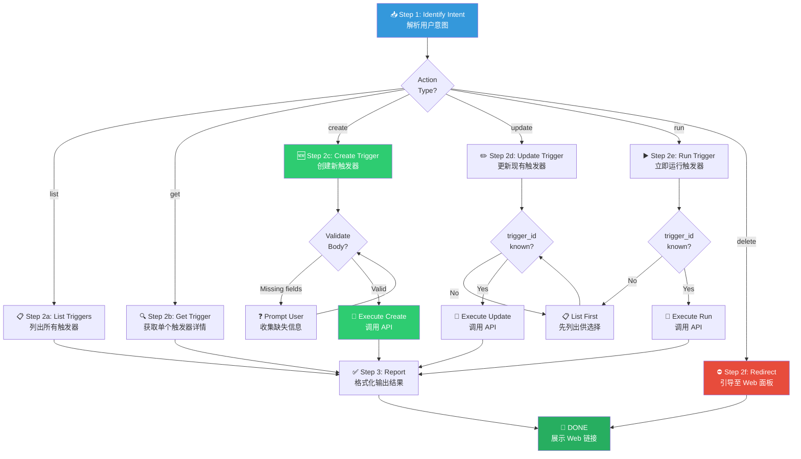

# 📅 Schedule Remote Agents (远程定时触发器管理)

You are executing the **Schedule Workflow** — a structured guide for managing **Remote Triggers** on Anthropic's cloud infrastructure. Each trigger spawns a fully isolated Claude Code Runner (CCR) session on a cron schedule, with its own git checkout, tools, and optional MCP connections. These are **NOT** local cron jobs.

> [!CAUTION]
> **工具前置守卫**: 在执行任何 trigger 操作前，你**必须**先通过 `ToolSearch` 加载远程触发器工具族（MCP: `create_trigger` / `list_triggers` / `update_trigger` / `delete_trigger` / `fire_trigger`；或内置 `CronCreate` / `CronList` / `CronDelete`）。认证由工具内部处理 — **绝不使用 curl**。

**Announce at start:** *"Using the schedule skill to manage remote triggers."*

---

## 🗺️ Skill Positioning & Ecosystem (生态定位)

```
┌─────────────────── Scheduling Ecosystem ───────────────────┐
│                                                            │
│  ┌───────────┐     ╔═══════════════╗     ┌──────────────┐  │
│  │ /loop     │     ║  /schedule    ║     │ claude.ai    │  │
│  │ 会话内循环 │     ║  远程持久调度  ║     │ /scheduled   │  │
│  │ (短命)    │     ║  (长命)       ║     │ (Web 管理台) │  │
│  └─────┬─────┘     ╚═══╤═══════╤══╝     └──────┬───────┘  │
│        │               │       │               │           │
│  Input:用户在当前   Input:用户需要  Output:已创建   补充:删除   │
│  会话中要循环做事   跨会话持久化    的 trigger     trigger     │
│                    定时任务                     只能去Web面板 │
└────────────────────────────────────────────────────────────┘
```

| 维度 | `/loop` (会话内循环) | `/schedule` (远程触发器) |
|------|---------------------|------------------------|
| **生命周期** | 随会话结束而消亡 | 独立于会话，持久存在 |
| **执行环境** | 当前本地 Agent | Anthropic 云端隔离 CCR |
| **上游 Input** | 用户在当前对话中的口头指令 | 用户明确要求创建/管理 trigger |
| **下游 Output** | 无持久化产出 | trigger_id 可用于后续 get/update/run |
| **典型用例** | "每5分钟检查一下部署状态" | "每天凌晨3点跑一次全量测试" |

---

## Process Flow Overview (流程总览)



---

## 🔑 Gate Points (质量关卡)

| 步骤阶段 | 准入前提 (Entry Gate) | 必须满足的检查项 (Checklist) | 产出与通过标准 (Exit Gate) |
|----------|----------------------|----------------------------|--------------------------|
| **Step 1: 意图解析** | 用户发出了与定时/触发器/schedule 相关的请求 | ① 正确分类为 6 种 action 之一 ② 排除 `/loop` 场景 ③ 排除本地 cron 场景 | 明确的 `action` 类型 + 所有必要参数 |
| **Step 2c: 创建触发器** | action = "create" | ① `create_trigger` (或 `CronCreate`) 已加载 ② body 包含必填字段 (cron, prompt) ③ cron 表达式语法合法 ④ prompt 非空 | API 返回 `trigger_id` + 200 状态码 |
| **Step 2d: 更新触发器** | action = "update" + 有效 `trigger_id` | ① `update_trigger` 已加载 ② `trigger_id` 存在（先 list 验证） ③ body 仅含要更新的字段 | API 返回更新确认 |
| **Step 2e: 立即运行** | action = "run" + 有效 `trigger_id` | ① `fire_trigger` 已加载 ② `trigger_id` 存在 | API 确认已触发执行 |
| **Step 3: 结果报告** | API 调用完成（成功或失败） | ① 成功：格式化 trigger 详情展示 ② 失败：展示原始错误信息 + 建议修复方案 | 用户收到清晰的操作反馈 |

---

## Step 1: 📥 Identify Intent (解析用户意图)

**目标**: 将用户的自由文本请求精确映射到 6 种操作之一。

### Action Routing Table

| 用户意图关键词/模式 | 映射 Action | 所需参数 |
|-------------------|------------|---------|
| "列出/查看所有触发器"、"有哪些定时任务" | `list` | 无 |
| "查看某个触发器详情"、"trigger 状态" | `get` | `trigger_id` |
| "创建/新建/设置一个定时任务"、"每天跑xxx" | `create` | `body` (含 cron + prompt) |
| "修改/更新触发器"、"把频率改成xxx" | `update` | `trigger_id` + `body` |
| "立即运行/手动触发" | `run` | `trigger_id` |
| "删除/移除/取消触发器" | `delete` | ⛔ 不支持 — 引导用户 |

### 歧义消解规则

1. **若用户说"定时执行某个东西"但不清楚是本次会话内循环还是远程持久调度** → 主动询问：
   ```
   您想要的是：
   1. 在当前会话中按间隔循环执行（会话结束即停止）→ 我将使用 /loop
   2. 创建一个远程持久定时任务（跨会话长期运行）→ 我将使用 /schedule
   ```
2. **若用户说"cron job"但描述像本地任务**（如"在我的服务器上每小时跑一次脚本"）→ 明确告知此技能仅管理 Anthropic 远程 Agent，并提供本地 crontab/Task Scheduler 指引。

---

## Step 2: 📡 Execute Action (执行操作)

> [!IMPORTANT]
> **工具加载前置条件**: 在执行任何 action 之前，必须先确认对应的远程触发器工具已加载。加载方法：
> ```
> ToolSearch select:create_trigger,list_triggers,update_trigger,delete_trigger,fire_trigger
> ```
> 若使用内置 Cron 工具族，则加载 `ToolSearch select:CronCreate,CronList,CronDelete`。
> 认证由工具内部自动处理 — **绝不使用 curl 或手动 HTTP 请求**。

> [!CAUTION]
> **工具加载失败应急**: 若 `ToolSearch` 未返回任何远程触发器工具（`create_trigger` / `list_triggers` / `update_trigger` / `delete_trigger` / `fire_trigger`，或 `CronCreate` / `CronList` / `CronDelete` 均不可用、环境未配置、或运行在不支持的环境中），**必须立即告知用户**：
> ```
> ⚠️ 无法加载远程触发器工具。可能原因：
>   1. 当前环境不支持远程触发器 API
>   2. 工具未注册 / 认证过期
> 
> 替代方案：请直接访问 Web 管理面板操作：
> 👉 https://claude.ai/code/scheduled
> ```
> **绝不尝试绕过** — 不可使用 curl、fetch 或任何手动 HTTP 调用替代。

### 2a. List — 列出所有触发器

```
list_triggers({})
# 或内置工具族： CronList({})
```

**输出格式化要求**: 将返回结果整理为可读表格：

```markdown
| # | Trigger ID | Cron | Prompt (前30字) | 状态 |
|---|-----------|------|-----------------|------|
| 1 | abc-123   | 0 3 * * * | "每日全量测试..."  | active |
```

### 2b. Get — 获取单个触发器

```
# 工具族无独立 get；用 list 拉全量后按 trigger_id 过滤
list_triggers({})   # 从返回列表中筛出 trigger_id == "<id>" 的条目
```

若用户未提供 `trigger_id` → 先执行 `list_triggers`，然后请用户选择或根据描述自动匹配。

### 2c. Create — 创建新触发器

**必填字段验证** — 在调用 API 前必须确保 body 包含：

| 字段 | 类型 | 必填 | 说明 | 示例 |
|------|------|------|------|------|
| `cron` | string | ✅ | 合法的 5 位 cron 表达式 | `"0 3 * * *"` |
| `prompt` | string | ✅ | 非空的执行指令 | `"运行全量测试并报告"` |
| `idle_timeout` | number | ❌ | Agent 空闲超时秒数（默认由平台决定） | `300` |
| `max_turns` | number | ❌ | 单次执行最大轮次（防止无限循环） | `50` |
| `allowed_tools` | string[] | ❌ | 允许 Agent 使用的工具白名单 | `["bash", "file_editor"]` |

> [!TIP]
> 可选字段仅在用户明确提出时才添加。不要主动询问每一个可选字段。

**Cron 表达式辅助构建**: 若用户用自然语言描述频率（如"每天凌晨3点"），你需要将其转换为标准 cron：

| 用户表述 | 对应 Cron | 注意事项 |
|---------|----------|----------|
| 每分钟 | `* * * * *` | ⚠️ 高频，可能产生大量费用 |
| 每小时 | `0 * * * *` | — |
| 每天凌晨3点 | `0 3 * * *` | 时区为 UTC，需提醒用户 |
| 每周一上午9点 | `0 9 * * 1` | 时区为 UTC |
| 每月1号 | `0 0 1 * *` | — |
| 工作日每天 | `0 9 * * 1-5` | — |

> [!WARNING]
> **时区警告**: Cron 表达式使用 **UTC 时区**。如用户以本地时间描述（如"北京时间凌晨3点"），需转换为 UTC（即 `0 19 * * *`，UTC 前一天 19:00）。务必向用户确认转换结果。

```
create_trigger({
  name: "全量测试",
  cron_expression: "0 3 * * *",
  prompt: "运行全量测试并将结果写入 docs/test-report.md"
})
# 或内置工具族： CronCreate({ cron: "0 3 * * *", prompt: "..." })
```

**创建成功后**必须向用户确认：

```markdown
✅ 触发器已创建！
- **Trigger ID**: <returned_id>
- **Cron**: <cron_expression>
- **频率**: <人类可读描述，如"每天凌晨3:00">
- **Prompt**: <prompt_content>
- **管理面板**: https://claude.ai/code/scheduled
```

### 2d. Update — 更新触发器

```
update_trigger({
  trigger_id: "<id>",
  /* 仅包含需要修改的字段，如 cron_expression / name / enabled */
})
```

**更新操作强制流程**（不可跳步）：

1. **先 `list_triggers` 查当前配置** — 确认 `trigger_id` 存在且获取完整当前状态。
2. **展示 before → after 变更对比** — 让用户明确看到将要发生的变化：
   ```markdown
   📝 变更预览：
   | 字段 | 当前值 | 新值 |
   |------|--------|------|
   | cron | 0 3 * * * | 0 6 * * * |
   ```
3. **获取用户确认** — *"确认提交以上变更？"* 收到明确确认后才执行。
4. 只传递需要变更的字段，不要全量覆盖。

### 2e. Run — 立即运行

```
fire_trigger({trigger_id: "<id>"})
```

运行后告知用户：该执行是一次性的，不影响已有的 cron 计划。

### 2f. Delete — 引导删除

> [!WARNING]
> **此 API 不支持删除操作。** 当用户要求删除触发器时，输出以下引导：
> ```
> ⚠️ 远程触发器暂不支持通过 API 删除。
> 请前往 Web 管理面板手动操作：
> 👉 https://claude.ai/code/scheduled
> ```

---

## Step 3: ✅ Report Results (结果报告)

每次操作完成后，必须向用户提供结构化反馈：

### 成功时

```markdown
✅ 操作完成：<action 类型>
- **详情**: <关键信息摘要>
- **管理面板**: https://claude.ai/code/scheduled
```

### 失败时

```markdown
❌ 操作失败：<action 类型>
- **错误**: <原始错误消息>
- **可能原因**: <基于错误码的分析>
- **建议**: <修复建议或替代方案>
```

### 常见错误码参考

| HTTP 状态码 | 含义 | 常见原因 | 建议操作 |
|------------|------|---------|----------|
| `400` | Bad Request | Cron 表达式语法错误 / prompt 为空 / 必填字段缺失 | 检查并修正请求 body |
| `401` | Unauthorized | 工具认证失效 | 重新加载对应触发器工具（`create_trigger` / `list_triggers` / … 或 `CronList` 等） |
| `404` | Not Found | `trigger_id` 不存在 | 先 `list` 确认有效 ID |
| `429` | Rate Limited | API 调用过于频繁 | 等待片刻后重试 |
| `500` | Server Error | 平台内部故障 | 等待后重试，或引导用户至 Web 面板 |

---

## 🔥 Hard Rules (铁律)

1. **工具前置加载**: 必须通过 `ToolSearch select:create_trigger,list_triggers,update_trigger,delete_trigger,fire_trigger`（或 `ToolSearch select:CronCreate,CronList,CronDelete`）加载工具后才能执行任何操作。绝不使用 curl。
2. **不可删除**: 此 API 无法删除 trigger。遇到删除请求必须引导至 Web 面板 `https://claude.ai/code/scheduled`。
3. **Cron 验证**: 创建/更新时必须验证 cron 表达式的语法合法性（5 位格式）。非法表达式禁止提交。
4. **Prompt 非空**: 创建时 prompt 不得为空字符串。若用户未提供，主动询问。
5. **先查后改**: 执行 update/run 前，若不确定 `trigger_id` 是否有效，先 `get` 验证其存在。
6. **格式化输出**: 所有 list/get 结果必须以 Markdown 表格或结构化格式呈现，禁止直接倾倒原始 JSON。
7. **歧义必澄清**: 当无法区分用户想要 `/loop`（会话内循环）还是 `/schedule`（远程持久化）时，必须主动询问，不可猜测。
8. **变更可追溯**: 执行 update 前必须展示 before → after 对比，获取用户确认后再提交。