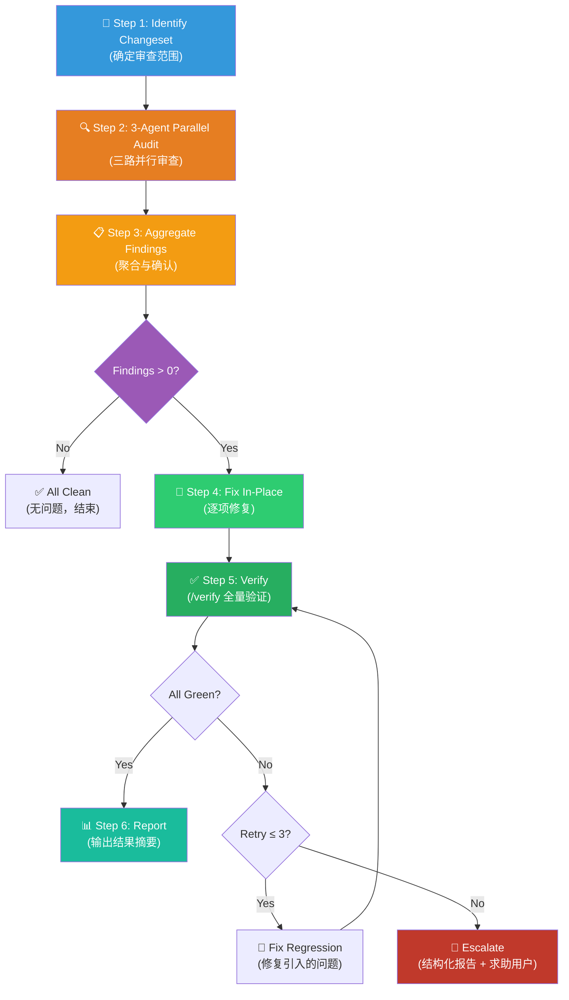

# 🧹 Simplify — Code Review & Cleanup (代码坏味道清理组合包)

You are executing the **Simplify Workflow** — a structured, three-agent parallel audit that identifies reuse gaps, structural code smells, and performance waste in the changeset, then fixes every confirmed issue in-place with full evidence-based verification.

> [!CAUTION]
> **TWO-PHASE GATE MODEL (两阶段关卡模型)**: Phase 1 (Audit) is **strictly read-only** (严格只读) — zero code modifications allowed. All fixes happen in Phase 2 only after findings are confirmed. Never "quick-fix" during the audit.

---

## Skill Positioning (技能定位与协作关系)

```
┌──────────────────────── Simplify Ecosystem ─────────────────────────┐
│                                                                       │
│  UPSTREAM (Callers / 谁调用我)                                        │
│  ━━━━━━━━━━━━━━━━━━━━━━━━━━━━                                        │
│  /02-quality Step 2 ──→ /simplify (As parallel audit engine)         │
│  /requesting-code-review ──→ /simplify (Triggered by review feedback)│
│  User ──→ /simplify (Direct manual trigger)                          │
│                                                                       │
│  THIS SKILL (当前技能)                                                │
│  ━━━━━━━━━━━━━━━━━━━                                                 │
│  3-Agent Parallel Audit (Reuse / Quality / Efficiency)               │
│  → Aggregate Findings → Confirm Fixes → Apply Sequentially           │
│                                                                       │
│  DOWNSTREAM (Outputs / 我的产出流向)                                  │
│  ━━━━━━━━━━━━━━━━━━━━━━━━━━━━━━━━                                    │
│  /verify ──→ Full verification post-fix (build + lint + test)        │
│  /02-quality Step 3 ──→ Stream findings to Optimization Proposal     │
│  /remember ──→ Consolidate review experience into memory             │
└───────────────────────────────────────────────────────────────────────┘
```

> **Boundary vs /02-quality (与 02-quality 的分工边界)**: `/simplify` = 只做「评审 + 重构清理」(review + refactor cleanup)；`/02-quality` = 先审出优化计划书再修复 + 测试 + 排障 (audit into a plan first, then fix + test + debug)。作为 `/02-quality` Step 2 引擎被调用时，`/simplify` 只跑 Phase 1 并回传发现，是否进入修复由上游把关。

---

## Process Flow Overview (流程总览)



---

## 🔑 Gate Points (关键质量关卡)

| Phase (步骤阶段) | Entry Gate (准入前提) | Checklist (必须满足的检查项) | Exit Gate (产出与通过标准) |
|------------------|----------------------|---------------------------|---------------------------|
| **Step 1: Scope Definition** | Invoked by user or upstream workflow (用户触发或上游调用) | ① Identify diff origin (git diff / session edits / user specific). ② Non-empty scope. (①防空跑 ②确认文件来源) | A confirmed list of files to review, minimum 1. (待审查文件列表) |
| **Step 2: Parallel Audit** | File list from Step 1 is confirmed (范围已确认) | ① All 3 Agents launched. ② Full file content/diff passed to them. ③ Strict read-only mode. (①三路并发 ②全量上下文 ③只读不改) | Structured lists of findings from each Agent. (各Agent结构化发现列表) |
| **Step 3: Aggregation** | All 3 Agents returned (Agent返回结果) | ① Deduplicate. ② Silently discard false positives. ③ Exact file/line numbers mapped. (①去重 ②处理假阳性 ③精确到行) | The final confirmed audit master list. (确认的发现总表) |
| **Step 4: Fix In-Place** | Confirmed findings > 0 (发现总数>0) | ① Single logical concern per fix. ② Match existing codebase style. ③ ≤50 lines per change. (①单一职责 ②遵循规范 ③切片修改) | Code changes applied successfully. (代码修改落地) |
| **Step 5: Verification** | All fixes applied (修复全部完成) | ① Run `/verify` (build+lint+test). ② Capture stdout/stderr evidence. (①全套验证通过 ②铁证捕获) | All green report OR escalate after 3 retries. (全绿报告或升级) |
| **Step 6: Report** | Verification passed or escalated (验证通过或升级) | ① Full statistics included. ② Each fix documented. (①数据统计 ②变动说明) | Structured Markdown summary report. (结构化摘要报告) |

---

## Phase 1 — Audit (审查阶段，只读)

> [!IMPORTANT]
> **NO CODE MODIFICATIONS allowed in Phase 1.** Compile, analyze, and record only. (Phase 1 严禁任何代码修改)

### Step 1: 📂 Identify Changeset (确定审查范围)

Attempt to resolve the review scope in this priority order, taking the first non-empty result (按优先级获取变更):

```bash
# Priority 1: Staged changes (暂存区变更)
git diff --cached --name-only

# Priority 2: Unstaged changes in working directory (工作区变更)
git diff HEAD --name-only

# Priority 3: Commits from recent history (最近提交)
git diff HEAD~5 --name-only
```

**If no git changes exist**: Review the files mentioned or edited in the current conversation. (无 git 变更时审查会话上下文文件)

**If user explicitly target paths**: Override and use those paths exclusively. (用户显式指定时，以用户为准)

**Output**: A clean list of target file paths and file count.

---

### Step 2: 🔍 Three-Agent Parallel Audit (三路并行审查)

Launch **all three** of the following review Agents concurrently using the `agent` tool. Provide the full file content or complete diff to ensure full context. (三线并发执行审查)

---

#### Agent 1: 🔁 Reuse Review (复用审查)

> **Goal**: Eliminate reinventing the wheel. (消灭重新造轮子)

**Heuristics (检测项)**:

| ID | Smell (坏味道) | Detection Heuristic (检测启发式) | Action (修复动作) |
|----|----------------|----------------------------------|--------|
| R1 | **Duplicate Utility** | New function overlaps with existing helper in `utils/`, `shared/` etc. (重复的工具函数) | Replace with existing (替换为已有) |
| R2 | **Inline Reimplementation** | Hand-rolled string ops, path handling, type guards where stdlib/helpers exist (内联手敲常见逻辑) | Swap to existing util (换用已有工具) |
| R3 | **Near-Miss Reuse** | Existing function handles 90% of need but wasn't recognized (擦肩而过的复用) | Extend existing / Delegate (扩展或委托) |

**Output format for Agent 1**:
```markdown
### Reuse Findings
| # | File:Line | Smell ID | Description | Suggested Fix |
|---|-----------|----------|-------------|---------------|
```

---

#### Agent 2: 🎯 Quality Review (质量审查)

> **Goal**: Kill structural code smells. (消灭结构性审查)

**Heuristics (检测项)**:

| ID | Smell (坏味道) | Detection Heuristic (检测启发式) |
|----|----------------|----------------------------------|
| Q1 | **Redundant State** | State mirror or derivable state; cache values read-on-demand (冗余推导状态) |
| Q2 | **Parameter Sprawl** | Function gaining new params instead of restructuring; >4 params (参数膨胀) |
| Q3 | **Copy-Paste Variation** | Twin blocks differing by ≤20% — unify via shared abstraction (复制粘贴的变种) |
| Q4 | **Leaky Abstraction** | Internal implementation details crossing module boundaries (抽象泄漏) |
| Q5 | **Stringly-Typed Code** | Raw strings where constants, enums, or branded types exist (使用裸字符串代替常量枚举) |
| Q6 | **Unnecessary Nesting** | Wrapper elements (divs, Boxes) adding no structural/layout value (无意义的包装嵌套) |
| Q7 | **Noise Comments** | Comments restating WHAT code does or task IDs — delete them (描述WHAT的噪音注释) |

**Output format for Agent 2**:
```markdown
### Quality Findings
| # | File:Line | Smell ID | Description | Suggested Fix |
|---|-----------|----------|-------------|---------------|
```

---

#### Agent 3: ⚡ Efficiency Review (效率审查)

> **Goal**: Eliminate wasted compute, memory, and I/O. (消灭浪费的计算与IO)

**Heuristics (检测项)**:

| ID | Smell (坏味道) | Detection Heuristic (检测启发式) |
|----|----------------|----------------------------------|
| E1 | **Redundant Work** | Duplicated computations, duplicate API reads, N+1 query patterns (重复工作/N+1) |
| E2 | **Sequential Indep.** | Independent async tasks running sequentially — use `Promise.all` (无依赖关系却串行等待) |
| E3 | **Hot-Path Bloat** | Heavy unoptimized logic in boot sequence, per-request, or render loops (热路径臃肿) |
| E4 | **Unconditional Update** | State updates/renders firing unconditionally — add change guards (无条件重新渲染/更新) |
| E5 | **TOCTOU Checks** | Checking existence before file/API IO — handle via try-catch instead (先检查后操作的竞态点) |
| E6 | **Memory Leaks** | Unbounded maps/arrays, unhandled event listeners (未解绑监听或无限长集合) |
| E7 | **Over-Broad Reads** | Reading entire dataset/payload when only a slice is needed (过度宽泛的读取) |

**Output format for Agent 3**:
```markdown
### Efficiency Findings
| # | File:Line | Smell ID | Description | Suggested Fix |
|---|-----------|----------|-------------|---------------|
```

---

### Step 3: 📋 Aggregate & Confirm Findings (聚合与确认)

1. **Wait** for all three Agents to finish. (等待全部完成)
2. **Merge** findings into a consolidated table grouped by file. (合并表单)
3. **Deduplicate**: If Agents report the same issue, merge into one. (去重)
4. **Filter False Positives**: Silently discard false alarms. Do not argue, do not log them. (静默处理误报)
5. **Exact Location**: Standardize `File:Line_Number` for all valid findings. (精准定位到行号)

**If 0 findings confirmed**: Skip to Step 6 and output the "All Clean" report. (若全绿，直达第六步)

---

## Phase 2 — Fix & Verify (修复与验证阶段)

> [!CAUTION]
> Phase 2 is ONLY executed after Phase 1 finishes. If invoked by `/02-quality`, Phase 2 is gated by the parent workflow (requires User Approval). If `/simplify` was triggered directly, proceed to Phase 2 automatically. (独立触发全自动，上游调用受上游控制)

### Step 4: 🔧 Fix In-Place (逐项修复)

Apply the confirmed fixes sequentially per the following constraints (按规约修复):

1. **Single Concern**: Fix exactly one finding at a time. No piggybacking new refactors. (单一职责修改)
2. **Match Style**: Strictly conform to existing codebase styles, naming, and indentation. (遵循已有风格)
3. **Chunking**: If a fix requires > 50 lines, slice the execution into steps. (大片段切分)
4. **DRY over Copy**: Prefer extracting shared abstractions to copying code. (优先抽象共享)
5. **YAGNI**: Fix only the targeted finding. Do not proactively add "might be useful" logic. (不过早优化)

### Step 5: ✅ Verify (全量验证)

**Invoke the `/verify` skill** to run the complete `build + lint + type check + test` cycle. (调用验证流)

**Verification Rules (验证规则)**:
- Must capture stdout/stderr evidence. "Looks fine" is an invalid response. (硬核捕获日志，严禁主观判断)
- If validation fails, analyze, fix properly, and run a FULL verify again. (失败后重跑全量，不准抽测)
- **Retry Budget**: Maximum of 3 fix/verify loops. (最多重试3次)
- Upon exhausting retry budget: Escalate to structured failure report. (超过重试即升级报警)

---

### Step 6: 📊 Report Results (输出结果摘要)

Output the final review metadata cleanly in the format below (按此格式输出总结):

#### When Findings Encountered (有清理动作时):

```markdown
## Simplify Results

**Files reviewed (评估文件):** <N>
**Issues found (发现雷区):** <N>  |  **Fixed (已修复):** <N>  |  **Skipped (误报排除):** <N>

| File | Smell ID | Agent | Fix Applied (变更概要) |
|------|----------|-------|------------------------|
| …    | R1/Q3/E2 | 1/2/3 | …                      |

📊 Verification: ✅ All Green (build + lint + test — exit 0)
```

#### When Zero Findings (零坏味道时):

```markdown
## Simplify Results

**Files reviewed:** <N>
**Issues found:** 0

✅ All changes reviewed — no issues found. (一切良好，未见异常)
```

---

## 🔥 Hard Rules (铁律)

1. **Phase 1 strictly Read-Only**: Zero code modification allowed during audit. "Quick fixes" are forbidden. (第一阶段不可越界修改代码)
2. **Parallel Agent Execution**: All 3 agents must be launched concurrently. Do not serialize. (三工序必须并行)
3. **Structured Outputs**: Agents must respond exactly using the Markdown table format. No prose. (严禁散文，死守表格结构)
4. **Exact Positional Targeting**: Vague locations rejected. Must use `File:Line`. (必须精准到行定位)
5. **Evidence > Claims**: Validation relies on process exit codes and text logs. Unacceptable to claim "it looks correct". (铁证重于主观宣称)
6. **Retry Limits**: Do not enter infinite loops on Step 5. Escalate after 3 failed verification loops. (严禁死循环，三次必退)
7. **Anti-Shirking Principle**: Test failures introduced after your code modification are your responsibility unless proven existing via baseline diff evidence. (谁改坏谁兜底，甩锅需出示基线证据)
8. **Upstream Awareness**: If dispatched by `/02-quality`, pause and return findings at the end of Phase 1 instead of continuing to Phase 2. (感知上游调度身份)
9. **No Pipeline Skips**: Skip none of the 6 steps. (六大步骤不可省略)