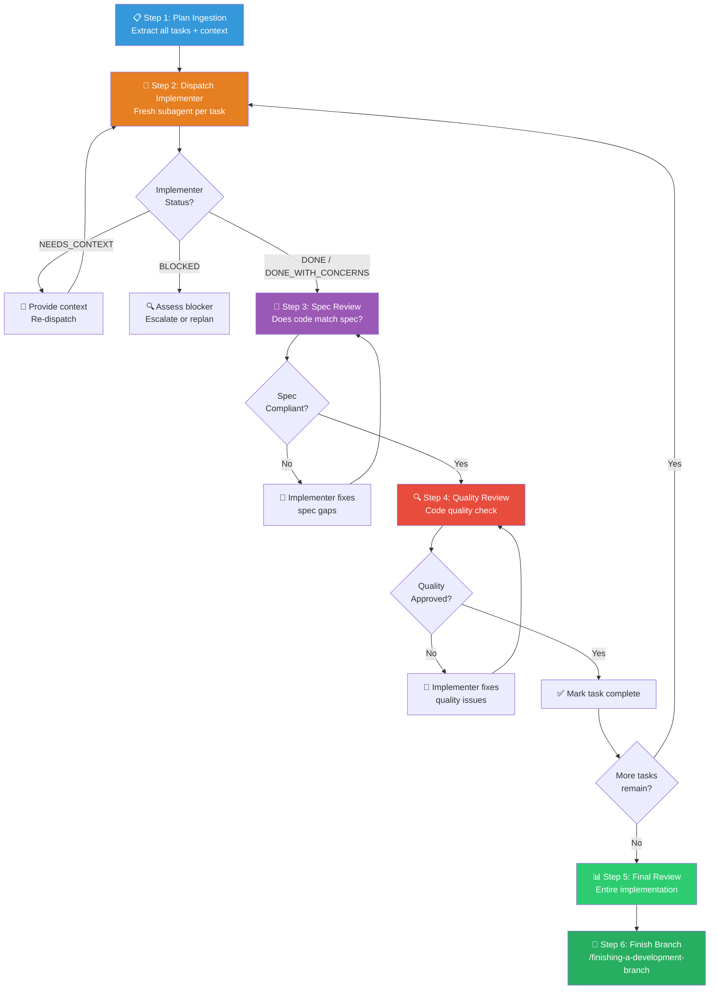

# 🤖 Subagent-Driven Development Workflow (子智能体驱动开发组合包)

You are executing the **Subagent-Driven Development Workflow** — a same-session orchestration pattern that dispatches a fresh subagent per task, then runs two-stage review (spec compliance → code quality) after each task, ensuring high quality through isolated context and systematic verification.

> [!CAUTION]
> **FRESH SUBAGENT PER TASK**: Every task gets a NEW subagent with precisely crafted context. Subagents should NEVER inherit your session's history. You construct exactly what they need — this keeps them focused and preserves your coordination context.

---

## Skill Positioning (技能定位与协作关系)

```
┌────────────────────── Execution Skill Decision Tree ──────────────────────┐
│                                                                            │
│  Q1: Have implementation plan?                                             │
│      No  → /brainstorming or manual execution                              │
│      Yes ↓                                                                 │
│  Q2: Tasks mostly independent?                                             │
│      No  → Manual execution (tightly coupled)                              │
│      Yes ↓                                                                 │
│  Q3: Stay in current session?                                              │
│      Yes → /subagent-driven-development (THIS SKILL) ✅                    │
│      No  → /executing-plans (parallel session)                             │
│                                                                            │
│  Upstream: /writing-plans → produces the plan this skill executes          │
│  Downstream: /finishing-a-development-branch → merge after all tasks       │
│  Setup: /using-git-worktrees → isolate workspace before starting           │
└────────────────────────────────────────────────────────────────────────────┘
```

**vs. /executing-plans (parallel session)**:
- Same session, no context switch
- Fresh subagent per task (no context pollution)
- Two-stage review after each task: spec compliance first, then code quality
- Faster iteration (no human-in-loop between tasks)

---

## Process Flow Overview (流程总览)



---

## Step 1: 📋 Plan Ingestion (计划吸收)

**Goal**: Read the plan ONCE, extract all task details upfront, and create a tracking list.

**Actions**:

1. **Read the plan file** — Read the full plan once. Do NOT have subagents read it (wastes their context).
2. **Extract all tasks** with their full text, acceptance criteria, and relevant context.
3. **Note cross-task context** — dependencies, shared interfaces, common patterns.
4. **Create tracking list** (TodoWrite or `task.md`) with all tasks listed.

---

## Step 2: 🚀 Dispatch Implementer (分发实现子智能体)

For each task, dispatch a fresh implementer subagent using `./implementer-prompt.md`.

### What to Include in the Implementer Prompt

| Section | Content |
|---------|---------|
| **Task text** | Full task description from the plan (copy, don't reference) |
| **Scene-setting context** | Where this task fits in the overall project |
| **Relevant code snippets** | Key interfaces, types, patterns the implementer needs |
| **Constraints** | What files to touch, what NOT to touch |
| **Test expectations** | What tests to write, what suites to run |

### Model Selection (模型选择)

Use the least powerful model that can handle each role to conserve cost and increase speed:

| Task Complexity | Model Tier | Signals |
|----------------|------------|---------|
| **Mechanical** | Cheap/Fast | Touches 1–2 files, complete spec, clear pattern to follow |
| **Integration** | Standard | Multi-file coordination, pattern matching, debugging needed |
| **Architecture/Review** | Most Capable | Design judgment, broad codebase understanding required |

### Handling Implementer Status (实现状态处理)

| Status | Meaning | Action |
|--------|---------|--------|
| **DONE** | Task completed successfully | Proceed to Step 3 (Spec Review) |
| **DONE_WITH_CONCERNS** | Completed but flagged doubts | Read concerns. If about correctness/scope → address first. If observational → note and proceed. |
| **NEEDS_CONTEXT** | Missing information | Provide the missing context and re-dispatch |
| **BLOCKED** | Cannot complete task | See blocker resolution protocol below |

### Blocker Resolution Protocol

```
1. Context problem → Provide more context, re-dispatch same model
2. Needs more reasoning → Re-dispatch with more capable model
3. Task too large → Break into smaller sub-tasks
4. Plan itself is wrong → Escalate to user
```

> [!WARNING]
> **Never** ignore an escalation or force the same model to retry without changes. If the implementer says it's stuck, something needs to change.

---

## Step 3: 📐 Spec Compliance Review (规格合规审查)

**Goal**: Verify the implementer's code matches the spec — nothing missing, nothing extra.

Dispatch a spec reviewer subagent using `./spec-reviewer-prompt.md`.

**What the Spec Reviewer checks**:
- All requirements from the task spec are implemented
- No unrequested features were added (YAGNI enforcement)
- Acceptance criteria from the plan are met
- Tests cover the specified behavior

**If issues found**:
1. Implementer (same subagent) fixes them.
2. Spec reviewer reviews again.
3. Repeat until `✅ Spec compliant`.

> [!CAUTION]
> **Spec compliance MUST pass before code quality review.** Wrong order = waste. Fixing spec gaps often invalidates quality feedback.

---

## Step 4: 🔍 Code Quality Review (代码质量审查)

**Goal**: Verify the code is well-built, not just spec-compliant.

Dispatch a code quality reviewer subagent using `./code-quality-reviewer-prompt.md`.

**What the Quality Reviewer checks**:
- Code clarity, naming, structure
- Test quality and coverage
- Error handling, edge cases
- Performance considerations
- Conformance to project conventions

**If issues found**:
1. Implementer fixes them.
2. Quality reviewer reviews again.
3. Repeat until `✅ Approved`.

**After both reviews pass**: Mark the task as complete in the tracking list. Proceed to next task.

---

## Step 5: 📊 Final Review (最终全局审查)

After ALL tasks are complete, dispatch a final code reviewer subagent to review the **entire implementation** as a whole.

**What the Final Reviewer checks**:
- Cross-task consistency and integration
- No leftover TODOs or incomplete wiring
- Full test suite passes
- All plan requirements satisfied end-to-end

---

## Step 6: 🏁 Finish Branch (分支收尾)

Invoke `/finishing-a-development-branch` to:
- Verify final green state
- Prepare for merge/PR
- Clean up worktrees if any

---

## Prompt Templates (提示词模板)

| Template | Purpose |
|----------|---------|
| `./implementer-prompt.md` | Dispatch implementer subagent |
| `./spec-reviewer-prompt.md` | Dispatch spec compliance reviewer subagent |
| `./code-quality-reviewer-prompt.md` | Dispatch code quality reviewer subagent |

---

## Integration with Other Skills (与其他技能的集成)

| Skill | Relationship |
|-------|-------------|
| `/using-git-worktrees` | **REQUIRED** — Set up isolated workspace before starting |
| `/writing-plans` | Upstream — creates the plan this skill executes |
| `/requesting-code-review` | Code review template for reviewer subagents |
| `/test-driven-development` | Subagents should follow TDD for each task |
| `/finishing-a-development-branch` | Downstream — complete development after all tasks |
| `/executing-plans` | Alternative — use for parallel session execution |

---

## 🔥 Hard Rules (铁律)

1. **Fresh Subagent Per Task**: Every task gets a new subagent with crafted context. Never reuse a subagent across tasks — context pollution degrades quality.
2. **Provide Full Text, Not References**: Give implementers the complete task text and code context. Never tell them to "read the plan file" — that wastes their context window.
3. **Spec Before Quality**: Spec compliance review MUST pass before code quality review begins. Never reverse the order.
4. **Review Loops Must Complete**: If a reviewer finds issues, the implementer fixes them and the reviewer reviews again. Never skip re-reviews.
5. **Self-Review Does Not Replace Review**: Implementer self-review is valuable but is NOT a substitute for spec + quality reviews. Both stages are always required.
6. **Sequential Tasks Only**: Do NOT dispatch multiple implementation subagents in parallel — they will create merge conflicts. One task at a time.
7. **Answer Questions Before Proceeding**: If an implementer asks questions, answer completely before letting them proceed. Don't rush them into implementation.
8. **Never Ignore Escalations**: If a subagent reports BLOCKED, something must change (context, model, task scope, or plan). Retrying unchanged is forbidden.
9. **No Main Branch Work**: Never start implementation on main/master branch without explicit user consent. Use worktrees.
10. **Controller Stays Clean**: As the coordinator, do NOT modify implementation files directly. If a subagent fails, dispatch a fix subagent — never fix manually (context pollution).
11. **Mark Complete Only After Both Reviews Pass**: A task is complete ONLY when both spec compliance AND code quality reviews approve. "Close enough" on spec compliance is not acceptable.
12. **Final Review Is Mandatory**: After all individual tasks pass, a final whole-implementation review must be performed before finishing the branch.
