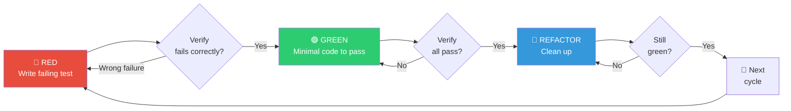

# 🧪 Test-Driven Development Workflow (测试驱动开发组合包)

You are executing the **TDD Workflow** — the Red-Green-Refactor cycle that forces you to write the test first, watch it fail, write minimal code to pass, then clean up. Every piece of production code must be born from a failing test.

> [!CAUTION]
> **THE IRON LAW**: NO PRODUCTION CODE WITHOUT A FAILING TEST FIRST. Write code before the test? **Delete it. Start over.** Do not keep it as "reference". Do not "adapt" it while writing tests. Do not look at it. Delete means delete. Implement fresh from tests. Period.

---

## Skill Positioning (技能定位与协作关系)

```
┌──────────────────── TDD in the Development Pipeline ────────────────────┐
│                                                                          │
│  /brainstorming → /writing-plans → /executing-plans                      │
│                                          ↓                               │
│                              Each task uses TDD (THIS SKILL)             │
│                                          ↓                               │
│                              /verify → /requesting-code-review           │
│                                          ↓                               │
│                              /finishing-a-development-branch             │
│                                                                          │
│  TDD is not a standalone workflow — it is embedded in every task that    │
│  involves writing or modifying production code.                          │
└──────────────────────────────────────────────────────────────────────────┘
```

---

## Process Flow Overview (流程总览)



---

## 🔴 RED — Write Failing Test (编写失败测试)

Write ONE minimal test showing what the code SHOULD do.

**Requirements**:
- **One behavior** per test. If the test name has "and" → split it.
- **Clear name** describing the behavior, not the implementation.
- **Real code** — no mocks unless absolutely unavoidable.

### Good vs. Bad Examples

````carousel
**✅ Good Test**
```typescript
test('retries failed operations 3 times', async () => {
  let attempts = 0;
  const operation = () => {
    attempts++;
    if (attempts < 3) throw new Error('fail');
    return 'success';
  };

  const result = await retryOperation(operation);

  expect(result).toBe('success');
  expect(attempts).toBe(3);
});
```
Clear name, tests real behavior, one thing
<!-- slide -->
**❌ Bad Test**
```typescript
test('retry works', async () => {
  const mock = jest.fn()
    .mockRejectedValueOnce(new Error())
    .mockRejectedValueOnce(new Error())
    .mockResolvedValueOnce('success');
  await retryOperation(mock);
  expect(mock).toHaveBeenCalledTimes(3);
});
```
Vague name, tests mock not code
````

### Verify RED — Watch It Fail

**MANDATORY. Never skip.**

```bash
npm test path/to/test.test.ts
```

| Observation | Action |
|-------------|--------|
| Test **fails** with expected message | ✅ Proceed to GREEN |
| Test **passes** immediately | ⚠️ You're testing existing behavior. Fix or rewrite the test. |
| Test **errors** (syntax, import, etc.) | 🔧 Fix the error, re-run until it fails correctly |
| Test fails for **wrong reason** (typo, not missing feature) | 🔧 Fix the test, re-run |

---

## 🟢 GREEN — Minimal Code (最小实现)

Write the **simplest possible code** to make the test pass.

| ✅ Do | ❌ Don't |
|-------|---------|
| Just enough to pass | Add features not tested yet |
| Hardcode if only one test case | Over-engineer with options/config |
| Simple, obvious implementation | Refactor other code |
| Exactly what the test demands | "Improve" beyond the test |

### Verify GREEN — Watch It Pass

**MANDATORY.**

```bash
npm test path/to/test.test.ts
```

| Observation | Action |
|-------------|--------|
| Test **passes** | ✅ Check other tests still pass too |
| Test **fails** | 🔧 Fix the production code (NOT the test) |
| Other tests **broke** | 🔧 Fix regression NOW before continuing |
| Output has warnings/errors | 🔧 Clean them up |

---

## 🔵 REFACTOR — Clean Up (重构清理)

After green ONLY:
- Remove duplication
- Improve names
- Extract helpers
- Simplify logic

**Keep tests green throughout.** Do NOT add new behavior during refactor.

Then: start the next RED cycle for the next behavior.

---

## Good Test Qualities (优质测试标准)

| Quality | Good ✅ | Bad ❌ |
|---------|--------|-------|
| **Minimal** | Tests one thing. "and" in name? Split it. | `test('validates email and domain and whitespace')` |
| **Clear** | Name describes behavior | `test('test1')` |
| **Shows intent** | Demonstrates desired API usage | Obscures what code should do |
| **Real code** | Tests actual behavior | Tests mock behavior instead |
| **Independent** | No shared mutable state | Tests depend on execution order |

---

## Bug Fix TDD Pattern (Bug 修复模式)

Bug found? Follow this exact sequence:

```
1. Write a failing test that reproduces the bug
2. Verify RED — confirm the test captures the bug
3. Fix the bug with minimal code
4. Verify GREEN — test passes, bug is gone
5. Refactor if needed

Never fix bugs without a test.
```

### Example

```typescript
// RED: Reproduce the bug
test('rejects empty email', async () => {
  const result = await submitForm({ email: '' });
  expect(result.error).toBe('Email required');
});
// Verify RED: FAIL — expected 'Email required', got undefined ✅

// GREEN: Minimal fix
function submitForm(data: FormData) {
  if (!data.email?.trim()) {
    return { error: 'Email required' };
  }
  // ...
}
// Verify GREEN: PASS ✅

// REFACTOR: Extract validation for multiple fields if needed
```

---

## Common Rationalizations (常见借口与反驳)

| Excuse | Reality |
|--------|---------|
| "Too simple to test" | Simple code breaks. Test takes 30 seconds. |
| "I'll test after" | Tests passing immediately prove nothing. |
| "Tests after achieve same goals" | Tests-after = "what does this do?" Tests-first = "what **should** this do?" |
| "Already manually tested" | Ad-hoc ≠ systematic. No record, can't re-run. |
| "Deleting X hours is wasteful" | Sunk cost fallacy. Keeping unverified code is technical debt. |
| "Keep as reference, write tests first" | You'll adapt it. That's testing-after. Delete means delete. |
| "Need to explore first" | Fine. Throw away exploration entirely, then start with TDD. |
| "Test is hard = skip it" | Hard to test = hard to use. Listen to the test — simplify the design. |
| "TDD will slow me down" | TDD is faster than debugging. Pragmatic = test-first. |
| "Existing code has no tests" | You're improving it now. Add tests for what you touch. |

---

## When Stuck (遇到困难时)

| Problem | Solution |
|---------|----------|
| Don't know how to test | Write the wished-for API first. Write the assertion first. Ask user. |
| Test too complicated | Design too complicated. Simplify the interface. |
| Must mock everything | Code too coupled. Use dependency injection. |
| Test setup is huge | Extract helpers. Still complex? Simplify design. |

---

## Red Flags — STOP and Start Over (红旗信号)

If ANY of these are true, **delete the code and restart with TDD**:

- Code was written before the test
- Test was added after implementation
- Test passes immediately on first run
- You can't explain why the test failed
- You're rationalizing "just this once"
- You said "I already manually tested it"
- You said "keep as reference" or "adapt existing code"
- You said "deleting X hours is wasteful"

---

## Verification Checklist (验收清单)

Before marking any work as complete:

| # | Check | Status |
|---|-------|--------|
| 1 | Every new function/method has a test | ☐ |
| 2 | Watched each test fail before implementing | ☐ |
| 3 | Each test failed for the expected reason (feature missing, not typo) | ☐ |
| 4 | Wrote minimal code to pass each test | ☐ |
| 5 | All tests pass | ☐ |
| 6 | Output is pristine (no errors, no warnings) | ☐ |
| 7 | Tests use real code (mocks only if unavoidable) | ☐ |
| 8 | Edge cases and error paths are covered | ☐ |

Can't check all boxes? You skipped TDD. Start over.

---

## Testing Anti-Patterns (测试反模式)

When adding mocks or test utilities, avoid these common pitfalls:
- Testing mock behavior instead of real behavior
- Adding test-only methods to production classes
- Mocking without understanding the dependency graph

Reference: `@testing-anti-patterns.md` for the full guide.

---

## 覆盖率与检查点（整合自 tdd-workflow）

### 覆盖率阈值

每个 TDD 周期结束后，运行覆盖率报告并确认全局阈值达标：

```bash
npm run test:coverage
```

推荐在 `jest.config` 中强制执行：

```json
{
  "jest": {
    "coverageThresholds": {
      "global": {
        "branches": 80,
        "functions": 80,
        "lines": 80,
        "statements": 80
      }
    }
  }
}
```

覆盖率低于 80% 视为未完成，需补充测试。

### Git 检查点提交规范

如果仓库在 Git 管理下，每个 TDD 阶段结束后创建检查点提交：

- **只计算当前活跃分支上当前任务新创建的提交**，不将其他分支或无关历史的提交视为有效检查点
- 验收检查点前，先确认提交可从当前 `HEAD` 可达

**推荐的紧凑工作流（三提交模型）：**

| 阶段 | 时机 | 推荐提交格式 |
|------|------|-------------|
| RED 验证后 | 失败测试已确认为预期失败 | `test: add reproducer for <feature or bug>` |
| GREEN 验证后 | 最小实现已通过测试 | `fix: <feature or bug>` |
| REFACTOR 完成后（可选） | 重构完成且测试仍绿 | `refactor: clean up after <feature or bug> implementation` |

**规则：**
- 不得压缩（squash）或重写这些检查点提交，直到整个 TDD 工作流完成
- 每条提交消息须描述阶段及捕获的具体证据
- 若测试提交与 RED 明确对应、修复提交与 GREEN 明确对应，可合并为两提交，无需额外的纯证据提交

---

## 🔥 Hard Rules (铁律)

1. **No Code Without Failing Test**: Production code exists ONLY because a test demanded it. Code-first = delete and restart.
2. **Delete Means Delete**: If you wrote code before the test, do not keep it, reference it, or adapt it. Delete completely. Implement fresh from tests.
3. **Verify RED Is Mandatory**: You MUST run the test and confirm it fails for the expected reason before writing any implementation code.
4. **Verify GREEN Is Mandatory**: You MUST run the test and confirm it passes before declaring the implementation done.
5. **Minimal Code Only**: Write the simplest code to pass the test. No over-engineering, no YAGNI violations, no "while I'm here" additions.
6. **One Behavior Per Test**: Each test should test exactly one thing. "and" in the test name = split it.
7. **Real Code Over Mocks**: Use actual implementations in tests. Mocks are a last resort for external services only.
8. **Refactor Only After Green**: Never refactor while tests are failing. Get green first, then clean up.
9. **Fix Production Code, Not Tests**: When GREEN fails, fix the production code. Do not weaken the test to make it pass.
10. **Every Bug Gets A Test**: Never fix a bug without first writing a test that reproduces it. The test proves the fix and prevents regression.
