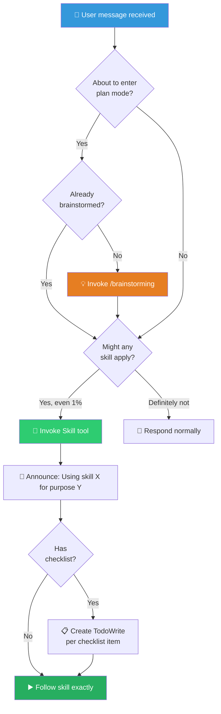

# ⚡ Using Superpowers — Skill Invocation Guide (超能力使用指南)

This skill governs how you discover, invoke, and follow all other skills. It is loaded at session start and applies to every interaction.

<SUBAGENT-STOP>
If you were dispatched as a subagent to execute a specific task, skip this skill.
</SUBAGENT-STOP>

> [!CAUTION]
> **MANDATORY INVOCATION**: If you think there is even a **1% chance** a skill might apply to what you are doing, you **ABSOLUTELY MUST** invoke the skill. This is not negotiable. This is not optional. You cannot rationalize your way out of this. IF A SKILL APPLIES TO YOUR TASK, YOU DO NOT HAVE A CHOICE — YOU MUST USE IT.

---

## Instruction Priority (指令优先级)

Superpowers skills override default system prompt behavior, but **user instructions always take precedence**:

| Priority | Source | Example |
|----------|--------|---------|
| **1 (Highest)** | User's explicit instructions (`CLAUDE.md`, `GEMINI.md`, `AGENTS.md`, direct requests) | "Don't use TDD" |
| **2** | Superpowers skills | "Always use TDD" |
| **3 (Lowest)** | Default system prompt | General behaviors |

If the user says "don't use TDD" and a skill says "always use TDD" → follow the user.

---

## Skill Invocation Flow (技能调用流程)

---

## How to Access Skills (各平台技能访问方式)

| Platform | Method | Notes |
|----------|--------|-------|
| **Claude Code** | `Skill` tool | Skill content is loaded and presented. Never use the Read tool on skill files. |
| **Copilot CLI** | `skill` tool | Auto-discovered from installed plugins. Same behavior as Claude Code. |
| **Gemini CLI** | `activate_skill` tool | Metadata loaded at session start, full content activated on demand. |
| **Other** | Check platform docs | See how skills are loaded in your environment. |

**Platform Adaptation**: Skills use Claude Code tool names. For tool equivalents, see:
- Copilot CLI → `references/copilot-tools.md`
- Codex → `references/codex-tools.md`
- Gemini CLI → Tool mapping auto-loaded via `GEMINI.md`

---

## Skill Priority When Multiple Apply (多技能优先级)

When multiple skills could apply, use this order:

| Priority | Category | Examples | Rationale |
|----------|----------|---------|-----------|
| **1st** | Process skills | `/brainstorming`, `/debug`, `/systematic-debugging` | Determine HOW to approach the task |
| **2nd** | Implementation skills | `/test-driven-development`, `/executing-plans` | Guide execution |

- "Let's build X" → `/brainstorming` first, then implementation skills.
- "Fix this bug" → `/systematic-debugging` first, then domain-specific skills.

---

## Skill Types (技能类型)

| Type | Behavior | Examples |
|------|----------|---------|
| **Rigid** | Follow exactly. Do not adapt away discipline. | TDD, debugging, verification |
| **Flexible** | Adapt principles to context. | Patterns, design, brainstorming |

The skill itself tells you which type it is. When in doubt, treat it as rigid.

---

## Red Flags — Rationalization Detector (红旗信号)

These thoughts mean **STOP — you're rationalizing skipping a skill**:

| Thought | Reality |
|---------|---------|
| "This is just a simple question" | Questions are tasks. Check for skills. |
| "I need more context first" | Skill check comes BEFORE clarifying questions. |
| "Let me explore the codebase first" | Skills tell you HOW to explore. Check first. |
| "I can check git/files quickly" | Files lack conversation context. Check for skills. |
| "Let me gather information first" | Skills tell you HOW to gather information. |
| "This doesn't need a formal skill" | If a skill exists, use it. |
| "I remember this skill" | Skills evolve. Read the current version. |
| "This doesn't count as a task" | Action = task. Check for skills. |
| "The skill is overkill" | Simple things become complex. Use it. |
| "I'll just do this one thing first" | Check BEFORE doing anything. |
| "This feels productive" | Undisciplined action wastes time. Skills prevent this. |
| "I know what that means" | Knowing the concept ≠ using the skill. Invoke it. |

---

## 🔥 Hard Rules (铁律)

1. **1% Rule**: If there is even a 1% chance a skill applies, invoke it. If invoked and irrelevant, you can skip it — but you must check.
2. **Check Before Action**: Skill check happens BEFORE any response, clarification, or exploration. Not after.
3. **User Overrides All**: User instructions (`CLAUDE.md`, direct requests) take precedence over any skill.
4. **Announce Usage**: When invoking a skill, announce: "Using [skill] to [purpose]". This sets expectations.
5. **Follow Checklists**: If a skill has a checklist, create a TodoWrite item per checklist item.
6. **Read Current Version**: Never rely on memory of a skill. Skills evolve. Read the current version every time.
7. **Process Before Implementation**: Process skills (brainstorming, debugging) take priority over implementation skills.
8. **Instructions Say WHAT, Not HOW**: "Add X" or "Fix Y" does NOT mean skip workflows. The user tells you WHAT to do; skills tell you HOW.
9. **Subagent Exception**: If dispatched as a subagent for a specific task, skip this meta-skill.
10. **No Rationalization**: Any argument for skipping a relevant skill is rationalization, not reasoning. Use the skill.
