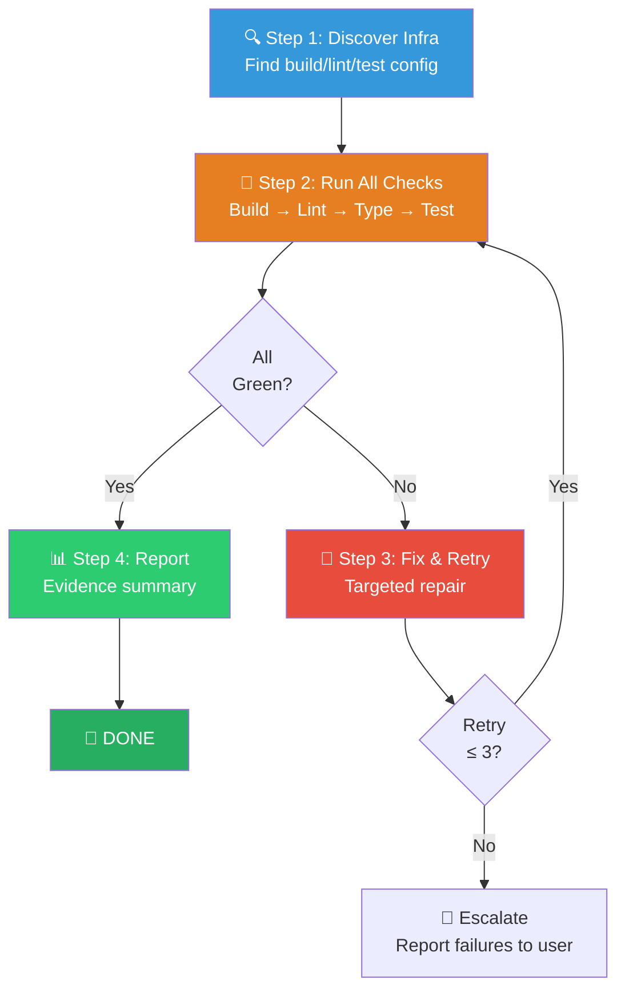

# ✅ Verify — Full-Suite Verification (全量红绿验收组合包)

You are executing the **Verify Workflow** — a rapid, automated sweep that discovers the project's verification infrastructure, runs all applicable checks (build, lint, type check, tests), fixes any failures, and reports back with captured evidence.

> [!CAUTION]
> **EVIDENCE IS MANDATORY**: You MUST capture and present stdout/stderr from every verification command. "Should be fine" or "looks correct" is NEVER acceptable. Only concrete command output with exit codes counts as verification.

---

## Skill Positioning (技能定位与协作关系)

```
┌──────────────────────── Verification Ecosystem ────────────────────────┐
│                                                                         │
│  /verify (THIS SKILL)              /verification-before-completion      │
│  ━━━━━━━━━━━━━━━━━━━              ━━━━━━━━━━━━━━━━━━━━━━━━━━━━━       │
│  Run build+lint+test suite         Completion-claim evidence gate       │
│  Fix failures, report status       5-step gate protocol for ANY claim   │
│  Quick, actionable sweep           Broader scope (agents, reqs, etc.)  │
│                                                                         │
│  Relationship: /verify is the execution engine.                         │
│  /verification-before-completion is the policy gate that uses /verify.  │
│                                                                         │
│  Common callers:                                                        │
│  /executing-plans → /verify (after each task batch)                     │
│  /03-refactor → /verify (after integration)                             │
│  /finishing-a-development-branch → /verify (final gate)                 │
└─────────────────────────────────────────────────────────────────────────┘
```

---

## Process Flow Overview (流程总览)



---

## Step 1: 🔍 Discover Verification Infrastructure (发现验证基础设施)

Scan the project to determine how testing, linting, and building should be run:

| Config Source | What to Look For |
|---------------|------------------|
| `package.json` | `scripts.test`, `scripts.lint`, `scripts.build`, `scripts.typecheck` |
| `Makefile` | `test`, `lint`, `build`, `check` targets |
| `pyproject.toml` / `setup.py` | pytest config, flake8/ruff config |
| `Cargo.toml` | `cargo test`, `cargo clippy`, `cargo build` |
| `tsconfig.json` | TypeScript type checking (`npx tsc --noEmit`) |
| `.github/workflows/` | CI config reveals the canonical verification commands |
| `CLAUDE.md` / project docs | Project-specific verification instructions |

> [!TIP]
> CI workflow files (`.github/workflows/*.yml`) are the most reliable source of truth for verification commands — they show exactly what the project's maintainers consider "green".

---

## Step 2: 🚀 Run All Checks (执行全量检查)

Execute checks in this order (skip any that don't apply to the project):

| # | Check | Typical Command | What Passes |
|---|-------|----------------|-------------|
| 1 | **Build** | `npm run build` / `cargo build` / `make build` | Exit code 0, no errors |
| 2 | **Lint** | `npm run lint` / `cargo clippy` / `ruff check` | 0 errors (warnings OK) |
| 3 | **Type Check** | `npx tsc --noEmit` / `mypy .` | 0 type errors |
| 4 | **Tests** | `npm test` / `cargo test` / `pytest` | 0 failures, exit code 0 |

**Execution Rules**:
- Run **fresh** every time — never rely on cached or previous results.
- Capture **full stdout and stderr** for every command.
- Record **exit code** for every command.
- Do NOT run heavy e2e tests or deploy steps — focus on quick, local checks.

---

## Step 3: 🔧 Fix & Retry (修复与重试)

If any check fails:

1. **Analyze the failure** — Read the error output carefully. Identify the specific cause.
2. **Fix the issue** — Apply the minimal change to resolve the failure.
3. **Re-run ALL checks** — Not just the one that failed. A fix for lint might break tests.
4. **Repeat** until all checks pass.

**Retry budget**: Maximum **3 fix-retry cycles**. If still failing after 3 → escalate to user with full evidence.

---

## Step 4: 📊 Report Results (报告结果)

Present verification results with captured evidence:

### All Green Report

```
📊 Verification Results
========================
✅ Build:      Success    (npm run build — exit 0)
✅ Lint:       0 errors   (npm run lint — exit 0)
✅ Types:      0 errors   (npx tsc --noEmit — exit 0)
✅ Tests:      47/47 pass (npm test — exit 0)
```

### Failure Report (after retry budget exhausted)

```
📊 Verification Results
========================
✅ Build:      Success    (npm run build — exit 0)
✅ Lint:       0 errors   (npm run lint — exit 0)
❌ Types:      3 errors   (npx tsc --noEmit — exit 2)
✅ Tests:      47/47 pass (npm test — exit 0)

Type Errors:
  src/api/handler.ts:42 — Property 'foo' does not exist on type 'Bar'
  src/api/handler.ts:58 — Argument of type 'string' is not assignable...
  src/utils/parse.ts:12 — Cannot find name 'Result'

Fix Attempts: 3/3 exhausted
Recommended: Manual review of type definitions in src/api/
```

---

## 🔍 可选扩展：安全扫描与 Diff 审查（整合自 verification-loop）

在标准四项检查全绿之后，可按需追加以下两个阶段，适合 PR 前或对改动范围存疑时使用。

### 扩展阶段 A：Secret / console.log 扫描

```bash
# 检查硬编码密钥
grep -rn "sk-" --include="*.ts" --include="*.js" . 2>/dev/null | head -10
grep -rn "api_key" --include="*.ts" --include="*.js" . 2>/dev/null | head -10

# 检查遗留调试输出
grep -rn "console.log" --include="*.ts" --include="*.tsx" src/ 2>/dev/null | head -10
```

> [!NOTE]
> **Windows（PowerShell）适配**：`grep -rn` 在 PowerShell 下不可用。两种等效做法任选其一：
> - 用 **Bash 工具**跑 `rg`（首选，Git Bash 自带 ripgrep 时最快）或 `grep`：
>   ```bash
>   rg -n "sk-|api_key" -g "*.ts" -g "*.js" . | head -10
>   rg -n "console.log" -g "*.ts" -g "*.tsx" src/ | head -10
>   ```
> - 或用 **PowerShell 的 `Select-String`**：
>   ```powershell
>   Get-ChildItem -Recurse -Include *.ts,*.js | Select-String -Pattern "sk-","api_key" | Select-Object -First 10
>   Get-ChildItem -Path src -Recurse -Include *.ts,*.tsx | Select-String -Pattern "console.log" | Select-Object -First 10
>   ```

发现问题则标记为 `Security: FAIL`，清零后再提 PR。

### 扩展阶段 B：Diff 审查

```bash
# 查看变更概览
git diff --stat
git diff HEAD~1 --name-only
```

> [!NOTE]
> `git diff` 本身跨平台通用；上面命令在 PowerShell 与 Bash 工具下均可直接运行，无需改写。

逐文件确认：
- 是否存在**非预期改动**
- 是否缺少**错误处理**
- 是否遗漏**边界情况**

将结果追加至验证报告：

```
Security:  [PASS/FAIL] (X issues)
Diff:      [X files changed, 已/未发现非预期改动]
```

---

## 🔥 Hard Rules (铁律)

1. **Evidence Is Everything**: Every verification claim must include captured stdout/stderr and exit codes. "Should work" is not verification.
2. **Fresh Runs Only**: Always run commands fresh. Never rely on previous results, cached outputs, or assumptions.
3. **Full Suite, Not Partial**: Run ALL applicable checks (build + lint + types + tests). Partial verification proves nothing about the whole.
4. **Fix Then Re-run All**: After any fix, re-run ALL checks — not just the one that failed. Fixes can introduce new issues.
5. **No Heavy Tests**: Skip e2e tests, deployment, and long-running integration suites. Focus on quick local verification.
6. **Retry Budget**: Maximum 3 fix-retry cycles. Beyond that → escalate with full evidence.
7. **Discover, Don't Assume**: Always check project config files to find the correct verification commands. Don't assume `npm test` if the project uses `make test`.
8. **Order Matters**: Run build → lint → types → tests. A build failure makes other checks meaningless.
9. **Capture Everything**: Capture all output, including warnings. Warnings may indicate real problems.
10. **Report Regardless**: Always report results — even when all green. The evidence itself is the deliverable.