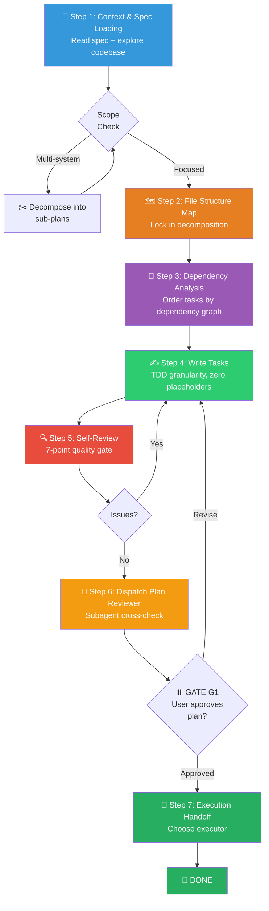

# 📐 Writing Plans Workflow (施工图编写组合包)

You are executing the **Writing Plans Workflow** — a structured planning engine that transforms an approved design spec (or a clear user requirement) into a detailed, zero-ambiguity implementation plan so granular that an engineer with **zero codebase context** can execute it task-by-task without asking questions.

> [!CAUTION]
> **PLANNING ONLY — ZERO IMPLEMENTATION**: You are FORBIDDEN from writing any production code, running builds, or invoking execution skills during this workflow. The ONLY output is a plan document. Implementation happens downstream via `/executing-plans` or `/subagent-driven-development`.

**Announce at start:** *"Using the writing-plans skill to create the implementation plan."*

**Principles:** DRY · YAGNI · TDD · Frequent atomic commits · Single Responsibility.

---

## Skill Positioning (技能定位与协作关系)

```
┌─────────────────── Ideation → Implementation Pipeline ───────────────────┐
│                                                                           │
│  /brainstorming        /writing-plans        /executing-plans            │
│  (upstream)            (THIS SKILL)          (downstream)                │
│  ━━━━━━━━━━━━━        ━━━━━━━━━━━━━━        ━━━━━━━━━━━━━━             │
│  Explore intent        Create step-by-step    Execute task-by-           │
│  Produce design spec   TDD implementation     task with TDD              │
│                        plan (bite-sized)       and verification           │
│                                                                           │
│  Alternative downstream executors:                                       │
│  → /subagent-driven-development (recommended: isolated context/task)     │
│  → /batch (large-scale mechanical changes, ≤5 files/unit)               │
│                                                                           │
│  Terminal States of THIS skill:                                          │
│    1. Invoke /subagent-driven-development (recommended)                  │
│    2. Invoke /executing-plans (inline alternative)                       │
│  Do NOT invoke /brainstorming, /simplify, or any other skill.            │
└───────────────────────────────────────────────────────────────────────────┘
```

---

## Process Flow Overview (流程总览)



---

## 🔑 Gate Points (用户确认卡口)

| Gate | When | What to Present | Resume Condition |
|------|------|-----------------|------------------|
| **G1** | After Step 6 (Plan Reviewer) | Complete plan file path + reviewer verdict + execution mode choice | User approves plan and picks executor |

> [!IMPORTANT]
> G1 is **blocking**. Do NOT invoke any execution skill before explicit user approval.

---

## Step 1: 📖 Context & Spec Loading (上下文与规格加载)

**Goal**: Deeply understand the project landscape and the design requirements before writing a single task.

**Actions**:

1. **Read Project Memory** — Check `CLAUDE.md`, `docs/短期记忆.md`, `docs/长期记忆.md` for prior decisions, conventions, and WIP context.
2. **Read the Design Spec** — If coming from `/brainstorming`, load the spec from `docs/superpowers/specs/`. If user provided requirements directly, treat them as the spec.
3. **Explore Relevant Code** — Understand existing architecture, naming conventions, test patterns, and file organization in the areas the plan will touch:
   - `package.json` / `pyproject.toml` / `go.mod` — tech stack & dependencies
   - Existing test files — testing framework & patterns in use
   - Directory layout — established module boundaries
   - Recent commits (`git log -10 --oneline`) — activity & conventions
4. **Identify Reusable Assets** — Note existing utilities, shared helpers, types, and abstractions that the plan should leverage rather than reinvent.

### Scope Check (规模预检)

Before proceeding, assess plan complexity:

| Scale | Indicator | Action |
|-------|-----------|--------|
| **Small** | ≤3 tasks, ≤5 files | Proceed normally |
| **Medium** | 4–8 tasks, 6–15 files | Proceed normally with extra care on task ordering |
| **Large** | >8 tasks or >15 files or multi-module | Split into independent sub-plans. Each sub-plan must produce **working, testable software on its own**. |

If large → suggest splitting into separate plans, one per subsystem. Each gets its own plan → execution cycle.

### 跨多 PR / 多 session 规模档（原 blueprint 蓝图法）

当一份计划要跨**多个 PR / 多个 session / 多 agent** 才能完成时，在上面基础上追加三条：

- **每步自带冷启动 brief**：每个 step 写一段自包含上下文（目标 + 涉及文件 + 验证命令 + 退出条件），让一个**零上下文的新 agent 冷启动**也能独立执行该步，不必读前面步骤。
- **并行步骤标注**：用依赖图标出彼此无共享文件、无输出依赖的步骤，可并行交给不同 agent（配合 `/dispatching-parallel-agents`）。
- **计划可变更协议**：步骤允许拆分 / 插入 / 跳过 / 重排 / 废弃，但每次变更留一句记录（audit trail），别默默改。

有 git+gh 时按「分支 / PR / CI」编排每步；没有则退化为就地编辑模式。

---

## Step 2: 🗺️ File Structure Map (文件结构映射)

**Goal**: Lock in the file decomposition before defining tasks. This map dictates task boundaries.

| Principle | Rule |
|-----------|------|
| Single responsibility | Each file has ONE clear purpose |
| Focused size | Prefer small files you can hold in context; large files = unreliable edits |
| Colocation | Files that change together live together — split by responsibility, not layer |
| Follow conventions | In existing codebases, respect established patterns; only split unwieldy files you're already modifying |
| Test mirroring | Every source file has a corresponding test file in the project's test directory |

**Output format**:

```markdown
## File Structure Map

### New Files
| File | Purpose |
|------|---------|
| `src/services/auth.ts` | Authentication service — token validation, session management |
| `src/middleware/requireAuth.ts` | Express middleware — JWT verification + user injection |
| `tests/services/auth.test.ts` | Unit tests for auth service |
| `tests/middleware/requireAuth.test.ts` | Unit tests for auth middleware |

### Modified Files
| File | Changes |
|------|---------|
| `src/routes/api.ts:45-60` | Add auth-protected route group |
| `src/types/index.ts:12` | Add `AuthenticatedRequest` type |
```

---

## Step 3: 🔗 Dependency Analysis (依赖分析与排序)

**Goal**: Determine the correct task execution order by analyzing inter-task dependencies.

**Actions**:

1. **Build the dependency graph** — For each file/component in the file map, identify what it imports from or depends on.
2. **Topological sort** — Order tasks so that every dependency is satisfied before the dependent task begins.
3. **Identify parallelizable groups** — Tasks with no inter-dependencies can be executed concurrently (relevant for `/subagent-driven-development`).

**Output format**:

```markdown
## Task Dependency Graph

Task 1: Types & Interfaces        → (no dependencies)
Task 2: Auth Service               → depends on Task 1
Task 3: Auth Middleware             → depends on Task 1, Task 2
Task 4: API Route Integration      → depends on Task 3

Parallelizable: [Task 1] then [Task 2, Task 3 in parallel] then [Task 4]
```

> [!WARNING]
> **Circular dependencies are plan failures.** If you find one, restructure the file map to break the cycle before proceeding.

---

## Step 4: ✍️ Write Tasks (编写任务步骤)

### Plan Header (REQUIRED — 计划头部)

Every plan MUST start with:

```markdown
# [Feature Name] Implementation Plan

> **For agentic workers:** Use `subagent-driven-development` (recommended)
> or `executing-plans` to implement this plan task-by-task.
> Steps use checkbox (`- [ ]`) syntax for tracking.

**Goal:** [one sentence]
**Architecture:** [2-3 sentences describing the high-level approach]
**Tech Stack:** [key technologies, frameworks, testing tools]
**Spec Source:** [path to design spec, or "direct user requirement"]
**Estimated Tasks:** [N tasks, ~M total steps]

---
```

### Granularity: One Action per Step (2–5 min each)

Each step must be a single, verifiable action:

```
- [ ] Write the failing test
- [ ] Run it — verify it fails with expected error
- [ ] Implement minimal code to pass
- [ ] Run tests — verify green
- [ ] Commit
```

### Task Template — Multi-Language

Every task MUST follow this structure. Adapt code blocks to the project's actual language:

````markdown
### Task N: [Component Name]

**Files:**
- Create: `exact/path/to/file.ts`
- Modify: `exact/path/to/existing.ts:123-145`
- Test:   `tests/exact/path/to/file.test.ts`

**Dependencies:** Task M (types), Task K (utilities)

- [ ] **Step 1: Write failing test**

```typescript
// tests/services/auth.test.ts
import { validateToken } from '../src/services/auth';

describe('validateToken', () => {
  it('should return user payload for valid JWT', () => {
    const token = 'eyJhbGciOiJIUzI1NiIs...';
    const result = validateToken(token);
    expect(result).toEqual({ userId: '123', role: 'admin' });
  });

  it('should throw AuthError for expired token', () => {
    const expired = 'eyJhbGciOiJIUzI1NiIs...expired';
    expect(() => validateToken(expired)).toThrow('TOKEN_EXPIRED');
  });
});
```

- [ ] **Step 2: Run test — verify failure**

Run: `npx vitest run tests/services/auth.test.ts`
Expected: FAIL — `validateToken is not a function` or `Cannot find module`

- [ ] **Step 3: Write minimal implementation**

```typescript
// src/services/auth.ts
import jwt from 'jsonwebtoken';

export class AuthError extends Error {
  constructor(public code: string, message: string) {
    super(message);
    this.name = 'AuthError';
  }
}

export function validateToken(token: string): { userId: string; role: string } {
  try {
    const payload = jwt.verify(token, process.env.JWT_SECRET!) as jwt.JwtPayload;
    return { userId: payload.sub!, role: payload.role };
  } catch (err) {
    if (err instanceof jwt.TokenExpiredError) {
      throw new AuthError('TOKEN_EXPIRED', 'Token has expired');
    }
    throw new AuthError('INVALID_TOKEN', 'Token is invalid');
  }
}
```

- [ ] **Step 4: Run test — verify pass**

Run: `npx vitest run tests/services/auth.test.ts`
Expected: PASS — 2/2 tests passing

- [ ] **Step 5: Commit**

```bash
git add src/services/auth.ts tests/services/auth.test.ts
git commit -m "feat(auth): add JWT token validation with error handling"
```
````

### Zero-Placeholder Rule (零占位符铁律)

Every step must contain **actual content**. The following are plan failures — NEVER write them:

| Forbidden Pattern | Fix |
|-------------------|-----|
| "TBD", "TODO", "implement later" | Write the actual content now |
| "Add appropriate error handling" | Show the exact error handling code |
| "Write tests for the above" | Include the actual test code |
| "Similar to Task N" | Repeat the code — engineer may read tasks out of order |
| Steps describing WHAT without showing HOW | Add code blocks with complete implementation |
| References to undefined types / functions | Define them or point to the exact defining task |
| "Configure as needed" | Show the exact configuration |
| Pseudocode or `// ...` elisions | Write real, runnable code |

### Edge Cases & Error Handling (边界场景)

For each component, explicitly address:

| Dimension | What to Cover |
|-----------|---------------|
| **Invalid input** | What happens with null, empty, malformed data? |
| **Failure modes** | Network errors, file not found, permission denied |
| **Boundary conditions** | Empty arrays, max-length strings, concurrent access |
| **Security** | Input sanitization, auth checks, injection prevention |

> [!TIP]
> Include at least one **negative test case** (testing error behavior) per task alongside the happy-path tests.

---

## Step 5: 🔍 Self-Review (七点自审)

Run this checklist yourself (NOT a subagent dispatch):

| # | Check | What to Look For | Action if Failed |
|---|-------|------------------|------------------|
| 1 | **Spec coverage** | Skim each spec requirement; can you point to a task that implements it? | Add missing task |
| 2 | **Placeholder scan** | Search for any forbidden patterns from the Zero-Placeholder table | Replace with real content |
| 3 | **Type consistency** | Do names match across tasks? (`clearLayers()` in Task 3 but `clearFullLayers()` in Task 7 = bug) | Fix inline |
| 4 | **Dependency order** | Does Task N depend on something from Task M where M > N? | Reorder tasks |
| 5 | **Command accuracy** | Are test/build commands correct for this project's actual tooling? (`jest` vs `vitest` vs `pytest`) | Fix commands |
| 6 | **File path consistency** | Do import paths, file creates, and file modifies all agree? | Fix paths |
| 7 | **Completeness of code blocks** | Every code block must be copy-pasteable and runnable — no `// ...`, no pseudocode | Expand to full code |

Fix issues in-place. Then proceed to Step 6.

---

## Step 6: 📄 Dispatch Plan Reviewer (计划审查分发)

**Goal**: Cross-validate the plan with an independent reviewer before presenting to the user.

**Actions**:

1. Save the plan to `docs/superpowers/plans/YYYY-MM-DD-<feature-name>.md` (user prefs override).
2. Dispatch the plan reviewer using the template in `skills/writing-plans/plan-document-reviewer-prompt.md`:
   - Feed it the plan file path and the spec file path.
   - The reviewer checks: Completeness, Spec Alignment, Task Decomposition, Buildability.
3. **If reviewer finds issues** → Fix them inline and re-run the self-review (Step 5). No need to re-dispatch the reviewer.
4. **If reviewer approves** → Proceed to Gate G1.

> [!IMPORTANT]
> The reviewer is a **quality gate**, not a rubber stamp. Take its findings seriously.

---

## ⏸️ GATE G1: User Approval (用户审批)

Present exactly:

```
Plan saved to `docs/superpowers/plans/<filename>.md`.

📊 Plan Summary:
  Tasks:    [N] tasks, [M] total steps
  Files:    [X] new, [Y] modified
  Tests:    [Z] test files
  Reviewer: [Approved / Issues fixed]

Choose execution mode:

1. Subagent-Driven (recommended) — fresh subagent per task, review between tasks
   → Skill: /subagent-driven-development

2. Inline Execution — batch execution with checkpoints in this session
   → Skill: /executing-plans

Which approach?
```

**Wait for explicit user approval.** Do NOT proceed until the user confirms.

---

## Step 7: 🚀 Execution Handoff (执行移交)

**Goal**: Seamlessly transition from planning to the chosen execution skill.

**Actions**:

1. Based on user's choice, invoke the corresponding skill:
   - **Option 1** → Invoke `/subagent-driven-development`
   - **Option 2** → Invoke `/executing-plans`
2. Pass the plan file path to the executor.

> [!CAUTION]
> **Terminal State**: The ONLY skills you may invoke after writing-plans are `/subagent-driven-development` or `/executing-plans`. Do NOT invoke `/brainstorming`, `/simplify`, `/batch`, or any other skill.

---

## 🔥 Hard Rules (铁律)

1. **Planning Only, Zero Code**: Do not write production code, run builds, or scaffold projects during this workflow. The ONLY output is a plan document.
2. **Zero Placeholders**: Every "TBD", "TODO", pseudocode, or `// ...` in a task step is a quality failure. Write real, complete, runnable code in every code block.
3. **TDD Structure Is Mandatory**: Every task must follow the RED → GREEN → REFACTOR → COMMIT cycle. No exceptions.
4. **Dependency Order Must Be Correct**: Tasks must be topologically sorted. A task that depends on another must come after it.
5. **Spec Coverage Must Be Complete**: Every requirement in the design spec must map to at least one task. Uncovered requirements = plan failure.
6. **Commands Must Be Accurate**: Test commands, build commands, and file paths must match the project's actual tooling. Do not guess framework names.
7. **Self-Review Is Non-Negotiable**: The 7-point self-review (Step 5) must be executed every time. Do not skip it for "simple" plans.
8. **Every Task Is Self-Contained**: An engineer should be able to read a single task in isolation and execute it without referencing other tasks (except for explicitly stated dependencies).
9. **Code Blocks Are Complete**: Every code block must contain the full file content (or clearly marked insertion points with 5+ lines of surrounding context). No abbreviated snippets.
10. **Terminal State Is An Executor**: After writing-plans, the ONLY permitted next skills are `/subagent-driven-development` or `/executing-plans`. Nothing else.
11. **Gate G1 Is Blocking**: Never auto-proceed to execution. Always wait for explicit user approval of the plan.
