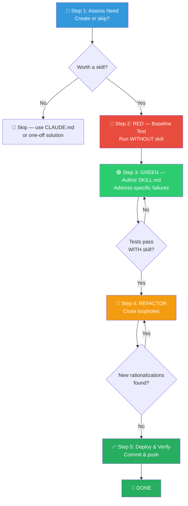

# ✍️ Writing Skills — Skill Authoring via TDD (技能编写组合包)

You are executing the **Skill Authoring Workflow** — a TDD-driven pipeline that creates or updates skill packages through baseline testing, minimal authoring, and iterative loophole closure.

> [!CAUTION]
> **NO SKILL WITHOUT A FAILING TEST FIRST**: You are FORBIDDEN from writing or editing any SKILL.md before running baseline pressure scenarios. Writing before testing = writing code before tests. If you already wrote it, **delete it and start over**. No exceptions.

**REQUIRED BACKGROUND:** You MUST understand `test-driven-development` before using this skill. That skill defines the fundamental RED-GREEN-REFACTOR cycle. This skill adapts TDD to documentation.

**Official reference:** See `anthropic-best-practices.md` in this directory for Anthropic's official skill authoring guidelines (conciseness, progressive disclosure, evaluation-driven development).

---

## Core Principle (核心原则)

**Writing skills IS Test-Driven Development applied to process documentation.**

| TDD Concept | Skill Creation |
|-------------|----------------|
| **Test case** | Pressure scenario with subagent |
| **Production code** | Skill document (SKILL.md) |
| **Test fails (RED)** | Agent violates rule without skill (baseline) |
| **Test passes (GREEN)** | Agent complies with skill present |
| **Refactor** | Close loopholes while maintaining compliance |

---

## Process Flow Overview (流程总览)



---

## 🔑 Gate Points (用户确认卡口)

| Gate | When | What to Present | Resume Condition |
|------|------|-----------------|------------------|
| **G1** | After Step 2 (Baseline) | Baseline failures report + rationalization patterns | User confirms proceed to authoring |
| **G2** | After Step 3 (Draft) | Complete SKILL.md preview as code block | User approves or requests revisions |

> [!IMPORTANT]
> G1 and G2 are **blocking**. Do NOT proceed past either gate without explicit user approval.

---

## Phase 0: 🎤 访谈提取（整合自 skillify）

**适用场景**：用户说「把这个做成技能」、「save this process」、/skillify，或者当前会话产生了一个可复用流程但尚未明确需求时。若需求已经明确，跳过本阶段直接进入 Step 1。

> [!CAUTION]
> **访谈完成前禁止动笔**：完成以下访谈轮次并获得用户确认后，才能进入 Step 1 评估。提前写 SKILL.md = 不跑测试就写代码。

### 准备：静默分析当前会话

在提问前，先静默分析会话，提取以下信息：

| 提取目标 | 关注点 |
|----------|--------|
| **可重复流程** | 哪些步骤可以泛化？ |
| **输入/参数** | 不同调用之间什么会变化？ |
| **离散步骤** | 有序的阶段划分 |
| **成功标准** | 什么证明每步完成？（"CI 通过的 PR" 而非"写了代码"）|
| **用户纠正** | 用户在哪里纠正了你——这些成为硬规则 |
| **工具与权限** | 需要哪些工具和权限模式？ |
| **目标与产物** | 最终产出是什么文件/状态？ |

### Round 1：高层确认

- 基于分析，建议**技能名**和**描述**，请用户确认或重命名。
- 建议**高层目标**和**具体成功标准**，让用户确认。

### Round 2：结构与存放

- 以编号列表呈现**高层步骤**，告知用户下一轮会细化。
- 若有**参数**，基于观察到的模式建议参数列表并说明用途。
- 若不明确，询问**执行模式**：

| 模式 | 何时用 |
|------|--------|
| **Inline** | 用户想在过程中介入；交互式工作流 |
| **Fork（子 agent）** | 自包含任务，过程中不需要用户输入 |

- 询问**保存位置**：

| 位置 | 路径 | 场景 |
|------|------|------|
| **本仓库** | `.claude/skills/<name>/SKILL.md` | 特定项目的工作流 |
| **个人全局** | `~/.claude/skills/<name>/SKILL.md` | 跨仓库的个人工作流 |

### Round 3：逐步拆解

对每个主要步骤（若不显而易见）询问：

1. 这步**产出**什么？（数据、产物、ID）
2. 什么证明这步**成功**、可以继续？
3. 是否需要**用户确认**后再继续？（尤其是不可逆操作）
4. 哪些步骤**独立**、可并行？
5. 步骤如何**执行**？（直接 / Task agent / Teammate / [human]）
6. 有哪些**硬约束**或偏好？

> [!TIP]
> 步骤较多时可分多轮（每步一轮）。**用户纠正点**要特别记录——这些成为技能的硬规则。

### Round 4：触发条件与边界情况

- 确认**何时**应调用本技能，建议触发短语。
  - 示例：「用户想将 PR cherry-pick 到 release 分支时触发：'cherry-pick to release'、'CP this PR'、'hotfix'」
- 询问**注意事项**或已知坑，若访谈中尚不清楚。

> [!IMPORTANT]
> **简单流程不要过度访谈！** 两步技能不需要四轮访谈。按技能复杂度调整访谈深度。

访谈完成后，带着收集到的需求进入 **Step 1** 继续评估。

---

## Step 1: 🎯 Assess Need (需求评估)

Determine whether a skill is warranted:

**Create when:**
- Technique wasn't intuitively obvious
- You'd reference this again across projects
- Pattern applies broadly (not project-specific)
- Others would benefit from the knowledge

**Don't create for:**
- One-off solutions → just do the work
- Standard practices well-documented elsewhere → link to docs
- Project-specific conventions → put in `CLAUDE.md`
- Mechanical constraints → automate with regex/validation

### Skill Type Classification (技能类型)

| Type | Description | Examples |
|------|-------------|----------|
| **Technique** | Concrete method with steps | `condition-based-waiting`, `root-cause-tracing` |
| **Pattern** | Mental model for problems | `flatten-with-flags`, `test-invariants` |
| **Reference** | API docs, syntax guides | Office docs, library references |

---

## Step 2: 🔴 RED — Baseline Testing (基线测试)

**Goal:** Run pressure scenarios WITHOUT the skill. Document exact failures.

> [!IMPORTANT]
> This is "write failing test first" — you MUST see what agents naturally do before writing the skill.

### Process

1. **Create 3+ pressure scenarios** combining multiple pressure types:

| Pressure | Example |
|----------|---------|
| **Time** | Emergency, deadline, deploy window closing |
| **Sunk cost** | Hours of work, "waste" to delete |
| **Authority** | Senior says skip it, manager overrides |
| **Exhaustion** | End of day, tired, want to go home |
| **Social** | Looking dogmatic, seeming inflexible |

2. **Run scenarios WITHOUT skill** — give agent realistic task with pressures.
3. **Document verbatim** — capture exact choices AND rationalizations word-for-word.
4. **Identify patterns** — which excuses appear repeatedly?

**Testing methodology:** See `testing-skills-with-subagents.md` for the complete testing reference (pressure scenario templates, meta-testing techniques, worked examples).

**Psychology reference:** See `persuasion-principles.md` for research foundation on why authority, commitment, and scarcity principles increase compliance pressure.

**⏸️ GATE G1**: Present baseline failures report. Wait for user approval.

---

## Step 3: 🟢 GREEN — Author SKILL.md (编写技能文件)

Write the **minimal** skill that addresses the specific rationalizations from Step 2. Don't add content for hypothetical cases.

### Frontmatter Specification (元数据规范)

```yaml
---
name: Skill-Name-With-Hyphens    # Letters, numbers, hyphens only (max 64 chars)
description: 技能编写元技能：用 TDD 创建/加固 SKILL.md 技能包。要做或改技能时用。
when_to_use: Use when [detailed triggers, symptoms, example phrases]
---
```

**Frontmatter Rules:**

| Field | Rule |
|-------|------|
| `name` | Letters, numbers, hyphens only. No parentheses or special chars |
| `description` | Third-person. Start with "Use when…". **NEVER summarize workflow** |
| `description` (length) | **≥50 chars, ≤250 chars.** Put ALL trigger keywords in the first 250 characters — Claude's context budget only includes the first 250 chars. Skills with <50 char descriptions are auto-invoked 3-5x less frequently. |
| `when_to_use` | Start with "Use when…" and include trigger phrases |

> [!WARNING]
> **Description = When to Use, NOT What the Skill Does.** Testing revealed that when a description summarizes the skill's workflow, the agent follows the description instead of reading the full skill content. Descriptions that summarize workflow create a shortcut the agent will take. The skill body becomes documentation the agent **skips**.

### Claude Search Optimization — CSO (搜索优化)

**Keyword coverage** — Use words agents would search for:
- Error messages: `"Hook timed out"`, `"ENOTEMPTY"`, `"race condition"`
- Symptoms: `"flaky"`, `"hanging"`, `"zombie"`, `"pollution"`
- Synonyms: `"timeout/hang/freeze"`, `"cleanup/teardown/afterEach"`
- Tools: Actual commands, library names, file types

**Naming** — Use active voice, verb-first:
- ✅ `creating-skills` not `skill-creation`
- ✅ `condition-based-waiting` not `async-test-helpers`
- Gerunds (-ing) work well for processes

**Token efficiency** — Every token counts when skills are loaded:
- Getting-started workflows: <150 words each
- Frequently-loaded skills: <200 words total
- Other skills: <500 words (still be concise)
- Move details to `--help`, use cross-references, compress examples

**Progressive Disclosure Split** — When a skill exceeds 500 lines:
- Main SKILL.md: <200 lines (always loaded)
- ADVANCED_PATTERNS.md: complex patterns (loaded on demand)
- REFERENCE.md: API docs, heavy reference (loaded on demand)
- EXAMPLES.md: worked examples (loaded on demand)

### Body Structure Template (文件结构模板)

```markdown
# Skill Name

## Overview
What is this? Core principle in 1-2 sentences.

## When to Use
Bullet list with SYMPTOMS and use cases. When NOT to use.

## Core Pattern (for techniques/patterns)
Before/after code comparison.

## Quick Reference
Table or bullets for scanning common operations.

## Implementation
Inline code for simple patterns. Link to file for heavy reference.

## Common Mistakes
What goes wrong + fixes.
```

### File Organization (文件组织)

| Structure | When to Use | Example |
|-----------|-------------|---------|
| **Self-contained** | All content fits in SKILL.md | `defense-in-depth/SKILL.md` |
| **With reusable tool** | Tool is reusable code | `condition-based-waiting/SKILL.md` + `example.ts` |
| **With heavy reference** | Reference >100 lines | `pptx/SKILL.md` + `pptxgenjs.md` + `ooxml.md` |

**Flat namespace** — all skills in one searchable namespace. Separate files only for heavy reference (100+ lines) or reusable tools/scripts.

### Cross-Referencing Other Skills (交叉引用)

Use skill name only with explicit requirement markers:
- ✅ `**REQUIRED SUB-SKILL:** Use test-driven-development`
- ✅ `**REQUIRED BACKGROUND:** You MUST understand systematic-debugging`
- ❌ `See skills/testing/test-driven-development` (unclear if required)
- ❌ `@skills/testing/test-driven-development/SKILL.md` (force-loads, burns context)

### Code Examples (代码示例)

**One excellent example beats many mediocre ones.**
- Complete and runnable, well-commented explaining WHY
- From a real scenario, ready to adapt
- ❌ Don't implement in 5+ languages
- ❌ Don't create fill-in-the-blank templates

### Flowchart Usage (流程图使用)

**Use flowcharts ONLY for:** Non-obvious decision points, process loops, "A vs B" decisions.

**Never use for:** Reference material (→ tables), code examples (→ markdown blocks), linear instructions (→ numbered lists).

### Run Verification (运行验证)

Run same pressure scenarios WITH the skill. Agent should now comply.

**⏸️ GATE G2**: Present complete SKILL.md as a code block. Wait for user approval.

---

## Step 4: 🔄 REFACTOR — Close Loopholes (关闭漏洞)

Agent found new rationalizations despite having the skill? This is like a test regression — plug each hole.

### Loophole Closure Checklist (漏洞封堵清单)

For each new rationalization, add ALL of the following:

**1. Explicit Negation in Rules:**
```markdown
Write code before test? Delete it. Start over.

**No exceptions:**
- Don't keep it as "reference"
- Don't "adapt" it while writing tests
- Delete means delete
```

**2. Entry in Rationalization Table:**
```markdown
| Excuse | Reality |
|--------|---------|
| "Keep as reference" | You'll adapt it. That's testing after. Delete means delete. |
```

**3. Red Flag Entry:**
```markdown
## Red Flags - STOP
- "Keep as reference" or "adapt existing code"
- "I'm following the spirit not the letter"
```

**4. Update Description** — Add symptoms of ABOUT to violate.

**5. Foundational Principle** — Add early in the document:
```markdown
**Violating the letter of the rules is violating the spirit of the rules.**
```

### Common Rationalizations Table (常见借口速查)

| Excuse | Reality |
|--------|---------|
| "Skill is obviously clear" | Clear to you ≠ clear to other agents. Test it. |
| "It's just a reference" | References can have gaps. Test retrieval. |
| "Testing is overkill" | Untested skills have issues. Always. 15 min saves hours. |
| "I'll test if problems emerge" | Problems = agents can't use skill. Test BEFORE deploying. |
| "Too tedious to test" | Testing is less tedious than debugging bad skill in production. |
| "I'm confident it's good" | Overconfidence guarantees issues. Test anyway. |
| "Academic review is enough" | Reading ≠ using. Test application scenarios. |
| "No time to test" | Deploying untested wastes more time fixing it later. |

**All of these mean: Test before deploying. No exceptions.**

### Re-verify After Refactoring (重新验证)

Re-test same scenarios with updated skill. If agent finds new rationalizations → continue REFACTOR cycle. If agent complies → skill is bulletproof.

---

## Step 5: ✅ Deploy & Verify (部署与验证)

### Deployment Checklist (部署清单)

**Quality Checks:**
- [ ] Small flowchart only if decision non-obvious
- [ ] Quick reference table present
- [ ] Common mistakes section present
- [ ] No narrative storytelling
- [ ] Supporting files only for tools or heavy reference
- [ ] Description has ≥3 trigger keywords in first 250 chars
- [ ] Out of Scope section present (70% of high-quality skills have this)

**Deployment:**
- [ ] Commit skill to git and push
- [ ] Consider contributing back via PR (if broadly useful)

### Discovery Workflow (发现路径)

How future agents find your skill:

1. **Encounters problem** ("tests are flaky")
2. **Finds skill** (description matches)
3. **Scans overview** (is this relevant?)
4. **Reads patterns** (quick reference table)
5. **Loads example** (only when implementing)

**Optimize for this flow** — put searchable terms early and often.

---

## Testing All Skill Types (各类技能测试要点)

| Skill Type | Test With | Success Criteria |
|------------|-----------|------------------|
| **Discipline-Enforcing** (TDD, verification) | Academic questions + multi-pressure scenarios (time + sunk cost + exhaustion) | Agent follows rule under maximum pressure |
| **Technique** (how-to guides) | Application + variation + missing-info scenarios | Agent successfully applies technique to new scenario |
| **Pattern** (mental models) | Recognition + application + counter-example scenarios | Agent correctly identifies when/how to apply |
| **Reference** (docs/APIs) | Retrieval + application + gap testing | Agent finds and correctly applies reference info |

---

## Anti-Patterns (反模式)

| Anti-Pattern | Why Bad |
|-------------|---------|
| ❌ **Narrative**: "In session 2025-10-03, we found…" | Too specific, not reusable |
| ❌ **Multi-Language Dilution**: example-js.js, example-py.py | Mediocre quality, maintenance burden |
| ❌ **Code in Flowcharts**: `step1 [label="import fs"]` | Can't copy-paste, hard to read |
| ❌ **Generic Labels**: helper1, step3, pattern4 | Labels should have semantic meaning |
| ❌ **Batch Creation**: Creating multiple skills without testing each | Deploying untested skills = deploying untested code |

---

## 🔥 Hard Rules (铁律)

1. **No Skill Without Failing Test**: Run baseline scenarios BEFORE writing. This applies to NEW skills AND EDITS to existing skills. No exceptions — not for "simple additions", "documentation updates", or "just adding a section".
2. **Delete Untested Work**: Wrote skill before testing? **Delete it. Start over.** Don't keep it as "reference". Don't "adapt" it. Delete means delete.
3. **Violating the Letter IS Violating the Spirit**: This cuts off the entire class of "I'm following the spirit" rationalizations.
4. **One Skill at a Time**: Do NOT create multiple skills in batch without testing each. Complete deployment for EACH skill before starting the next.
5. **Sequential Gates Are Blocking**: G1 (baseline report) and G2 (skill preview) both require explicit user approval before proceeding.
6. **Description ≠ Workflow Summary**: The description field must ONLY describe triggering conditions. Never summarize the skill's process — agents will follow the description shortcut and skip the body.
7. **Minimal Authoring**: Write skill addressing specific failures from baseline. Don't add extra content for hypothetical cases.
8. **Verbatim Capture**: Document all agent rationalizations word-for-word. These become your rationalization table entries.
9. **Exhaustive Loophole Closure**: Every new rationalization gets ALL 5 countermeasures: explicit negation, table entry, red flag, description update, and foundational principle.
10. **Token Budget Awareness**: Every skill loaded competes for context window. Optimize for conciseness. Getting-started: <150 words. Frequently-loaded: <200 words. Others: <500 words.
