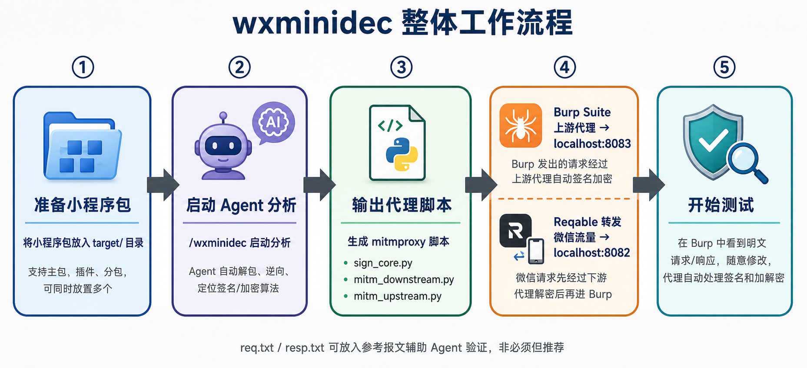
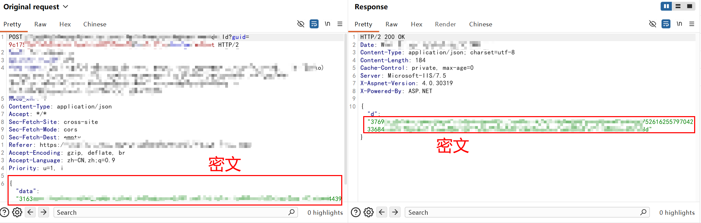
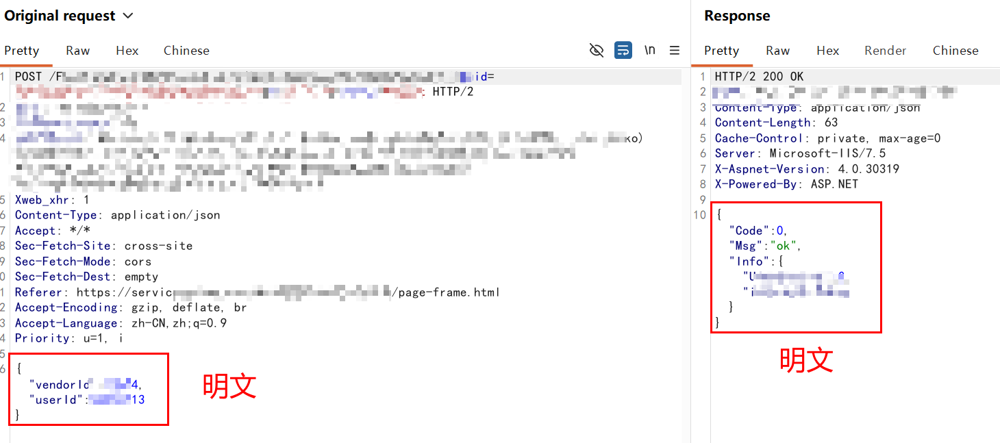
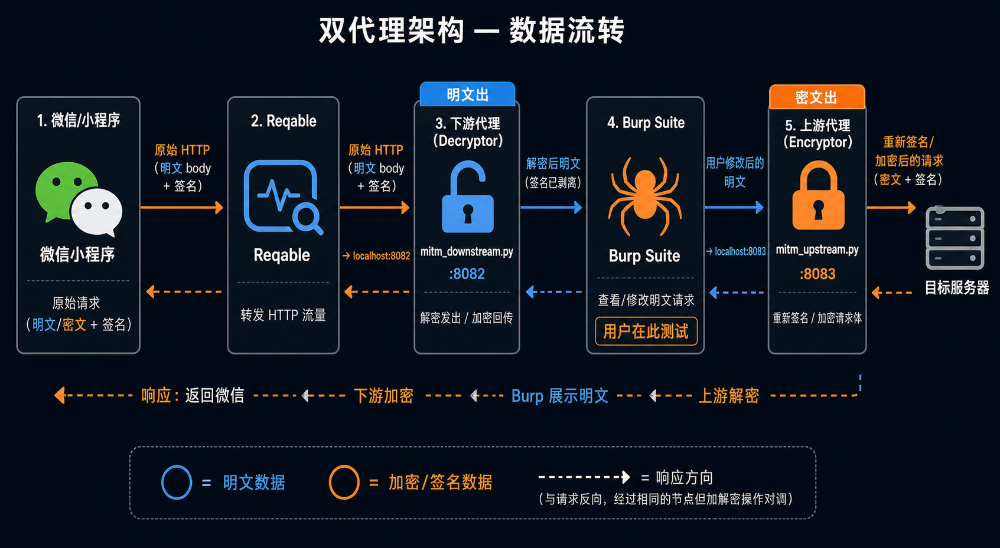
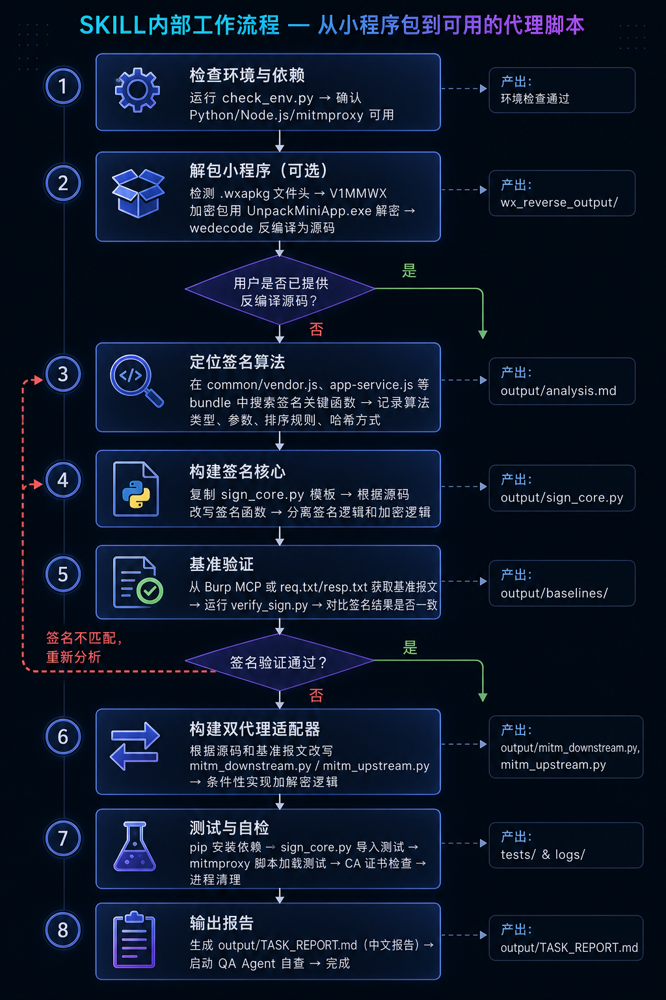
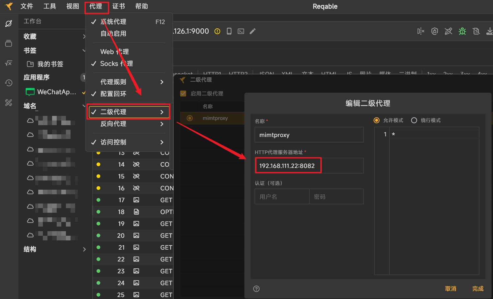
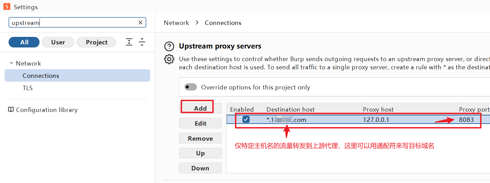
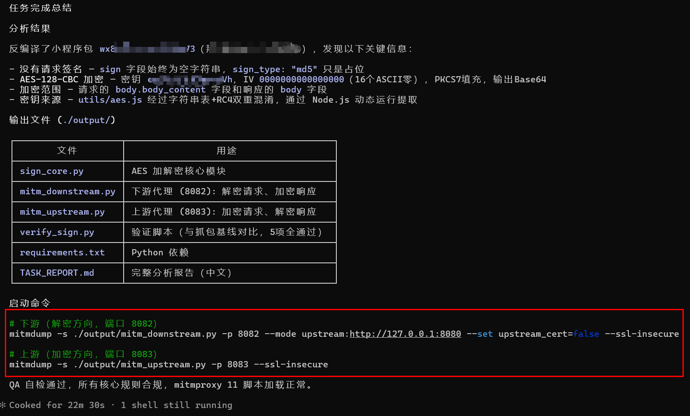

<h1 align="center">wxminidec — 微信小程序-签名/加密适配SKILL</h1>

<div align="center">

<p align="center">
  <a href="#">
    
  </a>
  <a href="#">
    
  </a>
  <a href="#">
    
  </a>
  <a href="#">
    
  </a>
</p>
</div>

---
20260803，已更新补充由于gitignore而遗漏的解密UnpackMiniApp.exe，该程序由dnspy反编译并去掉GUI修改为命令行调用。不放心的小伙伴请自行对原版UnpackMiniApp.exe修改或者替换为其他解密工具。
---
wxminidec 是一个面向授权场景的微信小程序签名/加密分析SKILL，通过 AI 驱动智能反编译、定位签名/加密算法、生成 mitmproxy 代理脚本，配合 Burp Suite 实现全自动和透明的签名与加解密处理，让安全人员可以像测试普通 Web 应用一样测试微信小程序。



**<font style="color:#000000;background-color:#FBF5CB;">核心SKILL文档：</font>**[**<font style="color:#000000;background-color:#FBF5CB;">.claude/skills/wxminidec/SKILL.md</font>**](.claude/skills/wxminidec/SKILL.md)

---

## 解决什么问题

攻防演练中对小程序资产做测试时，频繁的遇到4个核心障碍：

+ **HTTP请求 需要签名校验**：请求参数、时间戳、随机数等组合后签名，服务端验证不通过直接返回"非法请求"或"签名错误"，重放攻击和参数篡改无法进行。
+ **应用层 被加密**：请求体和响应体经过 AES/SM4 等算法加密，抓包看到的是 Base64 密文，完全无法分析接口逻辑。
+ **AI或许可以自动绕过** 签名/加密挖出漏洞，但**你无法复现**，写报告抓狂；由于签名和加密的关系，**人类很难参与进一步的漏洞挖掘**和深入测试。
+ **hook注入**微信等方式虽不需逆向算法，但**容易封号**

因此 wxminidec 自动完成这件事：解包反编译 → 定位签名/加密算法 → 生成 Python 代理脚本 → 使用基准报文验证 。

最终的效果是——**Burp Suite 里看到的是明文，Repeater/Intruder随意测试，代理自动签名、加密、封装，服务端正常接收**。

在测试开发过程中，**wxminidec + Claude Code + Deepseek V4 Pro 已成功处理攻防演练中遇到的10个小程序**。这些小程序在安全机制上各具特色：有的对HTTP头部或Body进行签名，有的对Body内容进行全量或部分字段加密，签名或加密字段出现在Header、GET或Body参数中，形式多样；涉及的算法涵盖SM4、AES、SHA、RSA、RC4等多种类型；JS代码则采用了包括自定义算法和腾讯Chaos VM在内的多种混淆方案。wxminidec 也在每次实践过程中，不断沉淀优化，减少了AI思维误区，提升了指令遵循度，用harness规避了常犯的错误。

实际效果例子如下，使用SKILL前：



使用之后：



## 亮点功能

+ **零手工逆向**：AI 自动浏览反编译源码，定位 `wx.request` 的拦截器、签名函数和加密切入点，无需人工翻阅混淆代码。
+ **双代理架构**：下游代理解密请求让 Burp 看到明文，上游代理重新签名加密发给服务器，请求和响应两面都透明。
+ **基准报文验证**：生成每个签名/加密函数后，用真实抓包报文对比输出，签名算法有错当场发现，不发往实际服务器试错。
+ **Chaos VM 支持**：针对腾讯 Chaos VM 混淆，内置 Node.js 动态提取方案，用小程序自己的代码算签名，不猜算法。
+ **全自动化**：从解包到可用的 mitmproxy 脚本，一句 `/wxminidec` 命令完成，输出物即开即用。

## 适用场景

+ SRC 白帽子对目标小程序进行漏洞挖掘，需要破解请求签名和响应加密。
+ 安全研究员分析小程序的 API 安全，需要透明代理以便 Burp Suite 查看和修改请求。
+ 每次小程序版本更新后，需要快速同步新的签名/加密逻辑到测试环境。
+ 遇到 `__TENCENT_CHAOS_VM` 混淆或国密 SM4 加密等复杂防护，需要自动化分析辅助。
+ 需要沉淀每个小程序的签名算法、密钥、加解密模式，便于团队复用和复盘。

## 成本花费

wxminidec + Claude Code + Deepseek V4 Pro，在作者的实验中，根据任务的复杂度：

- 单个小程序的开销在0.5~2元不等（白天高峰期）
- 用时在3~20分钟不等。

## 核心流程

### 1、整体工作链路

准备小程序包(.wxapkg) → 启动 /wxminidec → Agent 解包逆向 → 生成 mitmproxy 脚本 → 配置 Burp + Reqable → 开始安全测试

| 阶段 | 做什么 | 关键产出 |
|------|--------|----------|
| ① 准备 | 将主包、分包、插件 .wxapkg 放入 `target/`，推荐同时放入 `req.txt` / `resp.txt` | — |
| ② 分析 | Agent 自动解包、定位签名函数、提取密钥、构建 sign_core | `wx_reverse_output/` |
| ③ 输出 | 生成双代理脚本、验证脚本、任务报告 | `output/mitm_*.py` |
| ④ 配置 | Reqable 转发微信流量 → `8082（mimtproxy）`；Burp 上游代理 → `:8083（mimtproxy） ` | — |
| ⑤ 测试 | 启动两个mitmproxy脚本，在 Burp 中看到/修改明文，Repeater/Intruder自动处理签名/加密 | — |

### 2、双Mitmproxy代理架构 — 数据流图

微信小程序 → Reqable → mitm_downstream(:8082) → Burp Suite → mitm_upstream(:8083) → 目标服务器



| 节点 | 端口 | 方向 | 做的事 |
|------|------|------|--------|
| Reqable | — | 中转 | 将微信 HTTP 流量转发到下游代理 |
| `mitm_downstream` | `:8082` | 面向微信 | 解密请求体（明文进 Burp），响应回传时加密（密文回微信） |
| Burp Suite | — | 交互 | 查看/修改明文，分析接口，重放请求 |
| `mitm_upstream` | `:8083` | 面向服务器 | 接收 Burp 发出的请求，重新签名加密后发往目标服务器 |

> 一个代理只能处理单向（请求或响应），但需求是双向的——请求进 Burp 前要解密、出 Burp 后要重新签名加密。两个代理各管一段，才能做到 Burp 内全程明文、全程自动。

### 3、SKILL内部处理流程

环境检查 → 解包(可选) → 定位签名算法 → 构建 sign_core → 基准验证 → 构建双代理 → 自检 → 输出报告



| 步骤 | 说明 | 产出 |
|------|------|------|
| ① 环境检查 | 确认 Python/Node.js/mitmproxy 可用 | — |
| ② 解包 | 加密包先解密 (`UnpackMiniApp.exe`)，再反编译 (`wedecode`) | `wx_reverse_output/` |
| ③ 定位算法 | 搜索 `vendor.js`、`app-service.js` 等 bundle，定位签名函数和参数规则 | 分析记录 |
| ④ 构建核心 | 改写 `sign_core.py`，签名用 stdlib，加密懒加载 | `output/sign_core.py` |
| ⑤ 基准验证 | 用 `req.txt`/`resp.txt` 或 Burp MCP 流量对比签名结果，不匹配则回到 ③ | `output/baselines/` |
| ⑥ 构建代理 | 改写上下游 mitmproxy 脚本，按需实现加解密 | `output/mitm_*.py` |
| ⑦ 自检 | pip 安装依赖 → 导入测试 → mitmproxy 加载测试 → 清理进程 | — |
| ⑧ 输出报告 | 生成中文任务报告，启动 QA Agent 自查，确保所有核心规则通过 | `output/TASK_REPORT.md` |

---

## 快速开始

### 环境要求

+ Windows（目前暂未对linux系统做适配，请用windows）
+ Python 3.10+ （ https://www.python.org/ftp/python/3.11.3/python-3.11.3-amd64.exe ）
+ Node.js 18+（反编译/逆向时需要， https://nodejs.org/dist/v22.11.0/node-v22.11.0-x64.msi ）
+ mitmproxy（运行代理时需要， https://downloads.mitmproxy.org/12.2.3/mitmproxy-12.2.3-windows-x86_64-installer.exe ）
+ Burp Suite（建议 2023 +，无需pro）
+ Reqable 或同类工具（转发微信流量。 https://github.com/reqable/reqable-app/releases ）

### Step 0 — burpsuite抓取目标流量（非必选，但推荐）

burpsuite先抓取目标小程序带有签名/加密报文的流量，为后续SKILL启动分析提供情报支撑，后续也可以让AI通过burpsuite进一步自动测试，当然，不执行这一步也是OK的。如果你想要，那么参考 docs目录下的 [burpsuite-mcp配置.md](./docs/burpsuite-mcp配置.md)

### Step 1 — 放入小程序包

将微信packages目录下的小程序文件夹（主包、分包、插件均可），放入 `target/` 目录：

```
target/
├── wx87934bd63b30e73     # 主包
├── wxy2349da21kbw9b35    # 分包/插件（不一定有）
```

### Step 2 — 放入参考报文（推荐）

将小程序的一次真实请求和响应（带有签名或加密），分别保存到项目根目录的 `req.txt` 和 `resp.txt`，并在提示词中告诉AI。Agent 会把它们当作 "标准答案" 来验证自己生成的签名/加解密脚本是否正确。

不提供也行，Agent 默认将尝试从 Burp MCP 自动获取目标域名的报文。但确保你已安装配置好了 https://github.com/six2dez/burp-ai-agent

**推荐两者都提供**，如果**报文txt和Burp MCP**都没有提供，SKILL工作的正确率难以保证，虽然也可以生成mimtproxy脚本，但你需要自己验证。

### Step 3 — 启动分析

在 Claude Code 中，调用 `/wxminidec` 开始工作：

```
/wxminidec 分析 ./target 下的小程序包，输出适配该小程序的签名/加解密的 mitmproxy 脚本。 @req.txt 和 @resp.txt 是其中一个 http 请求和对应的响应，可供你参考
```

```
/wxminidec 分析 ./target 下的小程序包，输出适配该小程序的签名/加解密的 mitmproxy 脚本
```

```
/wxminidec 分析 ./target 下的小程序包，输出适配该小程序签名的 mitmproxy 脚本。该小程序存在某种形式的签名校验，例如对 /patientuser/v1/patinfo/170248590 接口重放时响应了"非法请求"
```

**推荐你使用第一种**，因为提供给AI越多的信息越好，也能帮你节省token。

因为AI能从你给它的请求/响应报文实例中，**拿到线上真实使用的目标域名（可能与js中不同）、接口地址、sign字段、密文字段等有效信息**，对它下一步针对性地分析js代码是事半功倍；你提供的报文也会作为测试的基准，让它可以准确地验证自己的工作，避免幻觉并提高正确率。

### Step 4 — 配置代理链路

Agent 完成分析后，你需要在**Reqable** 将微信/小程序流量转发到 `localhost:8082`：



**Burp Suite** 中添加 Upstream Proxy：`localhost:8083`，根据前期的抓包分析，可以配置哪些流量要转发到mimtproxy，burpsuite可以根据host来筛选，你根据实际情况配置目标小程序所使用的主机名（通常是域名）。



### Step 5 — 启动 mitmproxy

Agetn工作完成后，会告诉你如何启动，你也可以查看最终报告：



```bash
# 下游代理（承接微信/Reqable的流量，负责解密请求）
mitmdump -s ./output/mitm_downstream.py -p 8082 --mode upstream:http://127.0.0.1:8080 --set upstream_cert=false --ssl-insecure

# 上游代理（承接burpsuite向外发出的特定流量，负责签名和加密）
mitmdump -s ./output/mitm_upstream.py -p 8083
```

### 输出物一览

| 文件 | 用途 |
|:------|:------|
| `sign_core.py` | 签名核心函数，标准库零依赖，可直接在任何 Python 环境调用 |
| `mitm_downstream.py` | 下游代理脚本，解密请求 + 加密响应，面向微信/小程序 |
| `mitm_upstream.py` | 上游代理脚本，签名加密请求 + 解密响应，面向目标服务器 |
| `verify_sign.py` | 基准验证脚本，对比 Agent 生成的签名和真实报文中的签名 |
| `TASK_REPORT.md` | 中文任务报告，含签名分析、加密范围、使用说明和自查记录 |

---

## 项目目录

```
wxminidec/
├── req.txt                              # 参考请求报文（可选，推荐提供）
├── resp.txt                             # 参考响应报文（可选，推荐提供）
├── target/                              # 放入待分析的小程序包文件夹
├── output/                              # Agent 生成：脚本、报告、baselines
├── docs/images/                         # 文档图片
├── .claude/skills/wxminidec/            # 核心技能：小程序逆向与适配
│   ├── SKILL.md                         # 技能主入口，完整工作流定义
│   ├── sign_core.py                     # 签名/加密参考实现模板
│   ├── mitm_downstream_template.py      # 下游代理模板
│   ├── mitm_upstream_template.py        # 上游代理模板
│   ├── sign_helper_template.js          # Node.js 动态签名提取
│   ├── verify_sign_template.py          # 基准验证模板
│   ├── check_env.py                     # 环境依赖检查脚本
│   ├── UnpackMiniApp.exe                # 加密 wxapkg 解密工具 (.NET)
│   ├── decompile.md                     # Step 1 — 解包与反编译
│   ├── signing_analysis.md              # Step 2-3 — 签名定位与核心构建
│   ├── burp_traffic.md                  # Step 4 — Burp MCP 流量查找与验证
│   ├── adapter_dev.md                   # Step 5-6 — 双代理构建与验证
│   ├── testing.md                       # Step 6b — 依赖安装与加载测试
│   ├── chaos_vm_guide.md                # 腾讯 Chaos VM 混淆绕过指南
│   ├── pitfalls.md                      # 常见陷阱
│   ├── troubleshooting.md               # 常见问题排查
│   └── case_studies.md                  # 真实案例参考
└── .claude/skills/isolated-probe-testing/  # 辅助技能：隔离探测测试
```

---

## 功能模块概览

| 模块 | 主要能力 |
|:------|:------|
| 自动解包 | 检测 wxapkg 加密头 (V1MMWX)，自动解密，反编译为可读源码 |
| 签名定位 | 在 vendor.js、app-service.js 等 bundle 中搜索签名函数，分析参数拼接、排序、哈希规则 |
| Chaos VM 分析（案例） | 对 `__TENCENT_CHAOS_VM` 混淆，用 Node.js 执行原代码动态获取签名，不做静态猜测 |
| 加密识别 | 区分签名和 AES/SM4 应用层加密，仅在源码和流量双重确认后才启用加解密逻辑 |
| 双代理生成 | 下游 (:8082) 解密请求 + 加密响应，上游 (:8083) 签名加密请求 + 解密响应 |
| 基准验证 | 用真实抓包报文对比算法输出，签名不匹配自动回到分析步骤修正 |
| QA 自查 | 生成输出后自动启动另一个 Agent 审计全部产出，检查核心规则、基线证据和脚本可加载性 |
| 报告输出 | 中文任务报告，记录算法来源文件/行号、密钥提取位置、加密范围、使用命令 |

---

## 技术架构

+ AI 驱动：Claude Code + wxminidec 技能，Agent 全自动执行分析和生成
+ 逆向工具链：UnpackMiniApp.exe (解密) + wedecode (反编译) + Node.js (动态签名提取)
+ 签名实现：Python stdlib (hashlib, hmac, urllib) 标准库零依赖，加密函数懒加载 pycryptodome；根据情况AI编写
+ 代理框架：mitmproxy 10/11 双版本兼容，下游 + 上游双实例架构
+ 流量参考：Burp MCP 集成（自动获取已抓取报文）+ req.txt/resp.txt 手动输入
+ 运行环境：Windows ，Python 3.10+，PowerShell 交互

---

## 安全边界

+ 本工具仅供合法的 SRC 漏洞挖掘、授权的安全测试和白帽子研究使用。
+ 请勿对未授权的小程序进行分析或测试。
+ 生成的代理脚本中包含小程序的签名密钥和加密密钥，请妥善保管，不要提交到公开仓库。
+ 使用前请遵守《网络安全法》及当地相关法律法规。

---

## 免责声明

本SKILL仅用于合法授权的安全测试、攻防演练、防守验证和安全研究。使用者应自行承担部署、配置和使用过程中的合规与安全责任。作者不对因使用本项目产生的任何直接或间接后果负责。
