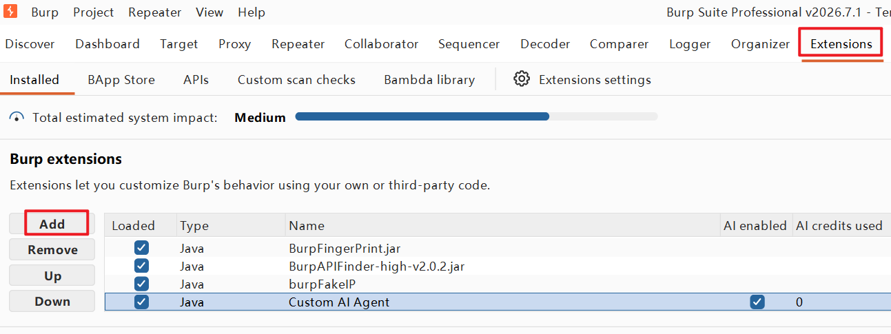
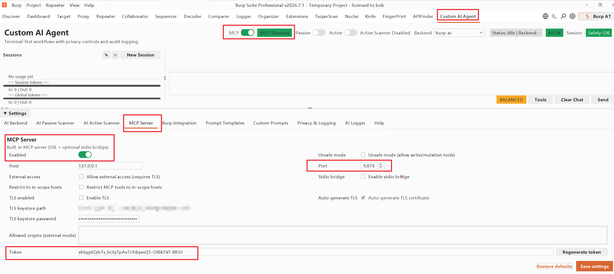
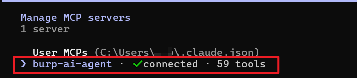
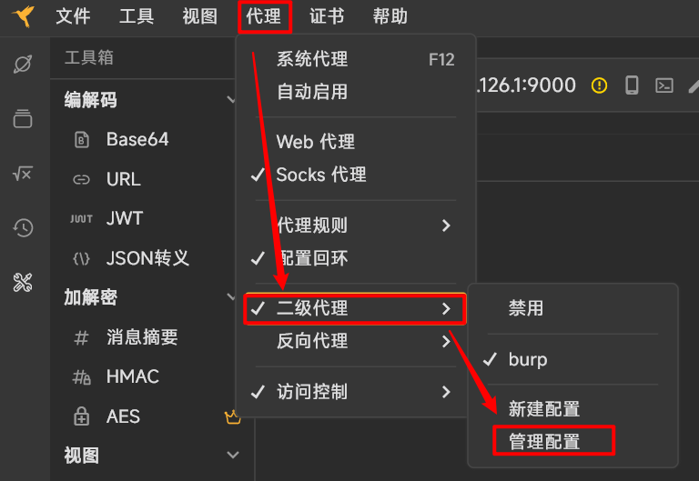
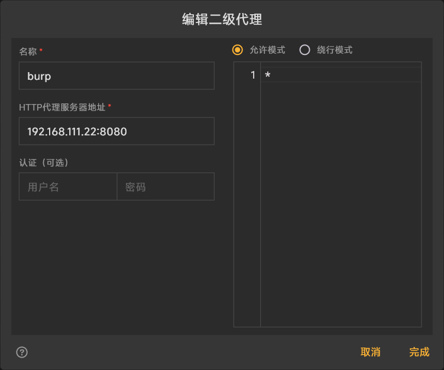
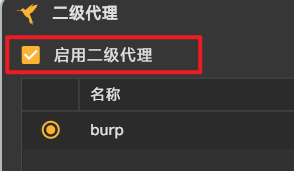
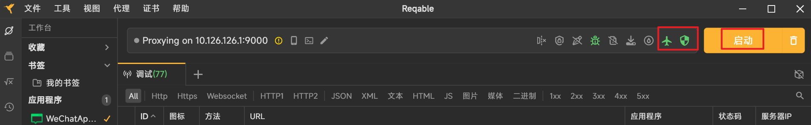

给burpsuite（需2023版本以上）安装mcp server 插件  https://github.com/six2dez/burp-ai-agent （一个jar包），在release中下载Custom-AI-Agent-full-0.9.2.jar。在burpsuite插件中添加：



进入插件视图，切换到“MCP Server”选项卡，点击“Generate token”生成一个mcp访问的token，然后打开mcp server，确保状态是running。



- 给Claude code配置mcp插件，在windows上需要修改 `C:\Users\用户名\.claude.json`文件，在json的第一层级里添加：

  ```
    "mcpServers": {
      "burp-ai-agent": {
        "type": "sse",
        "url": "http://127.0.0.1:9876/sse",
        "headers": {
          "Authorization": "Bearer <替换为你的burpsuite插件里自己配置的token>"
        }
      }
    }
  ```

  如果弄不好，你就把上面的json给AI，让AI为你添加这个mcp。

- 重启claude code，确保 /mcp 命令的输出看到了 burp-ai-agent

  

- 配置reqable的二级代理指向burpsuite的8080

  

  

  

  启动reqable抓包，启动之后流量就会经过burpsuite，然后可以打开目标小程序，积累一些目标报文，为后续启动skill提供基准报文：

  